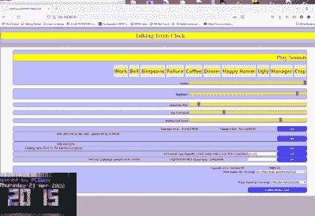

# 俄罗斯方块时钟获得健谈升级

> 原文：<https://hackaday.com/2022/05/13/tetris-clock-gets-talkative-upgrade/>

俄罗斯方块可以说是有史以来最受欢迎的视频游戏之一，其著名的砖块本身已经成为文化图标，正如《电子工程师》中的时钟“T2”所示。

The web interface allows the various sound options to be easily configured.

*俄罗斯方块*时钟的基本概念是下落的砖块以数字的形状粘在一起显示时间。在这种情况下，时钟是基于我们之前介绍过的由【布莱恩·洛】[创作的版本。](https://hackaday.com/2019/06/13/a-tetris-clock/)它依靠 RGB LED 矩阵作为显示屏。

然而，由于[电子工程师]的帮助，这个版本已经做了一些升级。在 I2S 音频转接板的帮助下，时钟可以在一天的不同时间播放声音。目前它是用各种卡通片的剪辑来宣布午餐和咖啡休息时间的。还增加了一个网络界面用于配置，还有一些文本标签。

看到一个受欢迎的开放项目得到一些升级，而其他人开始构建他们自己的版本，这很有趣。我们以前也见过一些其他有趣的*俄罗斯方块*钟。

 [https://www.youtube.com/embed/XYWxpT7TInU?version=3&rel=1&showsearch=0&showinfo=1&iv_load_policy=1&fs=1&hl=en-US&autohide=2&wmode=transparent](https://www.youtube.com/embed/XYWxpT7TInU?version=3&rel=1&showsearch=0&showinfo=1&iv_load_policy=1&fs=1&hl=en-US&autohide=2&wmode=transparent)

