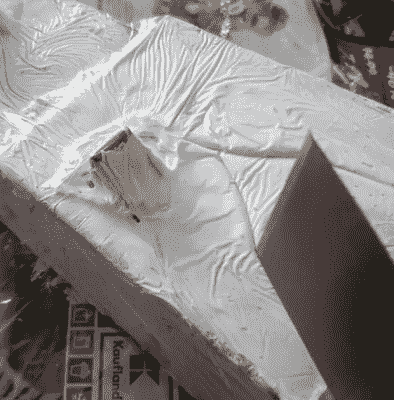

# 石器时代 3D 打印的纹理技巧

> 原文：<https://hackaday.com/2018/08/21/texture-trick-for-3d-prints-from-the-stone-age/>

可以说，3D 打印最困难的方面之一是试图让成品看起来像是*不是* 3D 打印的。掩盖指示性的层线(或者条纹，如果你想变得有趣的话)可能需要很多时间和工作，特别是如果你的 3D 打印机没有完全校准的话。虽然在 3D 打印零件上实现玻璃般的光洁度没有多少捷径，但如果你的最终目标是制作看起来像石头的东西，[Wekster]有一个提示给你。

 他通过建造一座*侏罗纪公园* 的正门[华丽的游乐设施来展示这一技术。这一过程使相对光滑的塑料看起来像粗糙的石头，几乎不需要手工操作。虽然确实没有太多的项目需要这种石头外观的饰面，但这肯定是我们会在心里存档的东西。](https://www.youtube.com/watch?v=3A6iAUhpBDQ)

那么秘诀是什么呢？[Wekster]首先在 3D 打印部件上涂上普通的木质填料，这种材料在任何五金店都可以买到。然后，他用透明的塑料包装将它们包起来，让包装聚在一起，而不是试图拉它教。为了获得更多的细节，他在塑料包装上挖来挖去，在成品上创造出看起来像是缝隙和裂缝的东西。然后让木材填充物干燥；这一过程通常只需要几分钟，但现在将需要相当长的时间，因为塑料包装将防止空气进入。

一旦它硬化并展开，[Wekster]就在它上面喷上一层彩色的底漆，然后用稀释的黑色和灰色颜料清洗几次。这种技术是任何画过微型画或模型画的人都熟知的；用于突出表面纹理并使表面更有深度。用这种方法，印刷中任何类似层线的东西都消失了，表面看起来如此复杂和详细，乍一看很少有人会相信这是塑料。

在完成他的*辐射 4* “干渴扎普”复制品的过程中[他也使用了木质填料。在过去，我们已经展示了如何](https://hackaday.com/2018/02/24/fully-3d-printed-nerf-thirst-zapper/)[用环氧树脂](https://hackaday.com/2017/11/15/visual-3d-print-finishing-guide/)磨平 3D 打印零件，并对使用 UV 树脂作为保形涂层的[进行了非常科学的研究，但也许是时候我们给木材填料一个机会了。](https://hackaday.com/2018/03/08/3d-printering-print-smoothing-tests-with-uv-resin/)

 [https://www.youtube.com/embed/3A6iAUhpBDQ?version=3&rel=1&showsearch=0&showinfo=1&iv_load_policy=1&fs=1&hl=en-US&autohide=2&wmode=transparent](https://www.youtube.com/embed/3A6iAUhpBDQ?version=3&rel=1&showsearch=0&showinfo=1&iv_load_policy=1&fs=1&hl=en-US&autohide=2&wmode=transparent)

