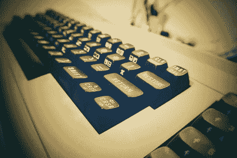

# 超级马里奥兄弟 C64 港口对这个世界来说太好了

> 原文：<https://hackaday.com/2019/05/20/that-super-mario-bros-c64-port-was-too-good-for-this-world/>

认为马里奥兄弟的冒险会存在于任天堂娱乐系统的城堡之外是愚蠢的。除了那一次。Hudson Soft company 是任天堂的密切合作伙伴，并利用这一优势将超级马里奥兄弟带到 NES 以外的平台。合作的结果是 1986 年的超级马里奥特别版，这是 NEC PC-88 系列台式电脑的一个端口。那张 5.25 英寸软盘上的东西听起来让人想起 Famicom 的原版，但总共有四种颜色(包括黑色)，而且看不到一个滚动屏幕；超级马里奥特别版玩起来感觉明显不够壮观。那些永远闪烁的精灵混合着不和谐的空白屏幕过渡永远不会离开日本，所以在未来的几年里，世界上很大一部分地区的马里奥将仍然被束缚在灰色的塑料盒子里。

如今玩《超级马里奥兄弟》的方法不在少数。各种官方和非官方形式的模仿已经注意到了这一点。几乎所有处理器比 NES 6502 更强大的机器都可以成为蘑菇王国的主机，然而，更现代的 NES 机器仍然无法获得这一标志性的头衔。

通过【zero Paige】为 Commodore 64 输入[2019 Super Mario bros .港口。历时七年的努力终于将这款游戏移植到了 80 年代最高产的电脑上，这无疑是一个辉煌的壮举，也是一个令人惊叹的编程，足以在 1986 年掀起一场风暴。没有苍白的模仿，这是 C64 上的马里奥。尽管在重新创建原始的跳跃和运行模式方面有细微的差别，同时封装了双 SID 芯片设置的所有八个声道，但任天堂认为应该扼杀这款令人难以置信的 170 kB 软件的扩散，因为他们声称这侵犯了他们的版权。](https://www.lemon64.com/forum/viewtopic.php?t=71262&start=0)

## 请停止建造那个口袋索引

The original Commodore 64 came in a brilliant beige case.

自 1996 年问世以来，神奇宝贝游戏就像钟表一样准时出现在任天堂游戏机上。多年来，开发团队对游戏设计的保守做法产生了负面影响，让长期粉丝越来越觉得续集是死记硬背。主线系列中的每一个新作品都坚定地遵循着原作的制胜法则，尽管回报在减少。[销售出现下降趋势](https://vgsales.fandom.com/wiki/Pok%C3%A9mon)，与配套游戏机的安装基数不一致。与此同时，来自神奇宝贝玩家社区的越来越多的反馈浮出水面，成为一个不变的口号，“请让神奇宝贝成为 MMO”。

任天堂长期以来一直对将互联网的连接能力融入他们的游戏保持沉默。任天堂 GameCube 的宽带适配器得到了近 600 款游戏机中多达 7 款的支持。当谈到他们的其他“在线”控制台/手持设备时，该公司选择了复杂的朋友代码系统，而不是简单的屏幕名称。这一堆乱七八糟的决定导致一些粉丝开发者联合起来创建他们自己的开源神奇宝贝多人游戏愿景 Pokénet。

Pokénet 项目的任务是创建一个在线游戏，允许玩家连接到同一个服务器，以便在穿越 Pokémon 的所有虚拟区域时相互交流。该项目从多个官方 Pokémon 版本中提取资产，因此在 2010 年任天堂发出停止信后，Pokénet 几乎一出现就被关闭了。在被关闭之前，成千上万的人已经体验了在线连接可以给游戏带来的好处；却发现官方完全忽略了粉丝的“反馈”。同样的循环在任天堂内部一直持续到今天，但也有其他公司探索出一种替代方法来盗版受人喜爱的视频游戏。

## 收税员来找索尼克队了

刺猬索尼克的粉丝根深蒂固。自 20 世纪 90 年代初以来，蓝模糊这个角色一直是游戏中的主要角色，并定期发布续集，评论界的好评不断下降。索尼克游戏的开发者索尼克团队在 2010 年发布了《刺猬索尼克 4》[,试图回归基本。这个游戏被设计成一个经典的 2D 设计，偶尔发布，问题是没有人关心。受到评论家和粉丝的严厉批评,《刺猬索尼克 4》在被取消前只上映了两集。索尼克团队改革球队的宏伟愿景失败了。](https://kotaku.com/project-needlemouse-is-sonic-4-episode-i-5463913)

与此同时，铁杆音速爱好者没有忘记这个系列的根源。一个名为 Sonic Retro 的在线开发社区举办了许多自制游戏比赛，致力于保持 20 世纪 90 年代 Sonic 游戏的活力。克里斯蒂安·怀特黑德(Christian Whitehead)，又名 Sonic Retro 论坛用户[Taxman]，参加了 Sonic 家酿游戏比赛之一，并因其被简称为 Retro Engine 的创作而声名狼藉。 [Whitehead 继续向 SEGA 推销他们自己的游戏](https://www.youtube.com/watch?v=omKGDC4JaMU)的移植，Sonic CD，用于使用复古引擎的 iOS。成功了。Sonic CD 被移植到多个现代平台，并在此过程中获得了粉丝们的高度赞扬。

在其他一些成功的声波游戏港口，怀特黑德被要求掌舵一个完全原创的经典 2D 风格的声波游戏。这个项目被称为音速狂热。2017 年发布的[《索尼克狂热》是二十五年来视频游戏评论家中评价最高的索尼克游戏](https://comicbook.com/gaming/2018/07/24/sonic-mania-plus-highest-rated-sonic-game-25-years/)。它超过了 Sonic Team 同年发行的《Sonic Forces》。粉丝制作的游戏在索尼克粉丝中引起的共鸣远胜于官方名片上印有该角色的人制作的任何东西。

## 你永远不会看到的最神奇的软件

这又把我们带回了超级马里奥。《64 号准将》的超级马里奥兄弟港口展示了一种罕见的技术水平。考虑到与 NES 同时代的微型计算机的固有局限性，可以看出克隆人的编程是多么熟练。由于任天堂的律师，如果你还没有一份拷贝，你将不得不用下面的视频来凑合。

> “按照 64 代准将的标准，这简直是疯了。就其动画、声音和播放效果而言……它听起来不像一部《海军准将》,而且他们还放了烟火。”
> 
> *–**杰夫·格斯特曼，巨型炸弹**的创始人*

它和超级马里奥官方特辑之间有一个峡谷，两者的区别是时间和激情的多少。粉丝绝对拥有时间和激情，拥抱它已经被证明会产生令人难以置信的结果。也许与其用一连串的停止通知来压制那些不那么官方的项目，不如把同样的精力集中在复印机和版权所有者之间的合作上。毕竟，这对索尼克很有效。

 [https://www.youtube.com/embed/cLb0SDlvmfI?version=3&rel=1&showsearch=0&showinfo=1&iv_load_policy=1&fs=1&hl=en-US&autohide=2&wmode=transparent](https://www.youtube.com/embed/cLb0SDlvmfI?version=3&rel=1&showsearch=0&showinfo=1&iv_load_policy=1&fs=1&hl=en-US&autohide=2&wmode=transparent)

