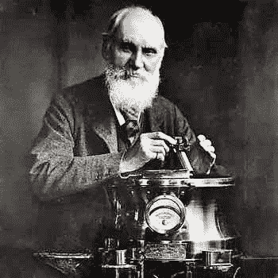
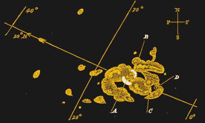

# 1859 年卡林顿事件

> 原文：<https://hackaday.com/2019/01/22/the-1859-carrington-event/>

像许多维多利亚时代的绅士，理查德卡林顿不需要玷污自己的劳动；相反，他把精力转向了自然哲学的研究。这是卡灵顿将应用自己的天文学领域，但不像其他类似倾向的绅士，他开始他的研究不是当太阳落下，而是当它升起。我们的明星对卡灵顿很感兴趣，他在 1859 年 9 月 1 日早上看到它的脸，会让他震惊。那天早上，当他勾画出一个不寻常的太阳黑子群时，该地区爆发出一道明亮的闪光，储存在太阳磁场扭曲绳索中的深不可测的能量被释放出来，推动数十亿吨的恒星物质与地球相撞。

卡林顿目睹了一次太阳耀斑，随后的日冕物质抛射将在 17 个小时后袭击地球，这将导致如此强度的地磁风暴，这将成为第二天的全球新闻，并将以他的名字命名。1859 年的卡灵顿事件让我们得以一瞥我们的恒星在适当的情况下能够做些什么，鉴于我们在地球周围和上方编织的微妙联系网络，它的含义确实发人深省。

## 令人尴尬的场面

Richard C. Carrington. Source: [SolarStorms.org](http://www.solarstorms.org/SCarrington.html)

太阳科学在 1859 年还处于萌芽阶段，虽然卡灵顿的仪器以今天的标准来看还很简陋——一架 4-1/2 英寸的赤道架望远镜将图像投射到一张白色卡片上——但这已经足够了。使用类似的设备，天文学家已经开始梳理出太阳的秘密，他们观察到太阳黑子的数量和它们在太阳表面的位置是循环出现的。他们还知道太阳黑子与地球上可观察到的现象有关，如北极光和南极光，太阳活动和地球磁场之间有明显的联系。一些太阳观测站甚至有磁强计，可以记录地球上的变化，并将它们与太阳活动联系起来。

卡灵顿有幸目睹了 9 月 1 日发生的事件，这只是太阳在多日内爆发的众多事件之一。太阳观察员报告说，从 8 月 28 日开始出现了大量的太阳黑子，从那天晚上开始，在异常低的纬度地区可以看到强烈的极光。这表明，一个或多个太阳黑子在此前两天的某个时候产生了足够能量的太阳耀斑和日冕物质抛射(CME ),将等离子云抛向地球——虽然太阳耀斑的电磁效应在发生后约 8 分钟可见，但随后喷射的物质需要几天时间才能穿过太阳和地球之间 9300 万英里(1.5 亿公里)的空间。

 

卡灵顿于 1859 年 9 月 1 日观测到的太阳黑子。耀斑开始于白色区域(A 和 B ),在消退之前，它在 35，000 英里宽的星团的整个表面上蔓延了 5 分钟。来源:理查德·卡灵顿[公共领域]，[via Wikimedia Commons](https://commons.wikimedia.org/wiki/File:Carrington_Richard_sunspots_1859.jpg)

这些爆发与 9 月 1 日太阳发布的消息相比就相形见绌了。卡灵顿当天对太阳黑子群的例行观测在当地时间上午 11 点 18 分被两个非常亮的白色光点的出现打断，这两个光点在太阳黑子的整个表面移动，然后逐渐淡出并消失。起初，他以为他的仪器出了什么问题，阳光直射到他的观察屏幕上，但很明显，他正在目睹一些罕见和不寻常的事情。他急忙去找其他人来见证这一事件，但当他一分钟后回来时，“发现它已经发生了很大的变化，变得虚弱无力，这让他感到羞愧。”整个事情持续了不到五分钟。

但是在这几分钟内释放的能量将会产生巨大的后果。数十亿吨的带电粒子从太阳表面喷射出来，沿着扭曲的太阳磁通量节点与地球相撞。在卡林顿看到耀斑后仅仅 18 小时，就报道了到达的 CME 的第一次影响，这表明先前的太阳耀斑已经清除了地球和太阳之间的空间，使等离子云的传播速度超过了通常的每小时 160 万公里；或者，9 月 2 日晚上到达的日冕物质抛射实际上是由更早的未被观测到的太阳耀斑释放的。

## 太阳出来了

不管来源是什么，到来的野兽引起了一场空前的地磁风暴。地球的磁气圈被猛烈地推到一边，让带电粒子溜进大气层，与气体分子结合，产生强烈的极光。在纬度接近热带的北半球和南半球都可以看到这种光；据报道，人们能够在午夜在街上阅读报纸，并误认为明亮的显示是日出，并过早开始一天的生活。

尽管极光展示令人敬畏，但它们只是当时席卷地球的毁灭性能量的背景。就像 1989 年的磁暴一样，地球磁场的扭曲最终达到了崩溃的地步。[美国宇航局有一个很好的模拟视频](https://youtu.be/cLLq6plMjU0)，用作文章顶部的图像。崩溃的磁场将其储存的太瓦能量释放回地球。由于几乎没有电力基础设施，大部分电流最终无害地消散了。但新生的电报网络将首当其冲受到损害。电报局报告停电和连接问题，开关设备发出噼啪声和火花，操作员触摸按键时被电击。由于录音接收器中的纸带突然着火，一些办公室报告了损失。

风暴持续了两天，破坏了全球的电报设备。一些运营商试图使他们的网络免受进一步的破坏，将他们的电池从线路上断开，却发现他们仍然可以利用风暴提供的电流发送信息。电线杆上的电线耦合的能量足以点燃它们，造成的损失是相当大的。当风暴结束时，这个羽翼未丰的网络已经遭受了数百万美元的损失。

## 会失去更多

在理查德·卡灵顿进行观察后的一个半世纪里，太阳科学家们研究了卡灵顿事件，并在冰芯和其他记录中寻找类似风暴袭击地球的证据。与 1859 年的风暴相比，迄今为止发现的一切都相形见绌。当然，有更多的侥幸逃脱。一个是由 2012 年太阳耀斑发射的“卡林顿级”日冕物质抛射，仅差 9 天就与地球轨道相交。

著名的伦敦保险公司劳埃德保险公司，在这样的事件中会损失很多，委托进行一项研究，以估计今天卡灵顿级事件袭击地球的影响。他们知道赌注要高得多，160 年的电线、开关、中继器、卫星和无线电加入了我们的电网，更不用说我们对建立在基础设施上的服务的完全依赖。他们的结论是，仅在美国，我们就可能看到高达 2.6 万亿美元的电网损失，停电时间长达两年。