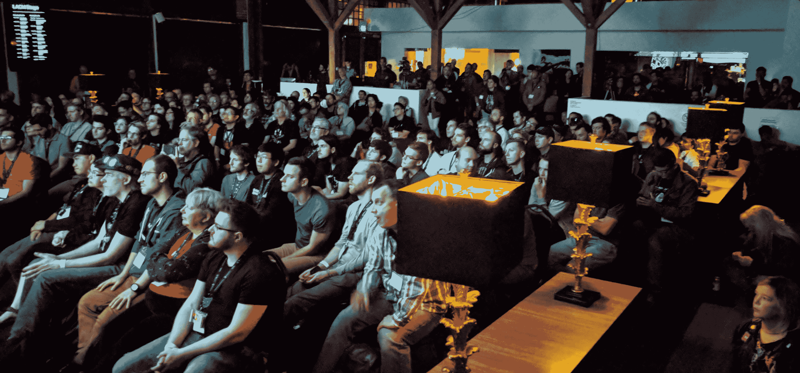

# 2022 年超级黑客日开始了！并公开征集提案

> 原文：<https://hackaday.com/2022/07/18/the-2022-hackaday-supercon-is-on-and-the-call-for-proposals-is-open/>

经过两年的远程模式，我们非常兴奋地宣布，今年的 Hackaday Supercon 将回来，现场直播！加入我们 11 月 4 日、5 日和 6 日在阳光普照的加州帕萨迪纳举办的为期三天的 hacks、讲座和 Hackaday 社区社交活动。我们很想亲眼看看和听听你在过去两年里都做了些什么——所以现在就开始集思广益，看看你要谈些什么，然后[填写提案征集表](https://docs.google.com/forms/d/e/1FAIpQLSffBmw2vNLZyzdKnPJhKF6u7nvYnjTZQ-lynOhhr8_S8fAd3w/viewform?usp=sf_link)。

## 超级电脑开始了！

我们将于 11 月 4 日星期五开始，先进行早起的登记，度过一个愉快的下午，进行徽章破解和研讨会，并举办一个派对来启动这场骗局。周六和周日将是完整的 enchilada:两个轨道的会谈，黑客站和摆在小巷里的食物，以及大量的研讨会。(只要一想到在小巷里砍人，然后再一次分享玉米卷，我的眼里就会涌出喜悦的泪水。)周日晚上，我们将颁发 2022 年黑客日奖，并有机会在舞台上演示周末的徽章黑客活动。

如果你以前没有去过超级城市，那它就是现实生活中的 Hackaday。人们带来了要展示和分享的黑客技术、要做的项目，以及他们的想法，这些想法太大了，无论如何也放不下。人群太棒了。有经验丰富的专业人士、著名的 YouTubers 用户和全新的黑客。但这并不是压倒性的——super co 太大了，不适合放在你的客厅里，但它仍然很舒适。出席的人都很棒，你会无意中遇到最棒的对话。

这是一个你不想错过的周末，所以现在就开始想办法去帕萨迪纳吧。

我们将很快开始发售门票，虽然我们无法预见未来，但它们已经售完了每年的*，所以请关注 Hackaday 以获得您的门票。当然，演讲者不需要臭票。*

 *## 征集建议

Supercon 有两个阶段和两条演讲路线:一个是在较小的设计实验室进行的 20 分钟的简短演讲，另一个是在更大的中心舞台上进行的 45 分钟的长篇演讲。我们真的很喜欢“更小”的形式在 2019 年带来了一群演讲者，他们可能不会承诺完整的演示，但他们仍然给出了整个 Supercon 中最有趣的一些演讲。它非常适合第一次参加演讲，或者在两年的中断后重新接触现实生活中的演讲——它帮助我们在周末有限的时间里挤出更多的演讲。如果你有更多要说或要展示的，当然还有主舞台。

Standing room only during a 2017 Hackaday Supercon talk

如果你想感受一下什么是好的超级谈话，[看看 2019 年演讲的视频播放列表](https://www.youtube.com/playlist?list=PL_tws4AXg7as58ENf383gSI9C5j8aXSJr)。不过，我们不想看以前展示过的东西——我们希望*你*带来任何让你兴奋的东西，所以不要限制自己。我们社区中丰富多样的经验和兴趣是 Supercon 成功的一半原因。[我们想听听你的故事](https://docs.google.com/forms/d/e/1FAIpQLSffBmw2vNLZyzdKnPJhKF6u7nvYnjTZQ-lynOhhr8_S8fAd3w/viewform?usp=sf_link)！

我们还会尽可能多地举办研讨会，所以如果你有什么东西想以一种更小、更实用的形式教给人们，请告诉我们！研讨会通常持续一两个小时，允许 10 到 40 人参加。[在](https://docs.google.com/forms/d/e/1FAIpQLSffBmw2vNLZyzdKnPJhKF6u7nvYnjTZQ-lynOhhr8_S8fAd3w/viewform?usp=sf_link)拿到方案，我们再谈细节。

## 回来真好

在接下来的几周内，我们将提供更多关于如何获得门票和徽章设计的花絮。虽然 11 月似乎还很遥远，但开始考虑 Supercon 永远不会太早。离开两年后，是时候了！

 <https://hackaday.com/wp-content/uploads/2022/07/Supercon2022CFPTeaser.mp4?_=1>

[https://hackaday.com/wp-content/uploads/2022/07/Supercon2022CFPTeaser.mp4](https://hackaday.com/wp-content/uploads/2022/07/Supercon2022CFPTeaser.mp4)*