# 罗马 Maker Faire 的 3D 打印机、扫描仪和艺术机器人

> 原文：<https://hackaday.com/2019/11/02/the-3d-printers-scanners-and-art-robots-of-maker-faire-rome/>

一个机器人怎么可能同时比我画得更好*和更差*,却能做出一件不可思议的艺术品？3D 扫描真的已经发展到一个简单的相机和电动夹具就可以拥有疯狂的分辨率了吗？这些都是我脑海中闪过的问题，也是这些优秀机器的创造者们在罗马 Maker Faire 上回答的问题。

在展览和博览会上，机器人创作艺术和 3D 打印的集中度很高，所以我为本文保留了最好的例子。但你也会发现一些聪明学生的黑客，以及让我意识到工业控制器一点也不无聊的硬件。我们来看看吧！

## 机器人艺术

 [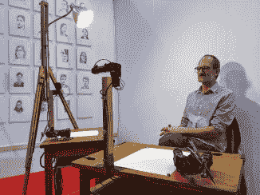](https://hackaday.com/2019/11/02/the-3d-printers-scanners-and-art-robots-of-maker-faire-rome/mfr19-human-study-drawing-robot-patrick-tresset/)    [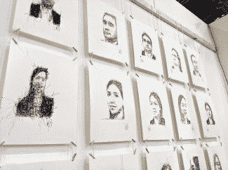](https://hackaday.com/2019/11/02/the-3d-printers-scanners-and-art-robots-of-maker-faire-rome/mfr19-human-study-drawing-robot-portraits/) 

机器人也能成为艺术家吗？这个项目令人信服地证明了它的可行性。帕特里克·特雷斯特在集会上展示他的 [*人类研究#1，5RNP*](https://patricktresset.com/new/project/5-rnp/) 。这是一套旧的木制绘图桌，带有由多个伺服系统和一个安装在棍子上的网络摄像头组成的机器人手臂。在大约 20 分钟的时间里，机器人将勾勒出一个人的肖像，但与典型的 CNC 精度不同，这里的亮点在于随机的涂鸦，这些涂鸦变成了壮观的图像。一切都由运行 Linux 的回收笔记本电脑驱动，这些笔记本电脑通过 USB 转串行电缆控制伺服电机。

 <https://hackaday.com/wp-content/uploads/2019/10/VID_20191019_115103.mp4?_=1>

[https://hackaday.com/wp-content/uploads/2019/10/VID_20191019_115103.mp4](https://hackaday.com/wp-content/uploads/2019/10/VID_20191019_115103.mp4)

虽然没有在这个视频中展示，但这个艺术装置最大的乐趣之一是网络摄像头也有伺服电机，这样它就可以在人像和纸张之间移动视线。这纯粹是戏剧，但拟人化的效果是迷人的。

## 只是一根绳子上的一支笔

 [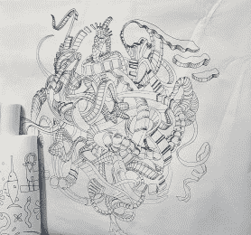](https://hackaday.com/2019/11/02/the-3d-printers-scanners-and-art-robots-of-maker-faire-rome/mfr19-string-plotter-surplus-art/)  [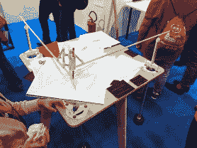](https://hackaday.com/2019/11/02/the-3d-printers-scanners-and-art-robots-of-maker-faire-rome/mfr19-string-plotter-gyrograph/)  [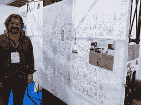](https://hackaday.com/2019/11/02/the-3d-printers-scanners-and-art-robots-of-maker-faire-rome/mfr19-string-plotter-antonio-ianiero/)  [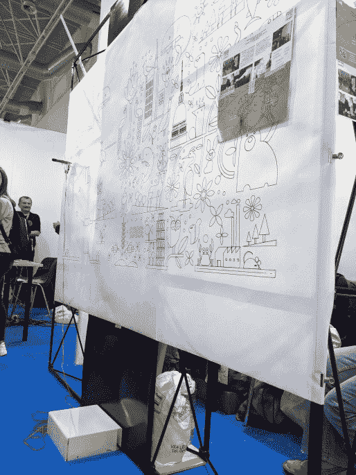](https://hackaday.com/2019/11/02/the-3d-printers-scanners-and-art-robots-of-maker-faire-rome/mfr19-string-plotter-white-control-box/)  [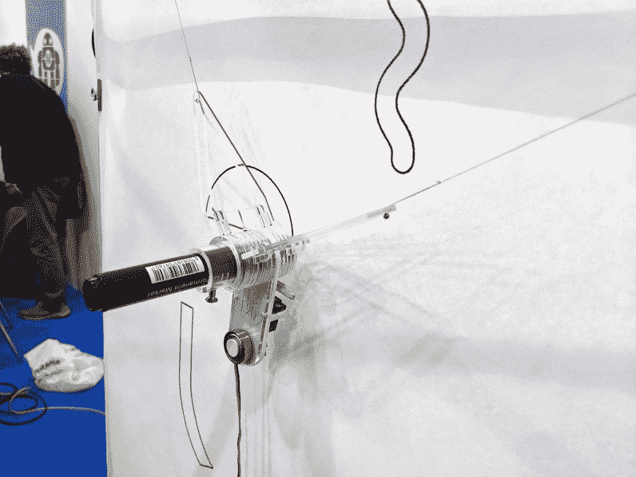](https://hackaday.com/2019/11/02/the-3d-printers-scanners-and-art-robots-of-maker-faire-rome/mfr19-string-plotter-stylus/) 

另一个极端是基于向量的机器所能达到的精度。我们都熟悉弦线绘图仪，但这个本身就是一件艺术品。值得注意的是滑轮系统，它将所有东西都移动到绘图表面中心地板上的一个干净、闪亮的白色盒子中，消除了我们通常在弦绘图仪的两个上角发现的有点不雅观的 NEMA 伺服电机。绘图头本身是视觉上令人愉快的干净，透明丙烯酸设计角。

 <https://hackaday.com/wp-content/uploads/2019/10/VID_20191020_135204.mp4?_=2>

[https://hackaday.com/wp-content/uploads/2019/10/VID_20191020_135204.mp4](https://hackaday.com/wp-content/uploads/2019/10/VID_20191020_135204.mp4)

在这个展台上同样受欢迎的是这种基于钟摆的绘图机，它产生的图像让人想起肺活量描记器。当然，消息灵通的读者[会认出这是和声](https://hackaday.com/2017/02/22/harmonographs/)(与瑞克和莫蒂无关)。

## 机器人康复中心

     [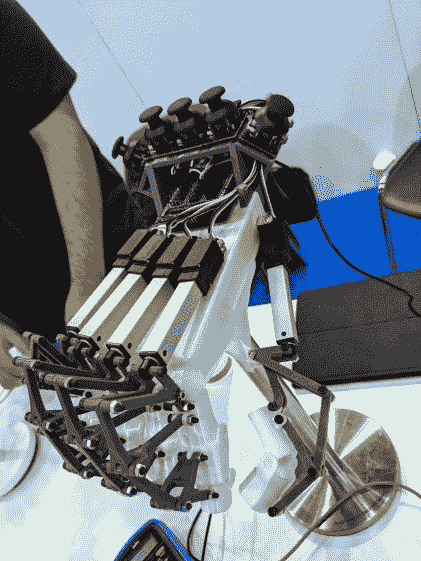](https://hackaday.com/2019/11/02/the-3d-printers-scanners-and-art-robots-of-maker-faire-rome/mfr19-robohand-3d-printed/) 

红色手套很容易被识别为使用柔性电阻的输入设备，但更像赛博朋克的手形硬件呢？机器人手是为物理治疗而设计的。这里显示了原型的两个不同版本。其中一个有 3D 打印的塑料部件，由使用一套游戏控制器拇指棒的线性致动器驱动。另一个也使用线性致动器，但有铝制组件，并无线连接到红色手套，因此物理治疗师可以控制病人的锻炼。

## 通过摄影测量的魔力进行 3D 扫描

 [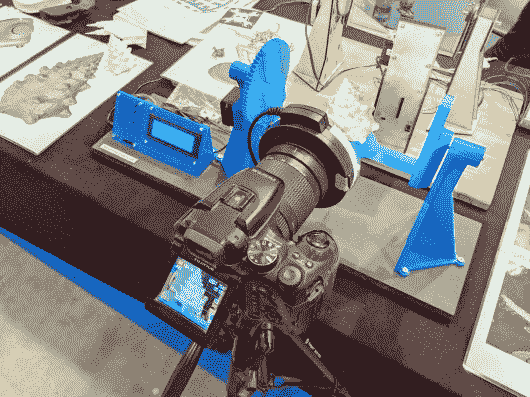](https://hackaday.com/2019/11/02/the-3d-printers-scanners-and-art-robots-of-maker-faire-rome/mfr19-openscan-3d-printed-rig/)  [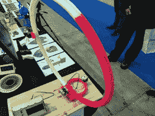](https://hackaday.com/2019/11/02/the-3d-printers-scanners-and-art-robots-of-maker-faire-rome/mfr19-openscan-early-prototype/)  [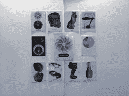](https://hackaday.com/2019/11/02/the-3d-printers-scanners-and-art-robots-of-maker-faire-rome/mfr19-openscan-resutls/)  [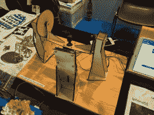](https://hackaday.com/2019/11/02/the-3d-printers-scanners-and-art-robots-of-maker-faire-rome/mfr19-openscan-laser-cut-prototype/)  [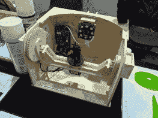](https://hackaday.com/2019/11/02/the-3d-printers-scanners-and-art-robots-of-maker-faire-rome/mfr19-openscan-laser-cut-rig/)  [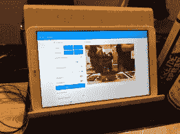](https://hackaday.com/2019/11/02/the-3d-printers-scanners-and-art-robots-of-maker-faire-rome/mfr19-openscan-table-control/) 

我不止一次参观了 OpenScan 的展台，因为他们展示的设备太酷了。他们展示了几个版本的机器，可以让你以令人难以置信的分辨率创建一个物体的 3D 模型。展示的最早的原型使用 3D 打印的环来移动物体周围的相机。随着原型的推进，摄像机变得静止，而零件移动了。最近的一次建造使用了激光切割胶合板和树莓 Pi 相机，以及作为用户界面的平板电脑。[你可以在没有这种硬件的情况下使用摄影测量](https://hackaday.com/2019/04/07/get-great-3d-scans-with-open-photogrammetry/)，但是和任何东西一样，这种精度真的放大了结果的质量。

## 全金属，无限体积

 [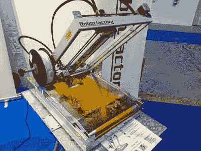](https://hackaday.com/2019/11/02/the-3d-printers-scanners-and-art-robots-of-maker-faire-rome/mfr19-robotfactory-infinite-build-volume-overview/)  [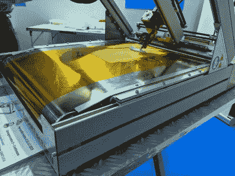](https://hackaday.com/2019/11/02/the-3d-printers-scanners-and-art-robots-of-maker-faire-rome/mfr19-robotfactory-infinite-build-volume-closeup/) 

在过去的几年里，我们已经看到了比我们能够计数的更多的配备传送带的 3D 打印机——它们是那些似乎永远需要一年才能达到临界质量的产品之一。在这一点上，我们不确定他们是否会真正流行起来，但这并没有阻止机器人工厂通过发布他们声称的第一个“全金属”带式打印机套件来推进最先进的技术。如果你在市场上寻找一台可以连续打印零件的无限容量打印机，这款重型打印机可能是你要考虑的。

## 使用智能手机闪光灯重新打印

   [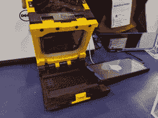](https://hackaday.com/2019/11/02/the-3d-printers-scanners-and-art-robots-of-maker-faire-rome/mfr19-lumibee-overview/)  [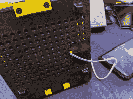](https://hackaday.com/2019/11/02/the-3d-printers-scanners-and-art-robots-of-maker-faire-rome/mfr19-lumibee-light-sensor/)  [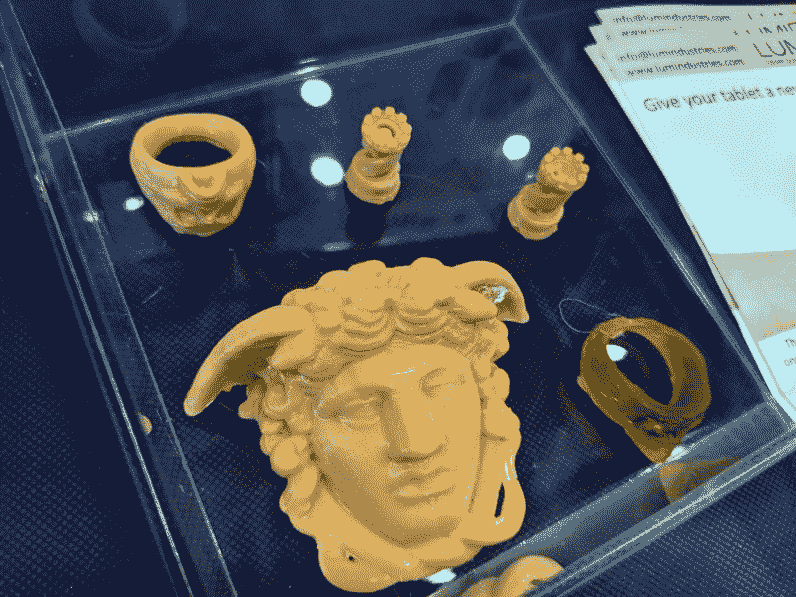](https://hackaday.com/2019/11/02/the-3d-printers-scanners-and-art-robots-of-maker-faire-rome/mfr19-lumibee-prints/) 

这款来自米露工业的树脂打印机被称为 lumi bee T1。这个聪明的建筑使用手机屏幕作为光源，一次固化一层树脂。这就引出了一个问题，如何连接电机来提升固化层，为下一次曝光腾出空间？他们在智能手机上使用相机闪光灯和一个简单的光传感器。更好的是，打印机底部的钉板性质意味着该传感器可以四处移动，以适应您在此过程中使用的智能手机。

## 印刷齿

 [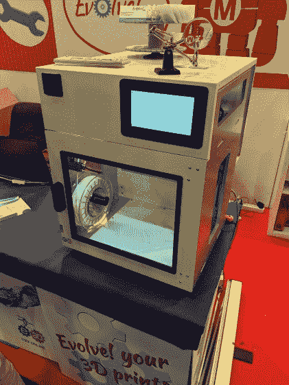](https://hackaday.com/2019/11/02/the-3d-printers-scanners-and-art-robots-of-maker-faire-rome/mfr19-evolve-3d-printer/)    [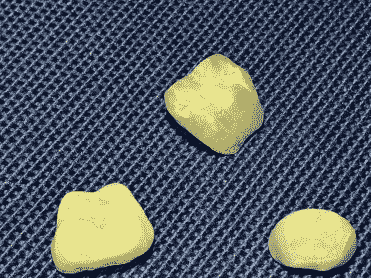](https://hackaday.com/2019/11/02/the-3d-printers-scanners-and-art-robots-of-maker-faire-rome/mfr19-evolve-3d-dental-crowns/)  [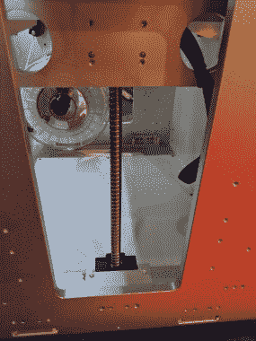](https://hackaday.com/2019/11/02/the-3d-printers-scanners-and-art-robots-of-maker-faire-rome/mfr19-evolve-3d-ball-screws/)  [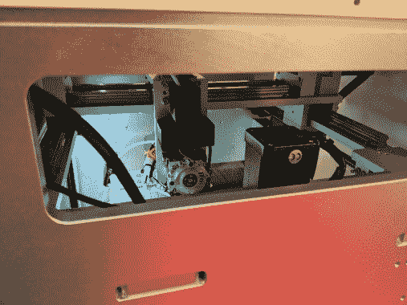](https://hackaday.com/2019/11/02/the-3d-printers-scanners-and-art-robots-of-maker-faire-rome/mfr19-evolve-3d-linear-rails/) 

我见到了 3D Evolve 的创始人，他正在努力降低工业级 3D 打印机的准入门槛。他断言滚珠丝杠和直线轴承是印刷术发展的下一步。但是谁需要这种类型的桌面精度呢？他陈述的一个用例是在 FDM 为牙科打印牙冠。是的，你可以用牙科树脂做到这一点，但他声称未固化的牙科树脂是有毒的，这回避了问题。我不确定我是否接受这个论点，但是从样本打印(和小工作台)来看，你必须承认这个东西可以以很高的精度挤出来。

## 工业用 Arduino

 [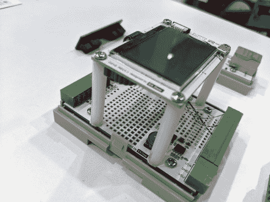](https://hackaday.com/2019/11/02/the-3d-printers-scanners-and-art-robots-of-maker-faire-rome/mfr19-industruino-breadboard/)  [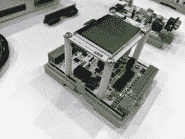](https://hackaday.com/2019/11/02/the-3d-printers-scanners-and-art-robots-of-maker-faire-rome/mfr19-industruino-guts/)  [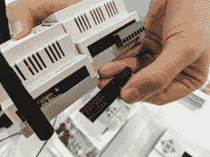](https://hackaday.com/2019/11/02/the-3d-printers-scanners-and-art-robots-of-maker-faire-rome/mfr19-industruino-jumpers/) Jumper PCB [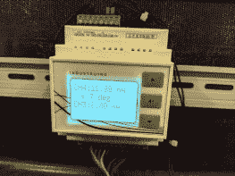](https://hackaday.com/2019/11/02/the-3d-printers-scanners-and-art-robots-of-maker-faire-rome/mfr19-industruino-module/)  [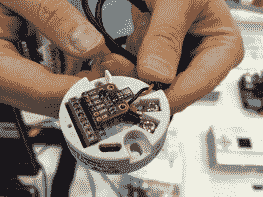](https://hackaday.com/2019/11/02/the-3d-printers-scanners-and-art-robots-of-maker-faire-rome/mfr19-industruino-sensor-breakout/)  [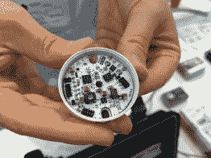](https://hackaday.com/2019/11/02/the-3d-printers-scanners-and-art-robots-of-maker-faire-rome/mfr19-industruino-sensor-host/) 

很难对工业控制器感到太兴奋，但当我在工业公司的展台前停下来时，我确实感到兴奋。熟悉的轨道安装硬件在任何工厂都是家常便饭，但这些都可以通过 Arduino IDE 来控制。在里面你会看到基本模型的两种风格，一种是准备摇滚，另一种是邀请你的硬件黑客的原型板。我最感兴趣的是用于添加遥感器的圆盘状模块。创始人 Loic De Buck 认为，用于 Arduino 的无数传感器分线板的可用性是生态系统的一个关键特性，这为连接您选择的板提供了一种强大的方式。每个光盘都有自己的微控制器，并执行 [4-20 mA 电流环路信号](https://en.wikipedia.org/wiki/Current_loop)与控制器进行反馈。

## Magikcube:一个自我解决的魔方

 [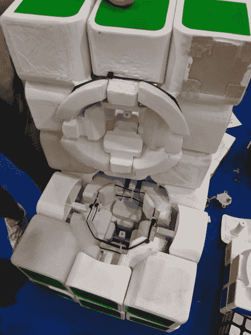](https://hackaday.com/2019/11/02/the-3d-printers-scanners-and-art-robots-of-maker-faire-rome/mfr19-magikcube-internals/)  [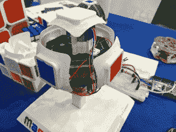](https://hackaday.com/2019/11/02/the-3d-printers-scanners-and-art-robots-of-maker-faire-rome/mfr19-magikcube-hub/)  [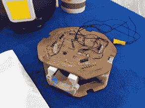](https://hackaday.com/2019/11/02/the-3d-printers-scanners-and-art-robots-of-maker-faire-rome/mfr19-magikcube-prototype/)  [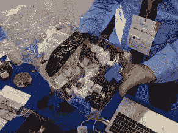](https://hackaday.com/2019/11/02/the-3d-printers-scanners-and-art-robots-of-maker-faire-rome/mfr19-magikcube-parts/)  [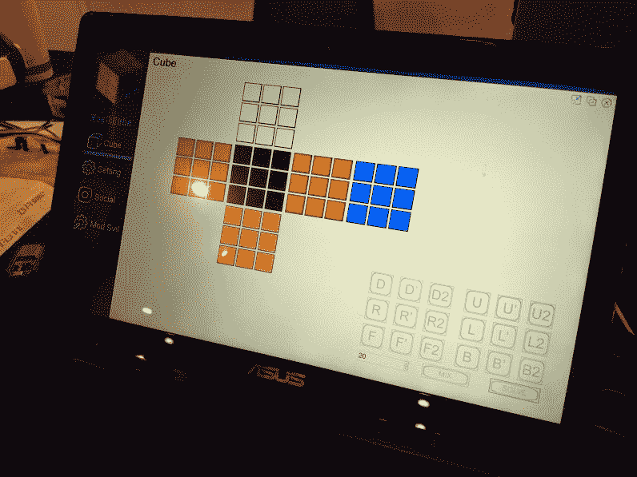](https://hackaday.com/2019/11/02/the-3d-printers-scanners-and-art-robots-of-maker-faire-rome/mfr19-magikcube-controller/) 

将一个魔方变成一个独立自主的机器人是一座需要攀登的高山，但是马可尼·皮亚里西学院的学生们已经准备好迎接这个挑战。为了建造这个巨大的立方体，他们拆开了一个消费者立方体，测量了所有的部分并建模。原型按比例放大，以便为添加电机腾出更多空间，平板电脑界面允许你一次转动一边，以及自动混合和解决立方体。我特别喜欢看他们在把设计送到工厂之前加工的原型电路板。

## 用很多伺服电机来可视化音乐

 [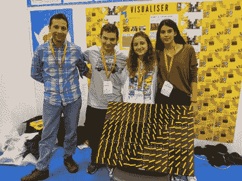](https://hackaday.com/2019/11/02/the-3d-printers-scanners-and-art-robots-of-maker-faire-rome/mfr19-servo-display-student-team/)  [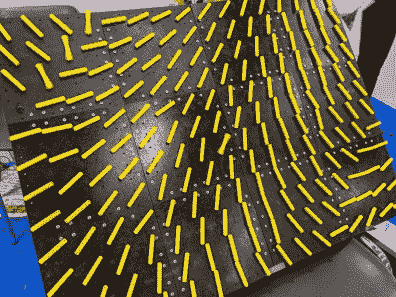](https://hackaday.com/2019/11/02/the-3d-printers-scanners-and-art-robots-of-maker-faire-rome/mfr19-servo-display-overview/) 

这三名来自土耳其伊斯坦布尔 Hisar 学校的学生正在展示他们用 192 个伺服电机制作的巧妙展示。该显示器是模块化的，内置 12 个黑色 3D 打印塑料方块，每个方块包含 16 个伺服电机。每个伺服系统都有一个印刷的黄色荧光臂，可以转动以改变显示，而不是喇叭。它感觉像一个圆点，但更抽象。该软件的原型是在 Scratch 中开发的，已经被移植到 Python 中，最终目标是基于正在播放的任何环境音乐生成算法可视化。

 <https://hackaday.com/wp-content/uploads/2019/10/VID_20191020_134505.mp4?_=3>

[https://hackaday.com/wp-content/uploads/2019/10/VID_20191020_134505.mp4](https://hackaday.com/wp-content/uploads/2019/10/VID_20191020_134505.mp4)

## 巨型试验板

 [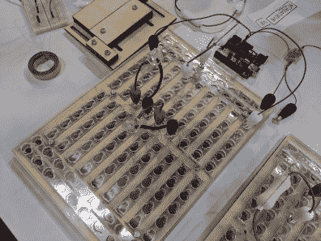](https://hackaday.com/2019/11/02/the-3d-printers-scanners-and-art-robots-of-maker-faire-rome/mfr19-giant-breadboard-overview/)   

哦，简单的力量。这可能是我最喜欢的东西。这是用于电子教学的无焊试验板的放大版。很难理解试验板是如何工作的，这增加了一个视觉元素，通过将表面制成透明的丙烯酸树脂，显示下面构成连接的弹簧钢。跳线由螺栓头制成，螺栓头嵌入电路板表面的钥匙孔中。Amy Beaulisch 发明了这个聪明的黑客技术，如果你想建立一个你自己的，这个技术在她的网站上被很好的记录为开放硬件。

我希望我能在罗马的创客节上多呆一天，但是也许那会让我明年有更多的未知去探索。查看[我的第一篇报道](https://hackaday.com/2019/10/25/giant-leds-ruby-lasers-hologram-displays-and-other-cool-stuff-seen-at-maker-faire-rome/)事件的文章，并确保在你的十月日历中为 2020 年制造商保留一些空间！