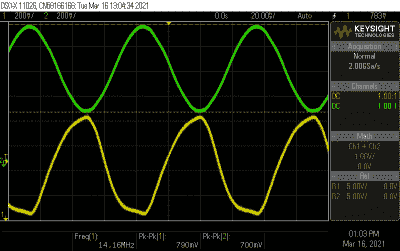
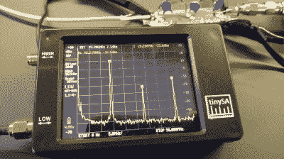
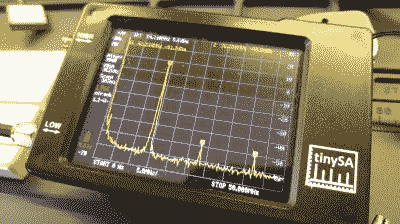
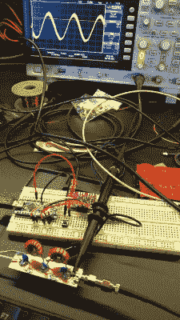
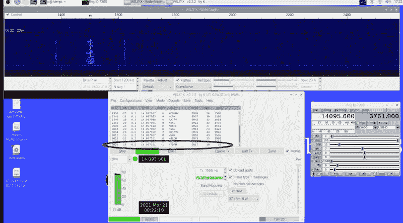

# 50 美元的火腿:一个简单的 WSPR 灯塔

> 原文：<https://hackaday.com/2021/04/15/the-50-ham-a-simple-wspr-beacon/>

我最近和一个人聊天，让我惊讶的是她有一个业余无线电执照。我想这不应该是一个惊喜；毕竟，在硬件黑客的生活中，获得业余无线电执照是一个相当常见的仪式。我想这让我很惊讶，因为在我们过去的谈话中，她从未提起过这件事，当我们谈到这件事时，我知道了原因。“我拿到执照是因为我认为业余无线电是关于制造收音机的，”她说。“但事实并非如此。”

在很多方面，她对业余无线电现状的看法是正确的。曾经有一段时间，制作自己的设备是这个爱好的核心，就像制作节目一样，也许更是如此。然而，现在，随着便宜到 30 美元的收音机和可以让跨越地球变得轻而易举的嗖嗖齿轮，建造自己的收音机已经下滑了几个档次。但是自制远不是一门死艺术，正如我们将在本期“50 美元的火腿”中看到的那样，对于好奇自制的人来说，HF 波段的 WSPR 信标实际上是一种有趣、简单且廉价的方式，可以体验一下自己制作发射机的感觉。

## 极简主义方法

在[的最后一期 50 美元火腿文章](https://hackaday.com/2021/03/25/the-50-ham-wspr-ing-around-the-world/)中，我谈到了弱信号传播模式(WSPR)是如何被用来探索世界各地的传播条件的。这个概念很简单:一个连接到 WSPR 客户端程序的收发器，比如内置在 [WSJT-X](https://hackaday.com/2021/02/10/the-50-ham-digital-modes-with-wsjt-x/) 中的收发器，监听其他电台发射的 FSK 调制信号。低比特率信号将一个最小的信息(发射站的呼号、Maidenhead 网格位置和发射功率)编码成一个数字信号，需要将近两分钟才能发送出去。然后，接收站将解码后的消息报告给中央 WSPR 数据库，该数据库跟踪联系人，并可以显示站之间的路径图。

在接收端，WSPR 的大部分魔力在于软件，特别是在数字信号处理方面，它从经常微弱和退化的信号中提取数据。但发射端就是另一回事了；在那里，对最小信息进行编码所需的软件非常简单，简单到只需要一个微控制器就可以完成这项工作。实际上，所需要的是一个振荡器，它能够产生固定频率的信号，并在软件控制下改变频率来编码信息。

有很多方法可以做到这一点，包括[使用 Raspberry Pi 上的 GPIO 引脚直接产生 RF 信号](https://hackaday.com/2013/03/21/wspr-transmitter-shows-true-value-of-raspberry-pi-for-hacking/)。不过，在这种情况下，我决定效仿许多其他 ham，使用 Si5351 时钟发生器分线板和 Arduino Nano。时钟发生器板有一个三通道 PLL 控制的振荡器，可实现 I2C，并有一个支持良好的库，因此可以轻松实现几乎任何频段的简单振荡器。

我决定为 20 米波段制作 WSPR 信标，没有其他真正的原因，只是因为我总是在白天的时候在那个波段上制作 WSPR 接触，这是我在我的小屋度过最多时间的时候。我还决定，至少在我第一次参与这个项目时，我会去掉所有那些很容易添加到 Arduino 项目中的附加功能。WSPR 传输需要小心地同步，以便在每一个偶数分钟的顶端开始，因此这些项目中的许多都包括诸如 GPS 接收器或 NTP 客户端之类的精心设计，以负责计时。我想，对我来说，简单地看一下时钟，按一下按钮，在适当的时间启动 WSPR 传输周期，会更快更容易。

为此，我搜索了“最小 WSPR 发射机”,找到了一些适合我的设计，包括 Peter B. Marks 的这个设计。他改编了 Jason mill drum(NT7S)在他出色的 si 5351 ether kit 库中的示例代码——我们都互相借鉴。我对代码的唯一添加是支持一个按钮来启动发射机。该代码简单地采用我的呼号、网格方块和发射功率，将其编码为 WSPR 消息，并告诉 Si5351 发送四个不同的 FSK 信号音序列，组成 162 符号长的消息。

```

/*
* Minimal WSPR beacon using Si5351Arduino library
*
* Based on code:
* Copyright (C) 2015 - 2016 Jason Milldrum
*
*
* This program is free software: you can redistribute it and/or modify
* it under the terms of the GNU General Public License as published by
* the Free Software Foundation, either version 3 of the License, or
* (at your option) any later version.
*
* This program is distributed in the hope that it will be useful,
* but WITHOUT ANY WARRANTY; without even the implied warranty of
* MERCHANTABILITY or FITNESS FOR A PARTICULAR PURPOSE. See the
* GNU General Public License for more details.
*
* You should have received a copy of the GNU General Public License
* along with this program. If not, see
* https://gist.github.com/NT7S/2b5555aa28622c1b3fcbc4d7c74ad926.
*/
#include "Arduino.h"
#include "si5351.h"
#include "Wire.h"
#define TONE_SPACING 146          // ~1.46 Hz
#define WSPR_CTC 10672            // CTC value for WSPR
#define SYMBOL_COUNT WSPR_SYMBOL_COUNT
#define CORRECTION 94674          // Determined experimentally -- parts per billion?
#define INPUT_PIN 7               // pushbutton
#define TX_LED_PIN 13

Si5351 si5351;
JTEncode jtencode;

unsigned long freq = 14097100UL;  // Transmit frequency
char call[7] = "N7DPM";           // Callsign
char loc[5] = "DN17";             // Grid square
uint8_t dbm = 10;                 // Transmit power
uint8_t tx_buffer[SYMBOL_COUNT];
int val = 0;

// Global variables used in ISRs
volatile bool proceed = false;

// Timer interrupt vector. This toggles the variable we use to gate
// each column of output to ensure accurate timing. Called whenever
// Timer1 hits the count set below in setup().
ISR(TIMER1_COMPA_vect)
{
    proceed = true;
    // Serial.println("timer fired");
}

// Loop through the string, transmitting one character at a time.
void encode()
{
    uint8_t i;
    Serial.println("encode()");
    jtencode.wspr_encode(call, loc, dbm, tx_buffer);

    // Reset the tone to 0 and turn on the output
    si5351.set_clock_pwr(SI5351_CLK0, 1);
    digitalWrite(TX_LED_PIN, HIGH);

    // Now do the rest of the message
    for (i = 0; i < SYMBOL_COUNT; i++)
    {
        uint64_t frequency = (freq * 100) + (tx_buffer[i] * TONE_SPACING);
        si5351.set_freq(frequency, SI5351_CLK0);
        Serial.print("freq = ");
        Serial.println(tx_buffer[i]);
        proceed = false;
        while (!proceed);
    }
    Serial.println("message done");
    // Turn off the output
    si5351.set_clock_pwr(SI5351_CLK0, 0);
    digitalWrite(TX_LED_PIN, LOW);
}

void setup()
{
    Serial.begin(115200);
    Serial.println("setup");

    // Use the Arduino's on-board LED as a keying indicator.
    pinMode(TX_LED_PIN, OUTPUT);
    digitalWrite(TX_LED_PIN, LOW);

    // Initialize the Si5351
    // Change the 2nd parameter in init if using a ref osc other
    // than 25 MHz
    si5351.init(SI5351_CRYSTAL_LOAD_8PF, 0, CORRECTION);

    // Set CLK0 output
    si5351.set_freq(freq * 100, SI5351_CLK0);
    si5351.drive_strength(SI5351_CLK0, SI5351_DRIVE_8MA); // Set for max power
    si5351.set_clock_pwr(SI5351_CLK0, 0);                 // Disable the clock initially

    // Set up Timer1 for interrupts every symbol period.
    noInterrupts(); // Turn off interrupts.
    TCCR1A = 0;     // Set entire TCCR1A register to 0; disconnects
    // interrupt output pins, sets normal waveform
    // mode. We're just using Timer1 as a counter.
    TCNT1 = 0;                     // Initialize counter value to 0.
    TCCR1B = (1 << CS12) | // Set CS12 and CS10 bit to set prescale
             (1 << CS10) | // to /1024
             (1 << WGM12); // turn on CTC
    // which gives, 64 us ticks
    TIMSK1 = (1 << OCIE1A); // Enable timer compare interrupt.
    OCR1A = WSPR_CTC;               // Set up interrupt trigger count;
    interrupts();                   // Re-enable interrupts.

    pinMode(INPUT_PIN, INPUT);
}

// wait for button press at the top of any even-numbered minute
void loop()
{
    val = digitalRead(INPUT_PIN);
    if (val == LOW)
    {
        encode(); // transmit once and stop
    }
}

```

## 清除信号

像任何好火腿一样，我在播出前测试了我的微型发射器。[我在本系列开始时构建的简单虚拟负载](https://hackaday.com/2019/04/25/the-50-ham-dummy-loads/)已经派上了用场，因为我可以直接将其连接到分线板上的 SMA 连接器。我把示波器连接到输出端，启动代码。Si5351 应该产生方波；它最终看起来更像一个锯齿波，但无论如何，该信号载有谐波，需要在播出前进行清理。

[](https://hackaday.com/wp-content/uploads/2021/03/harmonics.png)

Cleaning up harmonics from the Si5351\. Yellow trace is the raw ouput from the dev board; green trace is output from the low-pass filter.

幸运的是，处理这一重要的光谱卫生问题的低通滤波器非常简单。你可以购买它们，但这都是关于自制的，所以我播放了一个关于滤波器设计的视频，通过他的数学运算，得出了一个滤波器所需的电容和电感值，该滤波器可以截止大约 14.2 MHz 以上的所有频率。我使用[这个环形计算器](https://toroids.info/)来计算如何缠绕线圈，使用[一个来自 Harbor Freight](https://www.harborfreight.com/plug-cutter-set-4-pc-60613.html) 的廉价插头切割钻头将所有东西焊接在一块 PCB 上，并使用我的 NanoSA 频谱分析仪进行测试。

以前从未建造过这样的滤波器，我很惊讶它在清除谐波方面做得如此之好。示波器上的波形是一个漂亮、平滑的正弦波，频谱分析仪显示谐波明显减少。二次谐波(42 MHz，正好在 VHF 频段内)衰减了 35 dBm。这正是一个负责任的火腿不希望四处喷涌的那种虚假，所以我很高兴我建立了过滤器。

[](https://hackaday.com/spectrum-after/)

Si5351 spectrum before…

[](https://hackaday.com/spectrum-before/)

…and after the low-pass filter

## 直播——算是吧

[](https://hackaday.com/wp-content/uploads/2021/03/wspr-transmitter.jpg)

Doesn’t look like much of a transmitter, but I’m on the air.

一旦我确信我的小发射机正在输出一个干净的信号，我检查，以确保它输出的信号是在频率上和正确编码的。Si5351 开发板并不完全是实验室质量的信号源，虽然它能很好地保持设定频率，但它可能输出也可能不输出编程频率。因此，电路板需要校准，这通常只是在监控频率计数器输出的同时调整代码中的校正因子。遗憾的是，在我小小的测试套件中还没有“纳米频率计数器”，所以我不得不发挥创意。

我的方法是将我的 HF 装备调谐到 WSPR 发射器的所需频率——14.097100 MHz——并在向假负载发射时缓慢调整发射器的频率。这产生了一个听得见的拍频，当两个频率匹配时，拍频几乎消失。我无法完全消除拍频，但我确实把它降低到了几赫兹，我认为这已经足够接近了。

接下来，我通过启动 WSJT-X 并“广播”到我的高频设备来检查可解码的信号。即使连接了假负载，我也能在瀑布显示器上获得非常强的信号，并能清楚地看到 FSK 调制信号。我很高兴看到 WSJT-X 清晰地解码了我的信息。

[](https://hackaday.com/wp-content/uploads/2021/03/wspr-ota.jpg)

Decoding my own signal, to make sure everything is working. The range was only a few meters and the power was only 13 mW, but it worked!

## 希望下次运气好一些

受到这些成功的鼓舞，并且知道许多人已经用比我的小灯塔发出的 13 mW 更少的功率进行了跨大陆 WSPR 联系，我尝试真正地进行广播。我把信标接到我的端馈半波天线上，在约定的时间按下发送按钮。遗憾的是，虽然我从来没有能够得到任何其他站解码我的信号。在过去一周左右的时间里，我已经尝试了几十次，也许几百次，但我似乎没有成功。

我知道我的信号是正确编码的，我知道我在频率上，所以我很确定问题要么是我的天线，要么是我的低功率信号。鉴于这个系列的性质，我更倾向于用一个简单的功率放大器来解决后者。对此我已经有了几个设计，并且我已经订购了一些部件，所以我们将在下一期讨论这个问题，看看我是否能解开这个特别的成就。