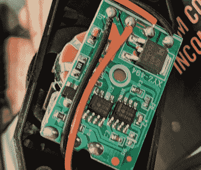
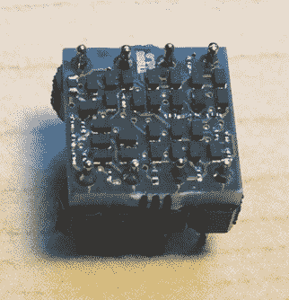

# 555 计时器大赛回归！

> 原文：<https://hackaday.com/2021/12/01/the-555-timer-contest-returns/>

它回来了！[555 定时器大赛](https://hackaday.io/contest/182830)希望看到你用 555 定时器芯片做一些很酷的事情。这关系到各地电子极客的奉承。由于 Digi-Key 对本次比赛的慷慨赞助，三名顶级获胜者将获得在 Digi-Key 仓库购物的 150 美元奖励。

## 记忆车道

首先回顾一下历史…“555 计时器比赛”在我们脑海中的印象是十年前由[Jeri Ellsworth]构思并由[Chris Gammell] 协助的比赛。这是一辆从一开始就失控的货运列车，众多赞助商提供奖品和名人评委名单。在 555 计时器悠久而辉煌的历史中，这当然不是唯一一次围绕它的比赛，但在我们的心中有一个特别喜欢的地方。很多参赛作品已经消失在时间的史册中——甚至比赛页面本身也不见了，除了[的互联网档案版本](https://web.archive.org/web/20110412103002/http://www.555contest.com/rules-and-categories/)。

[LED strip dimmer](https://hackaday.io/project/163584-a-tv-wall-to-hide-the-cords/log/158703-adding-led-backlighting) (circa 2019) uses a 555 timer, because what else would you use?

今年是最初设计的[50 周年。早在 1971 年[Hans Camenzind]组合了 23 个晶体管、16 个电阻和 2 个二极管，永远改变了世界。自动化概念的核心是计时，这种芯片是一种近乎通用的计时机制，既便宜又可靠。设计师可以使用 555 和一些无源元件来配置其输出如何工作。我们听说这是世界历史上销量最大的集成电路，但一直无法找到这一说法的可靠来源。说来有趣，这东西到处都是！](https://hackaday.com/2018/10/10/the-555-and-how-it-got-that-way/)

## 对，我们答应了一个比赛

简而言之，你只需要使用 555 定时器，你就有资格参加这个比赛。

更长的故事是，我们希望看到任何与 555 相关的东西。其实不使用 a 555 的项目，只要是基于这个想法就可以了。因此，如果全球芯片短缺让你甚至难以找到其中的一个，只要自己构建内部电路的一部分，你就成功了。这里真正的诀窍是解释你在做什么以及为什么。

[【Robo】的分立 555 定时器](https://hackaday.com/2021/05/11/smallest-discrete-transistor-555-timer/)仍然符合 DIP 封装

例如，[该项目使用表面贴装元件](https://hackaday.com/2021/05/11/smallest-discrete-transistor-555-timer/)在 DIP8 封装中重新创建了 555。它*不用* a 555，它*就是* a 555！

如果你没有达到那种疯狂的焊接，考虑加入为自己的目的滥用内部电路的长期历史。最近的一个例子是[这款电路雕刻振动传感器重新利用了 555 的触发器](https://hackaday.com/2021/01/10/circuit-sculpture-vibration-sensor/)。

但是，嘿，这不一定会改变世界。每个人都应该有机会玩这个芯片，所以如果你从来没有建立一个电路，现在是时候了。像定时器一样使用它；[闪烁一个 LED](https://hackaday.com/2018/09/25/minimal-blinky-project-makes-the-chip-the-circuit-board/) ，渐暗一个，或者[用其中的二十个发出一些甜甜的音乐](https://hackaday.com/2021/03/09/peek-into-this-synths-great-design-and-abandoned-features/)。

## 奖励和认可

对于最高奖项，我们希望你让我们惊叹，我们指的是每个阅读 Hackaday 的人。我们将考虑所有参赛作品，并选择三个有创意、聪明、有据可查的作品，从 Digi-Key warehouse 获得 150 美元的购物礼包。

但是，在考虑每一个条目时，我们还会考虑一组特殊的识别。闪烁第一个 LED 有一种神奇的感觉，所以如果这是你第一次驾驶 555，请在你的文章中这样说，我们可能会通过“你好，世界！”奖项。几年前[【Ted Yapo】写了一篇关于建造最快的 555 定时器](https://hackaday.com/2019/03/25/the-worlds-fastest-555-timer-and-the-state-of-the-555/)的文章——这种恶作剧将获得“带宽克星”奖。播放一些时髦的音乐，你可能会获得“Chiptunes”奖。做一些绝对不应该*而不是*在 555 上完成的事情，你就可以获得“不应该使用 555”奖。让参加“为艺术而艺术”奖的角逐成为一件美好的事情。

这些认可没有实际的奖励价值。但是想想极客的信誉吧！

## 女士们先生们，开始计时

你可以在太平洋时间 1 月 10 日中午之前报名。只需在 Hackaday.io 上启动一个项目页面，并使用项目页面左侧栏中的下拉菜单来参加 555 计时器竞赛。要了解完整的规则，[请前往竞赛页面](https://hackaday.io/contest/182830-555-timer-contest)。