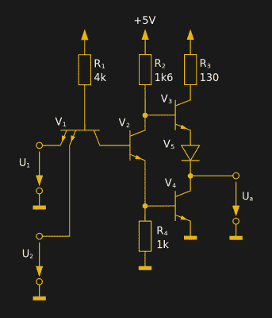

# 7400 四路 2 输入与非门，前微处理器时代被忽视的幸存者

> 原文：<https://hackaday.com/2018/12/28/the-7400-quad-2-input-nand-gate-a-neglected-survivor-from-a-pre-microprocessor-world/>

有一系列集成电路，我们大多数人会将其视为该类型的明确示例，这些设备成为特定功能的首选，并作为电子爱好者进入了我们的集体意识。自消费类集成电路诞生之初，它们就已投入生产，由于工程师们对它们的特性有了全面的了解，而且它们的工作做得很好，所以它们仍在使用。

你可能会说出我在这里要背诵的几个，David Fullagar 在 1968 年为 Fairchild 设计的 A741 运算放大器，Hans Camenzind 在 1971 年为 Signetics 设计的 NE555 定时器，以及我个人最喜欢的 Bob Widlar 在 1967 年为 Fairchild 设计的 A723 线性调节器。读者可能会在评论中提到其他一些人的名字，但有一个人，直到今天，你们中很少有人会想到。[德州仪器的 5400 和 7400 TTL 四路 2 输入 NAND](http://www.ti.com/product/SN7400#) 门自 1964 年以来一直在持续生产，是可能是数量最多的集成电路的祖先，但它在列出著名芯片时不会脱口而出，我们也没有人能说出它的设计者。所以今天，我们把聚光灯对准了这块被忽视的硅，并试图给它带来它应得的赞美。

## 你能说出这位匿名 IC 设计师的名字吗？

[![We could have featured a minicomputer such as a DEC PDP-11 as an example of a CPU built from 74 series logic. But the 74-driven Xerox Alto makes a greater point about 74 logic as the progenitor of modern computing devices. Joho345 [Public domain]](img/af6ce1df31389ac9e73f321c07275888.png)](https://hackaday.com/wp-content/uploads/2018/08/768px-xerox_alto_mit_rechner.jpg) 

我们可以用 DEC PDP-11 这样的小型机作为 74 系列逻辑 CPU 的例子。但是 74 驱动的[施乐 Alto](https://en.wikipedia.org/wiki/Xerox_Alto) 更强调 74 逻辑是现代计算设备的先驱。joho 345[[Public domain](https://commons.wikimedia.org/wiki/File:Xerox_Alto_mit_Rechner.JPG)]

随着半导体逻辑在 20 世纪 50 年代和 60 年代的出现，该领域出现了许多相互竞争的技术。二极管逻辑、二极管-晶体管逻辑、电阻-晶体管逻辑等都是进入早期固态计算机的竞争者。每种技术都有其依附的公司，但每种技术都有相关的限制，表现为速度低、功耗过大或电源要求苛刻。晶体管-晶体管逻辑，或 TTL，是由 TRW 公司的 James L. Buie 于 1961 年提出的，并承诺在更高的时钟速度、可观的速度和单个低压电源轨下实现合理的功耗。1963 年[Sylvania](https://archive.org/details/bitsavers_sylvaniadaiaUniversalHighLevelLogicMay66_3459527)率先向市场推出 TTL，1964 年 [TI 随后推出 5400 金属扁平封装军用 TTL 系列，1966 年推出我们熟知的塑料封装 7400 系列。该系列扩展到包括来自众多制造商的每一种可能的逻辑功能，并且作为新兴的工业标准，到 1990 年代末，整个微型计算机和微型计算机仅使用 74 系列 TTL 芯片来构造。使用它们的设计是第一代微处理器设计者的想法，它们的影响在 20 世纪 70 年代使用 74 式 5 V 逻辑电平的 CPU 上是显而易见的。](https://archive.org/details/TexasInstruments-TI-Data-TheTTLDataBookforDesignEngineersSecondEditionOCR)[![The die of a decapped National Semiconductor-branded 5400 from the 1980s Robert.Baruch [CC BY-SA 4.0]](img/b9ea9ae8543149f9e2200b2c81f8c23b.png)](https://hackaday.com/wp-content/uploads/2018/08/national_semiconductor_dm5400j_8838_die_image.jpg) 

一个从 1980 年代解封的国家半导体品牌 5400 的芯片。底部是飞兆的标志吗，表明这个芯片最初是该公司的产品之一？Robert Baruch [ [CC BY-SA 4.0](https://project5474.org/index.php?title=5400_NS_8020) 。因此，从某种意义上说，尽管 7400 不是第一个逻辑芯片，甚至也不是第一个 TTL 芯片，但它可以说是我们今天桌子上和口袋里的电脑的半导体祖先。它是前微处理器世界中一个未被注意的计算幸存者，尽管微处理器的出现，它仍设法与我们在一起，因为 74 系列逻辑已经成为将我们数字世界的许多部分结合在一起的“粘合剂”。它无处不在，并且已经超越了它形成 20 世纪 60 年代计算的构建块的最初目的，而是执行简单的逻辑任务，这些任务要求简单、快速、实现简单和低成本。它的成功也让人类的故事黯然失色，因为如果我们回到本页顶部提到的电路列表，我们会在它们旁边找到名称。Widlar、Fullagar、Cammenzind 和其他类似的名字在谈论早期集成电路时会脱口而出，但我们中有多少人能说出 7400 的创造者？当然不是我们，好像他们已经从历史中消失了。这是一个非常简单的装置，很可能是一个人的功劳，但即使这是一个团队的工作，我们也应该能够找到其成员的名字。真的，7400 的创造者应该因他们的成就而闻名，所以如果有人能对 20 世纪 60 年代早期的德克萨斯州有所了解，我们真的很有兴趣知道。

## 今天是 7400

The internal circuit of a single 7400 dual-input NAND gate. 30px MovGP0 ([CC BY 2.0 DE](https://commons.wikimedia.org/wiki/File:7400_Circuit.svg)).

多年来，已经出现了令人眼花缭乱的 74 系列兼容系列，这些系列解决了原始产品的缺点，功能远远超过它们，尽管许多更深奥的设备不再制造，但它仍可用于大量功能。在 2018 年生产的设备中发现 74 衍生产品仍然是完全正常的，毫无疑问，在可预见的未来，这种情况将继续存在。最初的系列可能很久以前就被取代了，但它们仍然在生产，你仍然可以从所有通常的来源订购 7400。所以我们就这么做了，挑选了一些 TI SN7400s 作为 Mouser 订单的一部分。有趣的是，单个数量的每件大约几美元，这不再是一个便宜的零件，虽然在 20 世纪 60 年代推出时它们会花费几十美元，但它们显然已经过了生产高峰期的低价位，现在正进入小批量生产的领域。80 年代后期的 HC 系列 CMOS part 74HC(T)00 似乎是目前最便宜的单量等效产品，价格约为 30 美分。

除非你迫切需要一点逻辑胶，否则四路 2 输入与非门很难称得上是最激动人心或最奇特的组件，所以在获得一些逻辑胶后，如果我们想的话，我们可以连接一个 LED 或制作一个非稳态触发器。但有趣的故事可能不在于 7400 能做什么，而在于为什么我们现在会使用 74HC00 或任何其他取代原始产品的系列。正如你所料，新的系列几乎都有更高的速度和更低的功耗，但它们也都解决了原来的固有缺陷。最早的逻辑门系列是数字电路，设计用于将逻辑 1 和逻辑 0 表示为高电压或低电压，但在逻辑状态之间的电压转换期间，它们也有一个点，在此期间，它们更像模拟电路而不是数字电路。最初的 74 系列与其近当代的 4000 系列 CMOS 共享这一点。

在一个包含 74 个串联器件的数字电路中，逻辑转换期间两个输出晶体管都断开的时刻会导致一个高电流尖峰通过，这会产生意想不到的副作用，使电路噪声非常大，并且需要进行大量的电源去耦工作。在这一点上值得注意的是，4000 系列芯片中意想不到的模拟属性在实验合成器的世界中变得流行，正如我们自己的[埃利奥特·威廉姆斯]在他的[逻辑噪声](https://hackaday.com/2015/02/04/logic-noise-sweet-sweet-oscillator-sounds/)系列中所展示的那样。

当时的 7400 是计算机设计关键时刻的一个被忽视的幸存者，已经默默无闻地坚持了 50 多年。毫无疑问，在未来几年，你仍然可以买到 7400，尽管我们不知道谁会在新设计中指定它们，而且在未来几十年，你肯定可以买到它的衍生品。我们希望这能照亮它，并给予它应有的认可，反过来，如果我们能给它的设计者一个名字，这本身就是一个迷人的故事。现在，如果你不介意的话，我们有一小包全新的 7400 要考虑一个项目。

7400 标题图像:Stefan 506[[CC-BY-SA-3.0](https://commons.wikimedia.org/wiki/File:TI_SN7400N.jpg)]