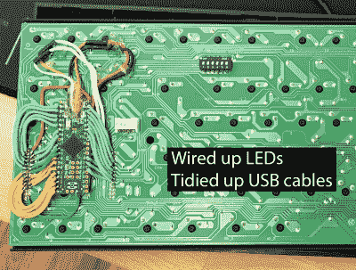

# 将 QMK 添加到 WASD 键盘的基础知识

> 原文：<https://hackaday.com/2020/05/05/the-abcs-of-adding-qmk-to-a-wasd-keyboard/>

[Oleg]是一名软件工程师，他欣赏好的键盘，尤其是在经历了机械键盘的黑暗面之后。他们说的没错——一旦你离开，就再也回不去了。

 无论如何，在成为一个配有垂直分离式 ergo 键盘的书呆子之前，[Oleg]有一个有许多优点的漂亮的小 WASD。因为 ErgoDox 是如此的可定制，他对 WASD 的使用已经半途而废。

这是因为 ErgoDox 可以运行 QMK 固件，这允许用户自定义他们看到的每个键，并添加功能层。许多人已经把各种各样的老式 keebs 换成了 QMK，把原生控制器换成了 Teensy，而[【Oleg】确信它能为 WASD](https://hackaday.io/project/171323-circuit-bending-wasd-keyboard) 工作。

[Oleg]走到引擎盖下，发现控制器位于箭头键周围的一个小的可移动板上，并通过两组双排接头引脚与主 PCB 对话。在用示波器仔细探测之后，控制板揭示了它的秘密，[Oleg]能够建立一个测试方案，通过将每一行连接到一个 led，并将所有列接地来逆向工程键盘矩阵。几乎没有空间给 Teensy，[Oleg]最终将它绑在开关 PCB 的背面，并非常漂亮地将其连接到插头引脚。

有了 Teensy 和 QMK，即使你笨手笨脚，也可以很容易地按你想要的方式制作键盘。