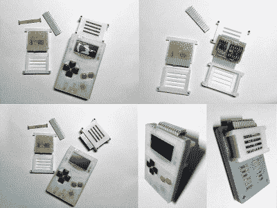

# ArduBoy 社区推出了他们自己的墨盒

> 原文：<https://hackaday.com/2019/06/07/the-arduboy-community-rolled-their-own-cartridge/>

正如你可能从名字中猜到的那样，Arduboy 是一封写给任天堂游戏机男孩的情书，许多黑客在成长过程中都会盯着它看。虽然开源手持设备远小于经典的 DMG-01，但它保留了相同的一般形状因素，单色显示器，甚至屏幕左侧的标志性红色 LED。但有一点它没有从原版继承下来，那就是可拆卸游戏卡带的概念。也就是说，直到现在。

在过去的一年里，[[Blinky 先生]和一群 Arduboy 的忠实用户一直致力于为这款小巧的掌上电脑添加一个可移动的墨盒](https://community.arduboy.com/t/flash-cart-ridge/5840)。理论上看起来很简单，只需在 Arduboy PCB 上已经存在的测试焊盘上悬挂一个外部 SPI 闪存芯片，但要将这一想法转化为实际应用，需要大量的工作和讨论。Arduboy 社区论坛上的帖子涵盖了从物理盒式磁带设计的人体工程学到可以加载多个游戏的新引导加载程序的开发的所有内容。

Early cartridge prototypes.

该小组必须解决的第一个问题是 Arduboy 有多小:后面根本没有空间添加墨盒插槽。因此，大量的时间花费在提出不同的方法，实际上得到理论上的墨盒连接到系统。有一些关于完全重新设计外壳的说法，以便它可以在内部安装墨盒(就像真正的 Game Boy 一样)，但这最终被一种侵入性更小的方法所取代，这种方法只是用 3D 印刷板取代了 Arduboy 的后部，从而为改装者提供了足够的空间来沿着系统的顶部边缘添加一个插头。

此外，盒式磁带连接器还可以作为 Arduboy 的扩展端口。在完善设计的同时，各种论坛用户加入了利用新端口的不同小工具，从 WS2812B LEDs 到额外的输入设备，如操纵杆或全 QWERTY 键盘。即使你对扩展 Arduboy 上的存储空间不感兴趣，能够插入新的硬件模块肯定会带来一些有趣的可能性。

事实上，这个项目给 Arduboy 的创造者[Kevin Bates]留下了深刻的印象，以至于他上个月就这个话题发表了意见，宣布他将开始考虑将社区的墨盒修改集成到生产硬件中。如果一切顺利，对于那些想要[扩展这台微型怀旧机器的能力](https://hackaday.com/2019/01/07/star-fox-comes-to-arduboy/)的人来说，很快就会有一条官方升级路径。

 [https://www.youtube.com/embed/9B4mz4AN39A?version=3&rel=1&showsearch=0&showinfo=1&iv_load_policy=1&fs=1&hl=en-US&autohide=2&wmode=transparent](https://www.youtube.com/embed/9B4mz4AN39A?version=3&rel=1&showsearch=0&showinfo=1&iv_load_policy=1&fs=1&hl=en-US&autohide=2&wmode=transparent)

【感谢小袋鼠的提示。]