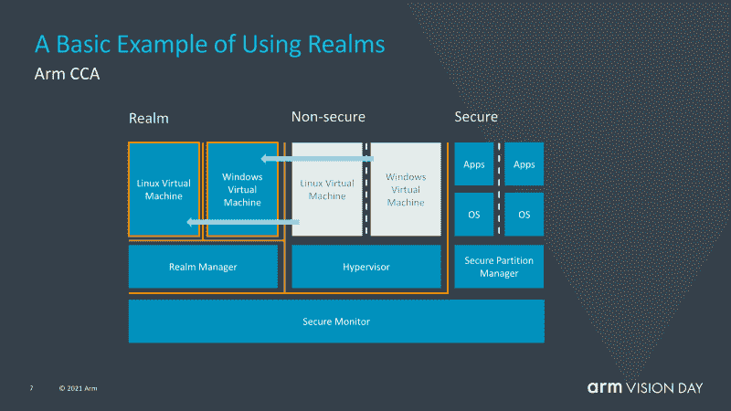

# ARMv9 ISA，以及它能为您做什么

> 原文：<https://hackaday.com/2021/05/10/the-armv9-isa-and-what-it-can-do-for-you/>

不同的 Arm 指令集架构(ISA)版本的数量在慢慢增加，ARM 每隔几年就会增加一个新版本。目前普遍使用的最古老的 ISA 版本是 ARMv6，ARMv6 ISA ( [ARM11](https://en.wikipedia.org/wiki/ARM11) )见于最初的 Raspberry Pi SBC 和 Raspberry Pi Zero (BCM2835)。ARMv6 ISA 于 2002 年推出，随后是 2005 年的 arm V7(Cortex-A 系列的开始)和 2011 年的 ARMv8。后者因增加了 64 位支持而引人注目。

ARMv7 是第一个 Cortex 内核，ARMv8 以 AArch64 的形式增加了 64 位支持，ARMv9 带来了哪些显著的特性？[正如今年早些时候宣布的](https://www.anandtech.com/show/16584/arm-announces-armv9-architecture)，ARMv9 的重点似乎是通过其机密计算架构(CCA)增加一系列功能，这些功能应该可以改善矢量处理(矢量扩展，或 SVE)以及数字信号处理(DSP)和安全性。

除此之外，ARMv9 还包括 ARMv8.1、v8.2、v8.3 等版本增加的所有功能。从本质上讲，这使得基于 ARMv9 的处理器理论上能够与英特尔和 AMD 提供的最佳产品针锋相对。

## 欢迎来到高端

很明显，ARMv9 不是我们很快就会在 Raspberry Pi 和 kin 等廉价单板计算机(SBC)中看到的 ISA。例如，Raspberry Pi 4 的 BCM2711 SoC 使用 Cortex-A72 内核，实现 ARMv8-A 规范。此后，ARMv8.1-A 更新增加了:

*   原子读/写等的附加说明。
*   改进的虚拟化支持(例如虚拟化主机扩展)。
*   SIMD(向量)扩展。

2016 年，ARMv8.2-A 增加了:

*   半精度浮点数据处理等各种任务的附加指令。
*   可伸缩矢量扩展( [SVE](https://developer.arm.com/documentation/101726/0300/Learn-about-the-Scalable-Vector-Extension--SVE-/What-is-the-Scalable-Vector-Extension-) ): SIMD 处理。

同年晚些时候推出了 ARMv8.3-A:

*   嵌套虚拟化。
*   高级 SIMD 复数支持。

接下来的三次更新增加并完善了更多功能，为基本 ARMv-8 规范创建了一个令人印象深刻的必需和可选更新列表。毫不奇怪，如此大量的 ISA 规范有点混乱，ARMv9 完成的事情之一是将所有这些版本集中在一个规范中。

ARMv9 在 ARMv8 上增加的另一个东西是[可伸缩向量扩展版本二(SVE2)](https://community.arm.com/developer/ip-products/processors/b/processors-ip-blog/posts/new-technologies-for-the-arm-a-profile-architecture) ，SVE 的继任者，本质上是霓虹 SIMD 指令的替代者。正如 Arm 指出的，NEON 指令仍然在 ARMv9 中，但只是为了向后兼容。正如 SVE 的“可扩展”部分所表明的，SVE 相对于 NEON 的一个主要优势是，它可以扩展到底层硬件，允许更小、更弱的平台仍然像高端芯片一样处理相同的基于 SVE2 的代码。

很明显，SVE [植根于 HPC(高性能计算)](https://community.arm.com/developer/tools-software/hpc/b/hpc-blog/posts/technology-update-the-scalable-vector-extension-sve-for-the-armv8-a-architecture)，日本 [Fugaku 超级计算机](https://www.anandtech.com/show/15869/new-1-supercomputer-fujitsus-fugaku-and-a64fx-take-arm-to-the-top-with-415-petaflops)是去年推出的首批使用它的系统之一。这意味着 ARMv9 的 SVE2 对于处理受益于基于 SIMD 算法的数据的应用来说非常重要。

## 领域和标记内存

ARMv9 中新增了“领域”的概念，它可以被视为一种安全容器，代码可以在其中执行，而不会影响系统的其余部分。这与例如管理程序一起工作，后者将大部分与安全相关的操作交给新的领域管理器。除了 Arm 在最近的公告中提供的信息之外，目前还不知道具体细节。

Basic example of how CCA Realms can be used. (Credit: Arm)

这不是 v9 的新功能，但从 v8.5 开始就有了，它是内存标记扩展( [MTE](https://en.wikichip.org/wiki/arm/mte) )。内存标记是一种在硬件级别跟踪非法内存操作的机制。这类似于 Valgrind 的 Memcheck 工具在跟踪内存访问以检测缓冲区溢出和越界读写时所做的工作，除了 MTE 在硬件级别支持这一点。

ARMv9 规范中具有这些特性意味着即将推出的 ARM 处理器和 SOC 可能会提供虚拟化和安全选项，这使它们对虚拟化和安全至关重要的数据中心和其他应用非常感兴趣。

## 敬请关注

就在几天前，Arm [发布了首批两个基于 ARMv9 规范的 CPU 内核](https://www.nextplatform.com/2021/04/27/arm-puts-some-muscle-into-future-neoverse-server-cpu-designs/)。这些新宇宙 V1(“宙斯”)和 N2(“珀尔修斯”)核心。这两个[都瞄准了数据中心和 HPC 应用](https://www.arm.com/company/news/2021/04/transforming-compute-for-next-generation-infrastructure)，亚马逊 AWS、腾讯、甲骨文和其他云提供商可能会使用它们。

事实是，在短期内，ARMv9 是普通消费者很少涉及的东西，因为许多平台没有太多动力从基线 ARMv8-A 转向 ARMv6-A。需要许可新内核和新 IP 当然是另一个因素。所有这些都意味着，在未来几年，我们不太可能看到基于 ARMv9 的芯片出现在移动设备或新的单板计算机中。(听起来像是对 Hackaday 读者的一种挑战，不是吗？)

这并不是说这不是一个有趣的发展，特别是一旦带有 SVE2 和 CCA 的 ARMv9 最终出现在这些平台上。例如，随着 SIMD 性能的大幅提高，许多数据处理和编码任务将突然变得更快，这对任何希望每天驾驶基于 ARM 的系统的人来说都是一个福音。

## 今天 ARM 生态系统

正如本文开头提到的，ARM 生态系统在这一点上相对分散，特别是当人们考虑到非常流行的 Raspberry Pi 板及其同时、持续使用的 ARMv6、ARMv7 和 ARMv8，以及后者对 AArch64 的中等支持时。虽然能够使用 ARMv8 和 v7 中的向后兼容性来运行 arm V6(“arm HF”)二进制文件有其好处，但它也消除了迁移到这些较新的 isa 的大部分好处。

随着 32 位支持在英特尔和 AMD 的世界中已经成为过去，坚持只使用 32 位 ARM ISAs 似乎有点古怪，尤其是在同时宣布这些系统的能力是[潜在的日常驱动力](https://hackaday.com/2019/09/09/can-you-really-use-the-raspberry-pi-4-as-a-desktop-machine/)的时候。即使只是 32 位架构带来的 4 GB 系统内存和每个进程的内存限制也足以毁掉许多潜在的乐趣。

ARMv6 和 ARMv7 还要多久才会加入 ARMv5 的行列进入退役？在这一点上，这不是一个容易回答的问题，尽管这个答案可能会在 ARMv9 需要多长时间才能在数据中心之外发挥相关作用的问题上发挥重要作用。

## 关于单片机的一点注记

在所有这些关于服务器芯片和 SOC 的讨论中，有时很容易忘记基于 ARM 的微控制器也使用与应用配置文件 ISAs 相关的 ISAs。随着 [Cortex-M55 使用](https://en.wikipedia.org/wiki/ARM_Cortex-M#Instruction_sets)的 [ARMv8.1-M](https://developer.arm.com/architectures/cpu-architecture/m-profile) 指令集，这些-M(微控制器)后固定规格也在这些年不断更新。这个 ISA 增加了氦矢量处理扩展，为 MCU 增加了显著的 SIMD 能力。

虽然 ARMv9 的应用配置文件不会以功能对功能的方式直接转换为微控制器配置文件，但任何对 MCU 平台有意义的功能都很可能以某种方式转换为微控制器配置文件。虚拟化特性对一个人来说没有什么意义，但是像 MTE 那样的内存标记和进一步的调试和监控特性可能是可取的。

当基于 Cortex-M55 的第一个 MCU 在未来几年出现时，这应该会让我们看到 ARMv9 在这一领域可能会带来什么。然而，到那时我们是否会从基于 ARM 的桌面系统中对这些 MCU 进行编程仍然悬而未决。