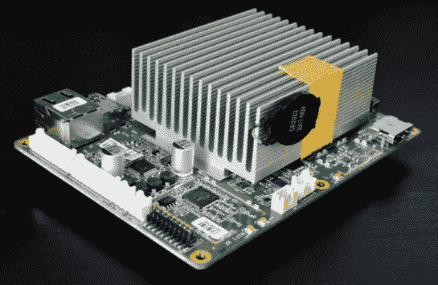
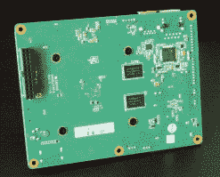
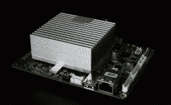
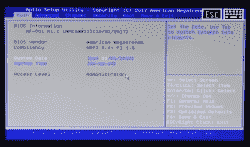
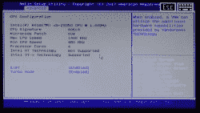
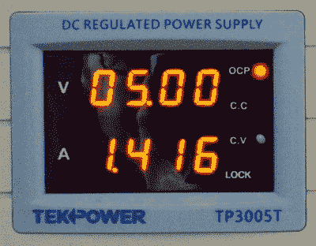

# 原子圆周率:值得吗？

> 原文：<https://hackaday.com/2019/06/06/the-atomic-pi-is-it-worth-it/>

几个月前，来自“Team IoT”的一个奇怪的 Kickstarter 项目出现了，它似乎好得令人难以置信。原子 Pi 被宣传为树莓 Pi 的高功率替代品，其规格令人惊叹。三十五美元，你就能买到一台配有英特尔处理器的单板电脑。你可以得到 16g 的 eMMC 闪存，对于一个基本的 Linux 系统，甚至是一个精简版的 Windows 10 来说都绰绰有余。你有无线网络，你有蓝牙，你有一个实时时钟，这些都是许多其他单板计算机所忘记的。最精彩的部分？它仅仅是三十五美元。

自然，人们失去了理智。树莓派有许多挑战者，但迄今为止，没有什么能在价格和性能上击败派。原子 Pi 会是最终让剑桥的人们屈服的单板计算机吗？这是那台将彻底改变 STEM 教育、登上邮票、销售数千万台的计算机吗？

不。答案是否定的。虽然我不被允许把原子圆周率称为“字面垃圾”，因为我们的编辑坚持认为它是“多余的”，因为它们是在扔进垃圾桶之前购买的，但不会有围绕这台 35 美元的单板计算机建立的社区。这是一块将被载入史册的电子垃圾，就在 Ouya 控制台旁边。不会有新的原子 pi，我非常怀疑会有任何软件更新。来把你的钱扔在硅、玻璃纤维和金属碎屑上吧！或者也许你用得上这东西。遇见原子圆周率！

### x86？在我的单板电脑生态里？比你想象的更有可能。

乍一看，Atomic Pi 并不像您通常使用的单板计算机。没有电源插孔或 USB 端口，这是我们所有小电子产品都有的东西。看起来 Atomic Pi 只是一个用于更大产品的模块。有这么多 JST 连接器，您可能会认为这是为更大的产品定制的模块。可能与汽车技术无关，但至少是某种物联网家居产品。甚至可能是机器人榨汁机。

推测是一回事，证明是另一回事。这里是原子 Pi 的 FCC 文档。这个东西最初是为 2017 年 1 月在 CES 上推出的 [Kuri 机器人](https://www.heykuri.com/explore-kuri/)设计的。这个机器人最初价值 700 美元，被描述为“有轮子和眼睛的亚马逊回声”。

亚马逊将在明年左右发布他们自己的“绑在 Roomba 上的回声管道”，而 Kuri 机器人则提前了。Kuri 的制造商梅菲尔德机器人公司[暂停了运营](https://www.heykuri.com/blog/important_difficult_announcement/)。但是他们仍然有一些硬件，特别是一些装载了 x86 芯片的高级单板计算机。[这些模块被放到拍卖台上](https://industrialbid.com/m/lot-details/index/catalog/1604/lot/285153/2003---High-Speed-PCBAs?uact=5&aid=1604&lid=285152&current_page=0)，IoT 团队将它们抢购一空，组装成一个 Kickstarter。这是原子圆周率。它是工业剩余产品，被重新包装成一种新颖的设备，面向用单板计算机“做事”的人销售。什么样的事情？我不知道。仿真器？家庭自动化？魔镜？

只有大约 28，000 个原子 pi 会被产生。它们已经生产出来了，现在那些还没有发货的正放在仓库里，准备用最新的操作系统刷新。Atomic Pi 谎称他们已经“建造”了几千个单位。这是不正确的，唯一进入原子 Pi 的工程是电源适配器和分线板。

Atomic Pi 背后的人正在开发 Atomic Pi 2，或者类似的东西，虽然细节很少，但我们知道这将远远超过 35 美元。与此同时，我们有一些不成功产品的剩余部分。再一次，不到三万个原子 pi 将会被生产出来，这是 Ouya 游戏机生产数量的一小部分。[树莓 Pi 第一天就卖了 10 万](https://www.zdnet.com/article/we-thought-wed-sell-1000-the-inside-story-of-the-raspberry-pi/)，我都好久没见过一个 26 针头的老 Pi 了，还带真 RCA 插孔。

我可以很容易地说，这是硅谷的理想，将文字垃圾重新包装，并作为突破性的颠覆进行销售，但我不会为《T2》杂志或《T4 大西洋》杂志撰稿。不，原子圆周率是当你试图通过买东西来填补存在的空虚时得到的。Atomic Pi 满足了那些认为安装 Kali Linux 的能力是一种个性的人的市场需求。

      

### 评论

Atomic Pi 采用英特尔凌动 x5-Z8350，这是一款专为 Windows 平板电脑设计的四核 SoC。这是一款三年前的芯片，主频 1.44 GHz(基本，最高 1.92 GHz)，内存 2 GB。有一个支持 DirectX 11.2 的 GPU，总的来说，你看到的是一个在 2010 年可以用于桌面的系统，在 2015 年足以用于 Outlook 和 Word，在 2020 年可以运行模拟器的系统。换句话说，如果你把它放在台式电脑的环境中，你会得到一些播放辐射 3 的东西。也许是堡垒之夜。GPU (Cherry Trail)受 Linux 支持，支持 OpenGL 和视频解码。我们这里处理的不是一个蹩脚的 Mali GPU 这个真的有用。

The boot screen

Bios CPU info

Atomic Pi 不是作为一个带有巨大散热器的台式电脑的小砖块出售的。这是一台单板计算机，任何评论都必须将其置于作为单板计算机的背景下。这意味着它必须有一些 GPIO 引脚，或者某种方式从命令行闪烁 LED。这里，原子 Pi 对于有限的应用已经足够:[你得到六个 GPIOs 和两个 UART](https://www.digital-loggers.com/ap26pin.pdf)。板上还有一些额外的 GPIOs 和其他端口，包括 JST 连接器上的一些 USB 端口。就对附加组件、外部协处理器和其他连接性的支持而言，原子 Pi 已经足够了。永远不会有一个完整的生态系统围绕原子 Pi 的附加板构建，但当你只制造几千个东西时就会发生这种情况。

Power draw topped out right around 7 Watts. I’d suggest at least a 10 Watt / 2 Amp supply.

软件支持方面，Atomic Pi 搭载 Ubuntu 18 . 04 . 1 LTS；当你运送一台普通的装有 Linux 的单板电脑时，这就是你要做的事情——只要拿到最新的 Ubuntu LTS，然后就可以收工了。WiFi 和蓝牙在 Linux 中工作，尽管您需要天线，并且主板的 WiFi 或蓝牙 RF 部分都没有安装金属 RF 屏蔽。

真正的问题:原子 Pi 做 Windows 吗？是的，但是 Windows 10 在 16 GB 的 eMMC 上很吃紧。要做任何有用的事情，你需要从 SD 卡安装，随之而来的是从 SD 卡运行操作系统的问题，我们在所有单板计算机中都可以看到。

最后，大问题。每个人都想回答的问题。原子 Pi 做仿真吗？没关系:谷歌分析数据告诉我，你可能是在台式机或笔记本电脑上阅读这篇文章，而不是在移动设备上。因此，您可以使用一台更强大的计算机，能够模拟 N64 和 Playstation 游戏。不要担心原子 Pi 上的仿真。根据社区的说法，[仿真对于 Atomic Pi 和 Raspberry Pi 来说都是一种浪费。](https://hackaday.com/2019/05/08/this-atomic-pi-eats-other-pis-for-lunch/#comment-6147829)

### 原子 Pi:该不该打扰？

不，你不必麻烦了。你只是浪费了宝贵的时间来阅读这篇评论。很抱歉。

对原子 Pi 的任何回顾或考虑都必须考虑到，它最终将在单板计算机历史的脚注中被顺便提及。如果没有超过三万块这样的板子，就没有未来可言。这不一定是一件坏事，因为许多令人印象深刻的建筑都是从在路边发现一些丢弃的设备开始的，这些设备被扔进了垃圾桶。但是单板电脑最终是由其生态系统定义的。有了固定的生产限制，就不会有社区。没有社群，就没有未来。

如果你想要一个玩具，当然，拿一个原子 Pi。[下面是链接](https://dlidirect.com/products/atomic-pi)。如果缺货，可能会有更多。但是原子 Pi 提供的卖点——便宜的 x86 机器，带 HDMI，可以运行 Windows——被更好的机器满足了。[看看 AcePC T11](https://www.iacepc.com/acepc-t11-silver/) 。这是一台 x86 机器，它使用与 Atomic Pi 相同的芯片组，具有两倍的 RAM 容量、更多的 eMMC，并支持 SATA 驱动器。它只需 130 美元，就能为你提供电源、多个 USB 端口、WiFi 和蓝牙天线，以及一个外壳。你还会得到一个电源。我提到过 AcePC 11 包括电源吗？

或者，如果你想在一个便携的外形中使用相同的英特尔芯片， [AcePC T5](https://www.iacepc.com/acepc-t5/) 可以直接插入 HDMI 端口。它使用与 Atomic Pi 相同的 Cherry Trail CPU，并配有 WiFi 和蓝牙天线。AcePC T5 还配有电源，价格仅为 100 美元。

单板计算机市场的价格参考已经由树莓 Pi 设定，这意味着 35 美元。现在，我可以花 37 美元 78 美分买一台 Pi 3 型号 B+,亚马逊一天免费送货。树莓派的任何竞争对手都必须在价格或性能上击败它。奥兰治派及其同类在价格上竞争。原子圆周率在性能上肯定胜过圆周率，在价格上也与之相当。然而，这是一种虚假的经济，因为原子π是一次性的工业盈余。如果那是你的事情，并且你需要一个便宜的 x86 系统，那就去做吧。但是有更好的选择，如果你把你的时间看得为零，你只会通过虚构你自己的电源来省钱。