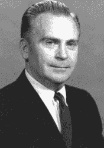

# 雨刷的来回和专利诉讼

> 原文：<https://hackaday.com/2020/04/23/the-back-and-forth-of-windshield-wipers-and-patent-lawsuits/>

我们当中有谁没有梦想过有一些头脑风暴的想法，将其原型化，然后让一些大公司将其投入全球生产？问题是，在大多数情况下，这并不像听起来那么简单。以罗伯特·卡恩斯为例。没听说过他？你经常使用他的一项专利的成果；卡恩斯发明了间歇式雨刷。

如果他把专利卖给一家大型汽车制造商，这将是一篇短文。不是说他没试过。但是事情进行得并不顺利，虽然最后他赢了，但这是一场代价很高的胜利。

## "太棒了，你应该申请专利！"

 早期的雨刷有两种设置:开和关。如果雨不是很大，你必须打开雨刷，然后关闭，几秒钟后再打开。这些小烦恼之一，但仍然是一个烦恼。

如果你开过本世纪制造的汽车，你就会知道间歇式雨刷是如何工作的。你扳动开关，雨刮片就会掠过。然后，它会等待很长时间(通常是可选的很长时间)，然后再次扫描。当你被洒了一点点的时候，这是一张票。这是一项足以申请专利的坚实发明吗？

专利法是个奇怪的东西。一项发明必须是非显而易见的。你可能会说，雨刷暂停一点应该是非常明显的，但有几项专利就是针对这个东西的。1923 年，[雷蒙德·安德森获得了一项机电设计的专利](https://patents.google.com/patent/US1588399A/en)。他还提到，其他人已经使用螺线管制造了间歇式雨刷，但它们噪音很大。所以这个想法必须早于 1923 年的申请。像许多东西一样，在晶体管出现之前，这不是一个非常实际的想法。英国汽车制造商的工程师 J. C. Amos [在 1961 年获得了固态间歇雨刷控制电路的专利](https://patents.google.com/patent/US3262042A/en)。

三年后的 1964 年，卡恩斯为他的设计申请了专利。我们不是专利律师，但似乎人们已经想到了这个想法，使用晶体管和 RC 网络来实现这个目标可能并不新奇。然而，不管你怎么看理由，卡恩斯得到了他的专利。我们的发明家创造灰姑娘的故事已经进行到一半了，对吧？

## **受眼睑启发的雨刷** 

卡恩斯说，他想到雨刷是因为十年前他度蜜月时发生的一件事。一个香槟软木塞击中了他的左眼，导致他失明。在小雨中开车时，他发现雨刮片分散了他已经受损的视力。他思考了人类的眼睑是如何在固定的周期上不眨眼的，并决定尝试制作一个原型。

 他在地下室建了一个实验室，用垃圾场的一块挡风玻璃做试验。1963 年，他在一辆福特 Galaxie 敞篷车上安装了原型车。他开着那辆车去参加福特公司高管的会议。

福特似乎很感兴趣，但没有做出任何承诺。不过，他们确实邀请他回来参加第二次会议。那次会议是和工程师们一起开的，他们问了很多问题。他们显然在为即将到来的水星号开发自己的系统。他们继续会面了两年，但福特从未向他提供商业交易。到 1965 年，福特不再打电话。我相信你能看出这是怎么回事。1969 年，福特开始提供电子间歇雨刷。

1976 年，卡恩斯的儿子丹尼斯从一辆梅赛德斯-奔驰上拆卸了一个雨刷控制箱。里面的电路是他父亲专利中电路的精确复制品。卡恩斯开始研究福特、通用、大众和其他公司的专利申请。他们都只是复制了他设计的关键元素。

## 法律战

卡恩斯于 1977 年对几家汽车制造商提起诉讼。虽然他得到了一些法律帮助，但大部分时间他都是自己当律师。这让他付出了代价，因为显然有几个案子因为技术问题被驳回了，而这是一个有经验的律师会处理的(例如，错过了提交文件的最后期限)。耗时 13 年，但福特最终以 1020 万美元和解。1992 年，克莱斯勒损失了 3000 万美元，但上诉和试图去最高法院意味着他直到很久以后才真正看到这笔钱。

成本很高。卡恩斯花了很多钱追查这些案子。他精神崩溃了，长期的婚姻也破裂了。虽然 1000 万美元听起来很多——经通货膨胀调整后，1990 年的价值接近 2000 万美元——但实际损失可能会更严重。1990 年，福特生产了 1680 万辆带有雨刷的汽车。卡恩斯一直寻求每项侵权赔偿 50 美元，这将超过 8 亿美元。

汽车制造商确实以一种方式等待卡恩斯出局。案件解决时，专利已经过期，这意味着他只在专利期限内获得损害赔偿。

## 惨胜？

这里有很多要考虑的。虽然专利是一件伟大的事情，但它只是帮助了卡恩斯，因为他准备好了与那些资金比他雄厚得多的公司进行长达十年的斗争。我们不确定原始专利是否非常新颖和非显而易见，但法院支持它们，所以这才是最重要的。

这似乎也不是一个孤立的事件。1983 年《华盛顿邮报》的文章中提到的一个早期案例[显示，福特侵犯了一项动力转向泵专利，必须为 650 万台泵支付 10 美分的专利使用费。最近有关于混合动力系统](https://www.washingtonpost.com/archive/business/1983/01/17/inventor-fights-for-patent-decision/bc24ec8f-6e9b-46ce-b727-8a8b4e548e9a/)(已解决)、转向灯和[麻省理工学院开发的排放系统](https://www.alston.com/en/insights/news/2020/02/ford-motor-wins-patent-infringement-case/)(他们赢了)的[诉讼。福特从一开始就卷入了专利诉讼。1903 年，乔治·塞尔登就他 1895 年的塞尔登公路发动机专利起诉福特和其他四家汽车制造商。塞尔登赢了，但后来上诉失败。](https://www.zdnet.com/article/toyota-ford-settle-lawsuits-over-hybrid-electric-car-patents/)

专利的话题当然是一个混乱的话题。许多人认为它们是对发明者突破的保护。但是你会看到福特有时会申请挡风玻璃形状的专利——可能是为了防止第三方进行替换。当然，不仅仅是福特。专利已经成为一种竞争激烈的商业工具。无论对错，你最好有足够的钱来捍卫你的专利。

卡恩斯于 2005 年去世，他是 2008 年电影《天才闪现》 的主角，格雷戈·金尼尔在其中扮演发明家。在他的一生中，为了保护他的专利，他提起了[好几起诉讼](http://www.inventored.org/inventors/Kearns/lawsuits.html)。