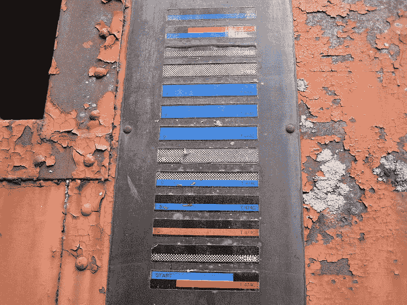
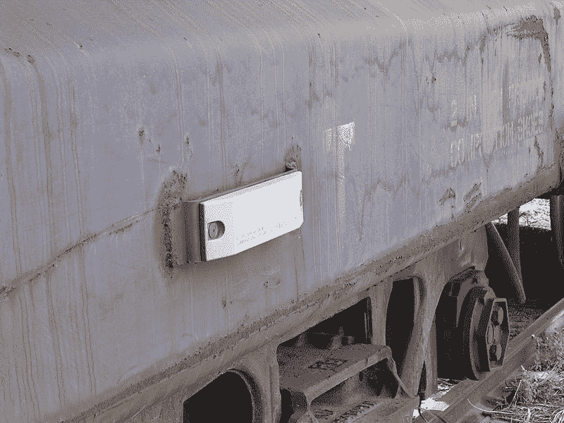
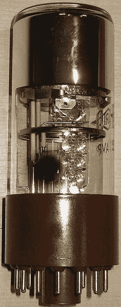
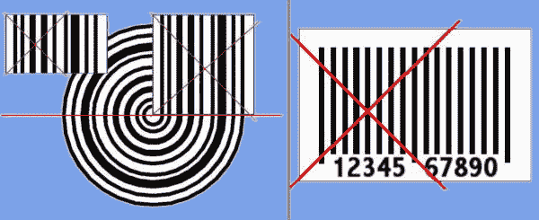
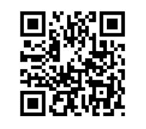

# 条形码革命:欢迎来到我们的自动化世界

> 原文：<https://hackaday.com/2020/01/08/the-barcode-revolution-welcome-to-our-automated-world/>

在许多科幻小说中，条形码被描述为一种更快、更有效的记录和传输信息的方式，如今，条形码不仅极其普遍，而且许多人对它的了解仍然少得惊人。最初设计的目的是通过允许计算机系统扫描带有其所标记物品信息的代码来提高自动化程度，它作为信息载体的潜力正变得越来越受欢迎。

如果没有条形码的标记能力(以及它们的近亲:RFID 标签)，今天的大部分现代世界将会陷入停顿。邮件和包裹的自动分拣和交付系统、整个库存管理系统、全球关键航空电子设备和火箭部件的跟踪，以及超市中看似平常但广泛使用的快速结账，都依赖于各种条形码。

和我一起踏上卑微条形码的过去、现在和未来之旅。

## 去除人为因素

KarTrak barcode on the side of a rail car.

早在 20 世纪 30 年代，西屋电气公司的约翰·科莫德、道格拉斯·杨和哈里·斯帕克被列为自动卡片分类系统的发明者。这个系统使用了许多印在纸上的条码，这些条码将被光电电池读取，进而触发卡片(对账单、发票等)。)通过特定的活板门落下，将物品分类到适当的箱子中。

该系统的目标是加快日常任务的速度，减少人类跟踪轨道车、邮车和 20 世纪开始横跨美国的不断增长的物流网络中的其他元素的负担，[自动设备识别](https://en.wikipedia.org/wiki/Automatic_equipment_identification) (AEI)系统，如 [KarTrak](https://en.wikipedia.org/wiki/KarTrak) 被开发出来。该系统旨在让美国铁路跟踪其铁路车辆。

一块有 13 个不同尺寸和颜色的水平标签的板被安装在汽车的两侧，轨道侧扫描仪将记录图案并记录它所附着的汽车。

Modern AEI tag on rail car.

不幸的是，KarTrak 的条形码标签在实际使用中被证明太不可靠，灰尘积累和标签损坏是该系统最终在 20 世纪 70 年代末被淘汰的主要原因。这些天来，基于 RFID 的 AEI 系统被用来代替，这是免疫这样的问题。诸如此类的案例证明，条形码的主要限制永远是可见性，就像纸质条形码可能会被损坏、撕掉或撕掉一样。

然而，在生产环境、仓库和零售店中，这种限制并不是一个很大的问题，在这些地方，它们最常用来代替 RFID 标签。

## 扫描后装袋

早在 20 世纪 40 年代，人们就试图发明一种系统，使杂货店的部分结帐过程自动化，特别是查找和计算价格。1948 年，研究生[伯纳德·西尔弗](https://en.wikipedia.org/wiki/Bernard_Silver)无意中听到当地食品博览会食品连锁店的总裁要求其中一位院长开发一个系统，在结账时自动读取产品信息。

A photomultiplier tube (PMT).

西尔弗会把这件事告诉他的朋友诺曼·伍德兰德，然后他们一起着手开发这样一个系统。在最初的紫外线墨水尝试失败后，西尔弗将使用莫尔斯电码背后的基本概念来创建线条，本质上是向下延伸点和破折号。借鉴电影业的经验，他选择使用一个[光电倍增管](https://en.wikipedia.org/wiki/Photomultiplier_tube)和一个 500 瓦的白炽灯泡来读取条形码。

在他们 1949 年的专利申请中，他们描述了这种线性条形码，以及“靶心”版本，Silver 认为这种版本更有效，更容易阅读。当 Woodland 在 1951 年转到 IBM 时，他试图引起 IBM 对该系统的兴趣。尽管他在这方面取得了成功，但人们得出的结论是，当时还不具备实现这一目标所必需的技术。

直到 20 世纪 60 年代，这个话题才再次被提起，位于北卡罗来纳州三角研究公园的 IBM 指派[乔治·劳雷尔](https://en.wikipedia.org/wiki/George_Laurer)(他在 2019 年 12 月初不幸去世)领导团队，该团队后来创建了现在被称为 UPC-A 条形码的东西。这个团队由威廉·克劳斯(Delta C 条形码的发明者)、赫德·鲍梅斯特(计算每种条形码可实现的字符数)、诺曼·伍德兰德(仍在 IBM 工作)和项目接近尾声的数学家大卫·萨维尔组成。

Reading patterns for the bulls-eye, Delta A, B and C barcodes.

在项目接近尾声时，团队解散，导致开发工作中出现一些小故障。Laurer 在没有应用鲍梅斯特方程的情况下对 Delta C 条形码进行了一些修改——使得读取错误率飙升——但是 [GS1](https://en.wikipedia.org/wiki/GS1) 零售组织最终接受了 IBM 提出的这种 Delta C 条形码作为 UPC-A [通用产品代码](https://en.wikipedia.org/wiki/Universal_Product_Code)条形码，这种条形码几乎没有改变，一直延续到今天。

该系统最显著的变化是 UPC-A 的[内部商品编号](https://en.wikipedia.org/wiki/International_Article_Number_(EAN)) (EAN)超集。EAN 在编号的开头添加了一个额外的数字，将唯一值的理论数量扩展到一万亿，表明销售该产品的公司所在的国家(使用 GS1 国家代码)。如今，零售中使用的所有条形码基本上都是 EAN-13 型的。

## 进入矩阵

A simple QR code.

尽管这些类型的一维条形码过去和现在都非常有用，但人们意识到，通过增加第二维度，可以扩大标签中包含的信息量。在改进扫描仪和更便宜的 CMOS 和 CCD 图像传感器的帮助下，像 QR 码这样的矩阵条形码被开发出来。QR(“快速响应”)码是由日本公司 [Denso Wave](https://en.wikipedia.org/wiki/Denso#Denso_Wave) 早在 1994 年( [25 年前](https://www.denso-wave.eu/en/about-us/25-years-qr-code.html))开发的，用于汽车行业。

这种类型的条形码旨在包含制造过程中跟踪车辆所需的信息，允许使用单帧图像数据进行快速扫描。通过在矩阵条形码的角上设置位置标记，可以很容易地确定何时有足够完整的图像来解析它。

如今，智能手机用户可以在任何需要快速获取某种信息的地方使用二维码，而无需手动复制字符串，包括 URL、WiFi 网络登录凭据或任意数据字符串。扫描 1D 和 2D 条形码的能力是这种智能手机的标准功能，因为不需要额外的硬件，这要归功于微型相机技术，这在 20 世纪 70 年代是可望而不可及的。

A number of Data Matrix barcodes on a WiFi card.

二维码显然不是矩阵条码的唯一类型。电子元件通常标有[数据矩阵](https://en.wikipedia.org/wiki/Data_Matrix)条形码。这种类型的矩阵条形码允许非常小的标签，即使在光线不好的情况下也是可读的。这对于跟踪小组件非常有用。

这种类型的条形码通常出现在电子元件、库存标签、食品标签上。根据矩阵中单元的数量，它可以存储从几个字节到 1，556 个字节的数据。这类似于 QR 码，其可以是具有相应物理尺寸的微小标签(例如 21×21 矩阵)或大标签(例如 177×177 矩阵)。

从 WiFi 卡图像上可以看出，所选条形码的大小取决于要编码的信息量。不仅可以缩放条形码本身，可以编码的最大数据量也取决于矩阵的大小，必须考虑填充、方向标记和纠错的开销。

正如任何试图扫描模糊、损坏或极其微小的二维码的人可能会证明的那样，获得可靠的扫描结果需要你记住所有这些因素。如果一个高科技的矩阵条形码不能再显示它所包含的数据，那么它还有什么用呢？

## 欢迎来到未来

尽管在 20 世纪 90 年代之前，可靠的条形码扫描并不容易，但今天的技术已经可以将功能强大的 1D 和 2D 条形码扫描仪放入每个人的口袋。新技术已经在创造第一个 [3D 条形码](https://www.bradford.ac.uk/news/archive/2015/fighting-fakes-with-the-first-integral-3d-barcode.php)方面取得了一些进展，这将在材料上制造分辨率为 0.4 微米的印记，用干涉仪装置读取。这种复杂性可以用来打击假药之类的东西。

A Bokode tag taken in- and out of focus.

正如我们在 2015 年和 2018 年再次在[注意到的那样，1D 和 2D 条形码的数量确实呈爆炸式增长，当时 JAB(只是另一种条形码)加入了彩色而不是黑白标记的行列，以增加每个点的数据深度。然而，很少有人像](https://hackaday.com/2018/11/22/bar-code-adds-a-third-dimension/) [Bokode tag](https://en.wikipedia.org/wiki/Bokode) 那样令人疯狂敬畏，它借助先进的光学技术将“微型”提升到了一个全新的水平。Bokodes 也可以供电和重写，同时在 4 米范围内可读。

仅“条形码”的维基百科页面就列出了大约 100 种 1D 和 2D 的条形码类型，而且许多新的条形码正在开发中，看来我们可能会看到一个科幻的未来，条形码比人类可读的文本更常见。也就是说，直到我们最终为我们的机器人眼睛升级了条形码阅读器。