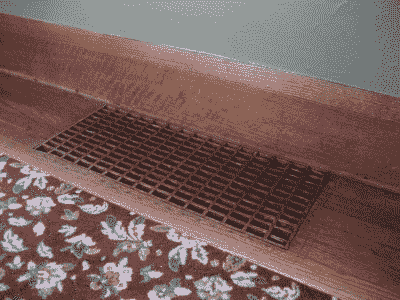
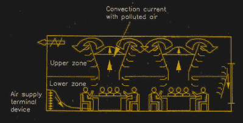

# 置换通风的好处

> 原文：<https://hackaday.com/2022/07/07/the-benefits-of-displacement-ventilation/>

一种呼吸道病毒疫情彻底撼动了世界。人类已经从工具箱中搜罗了战斗中所有可能的武器，无论是口罩、疫苗还是先进的抗病毒治疗。

就过去两年来应对新冠肺炎的医学进展而言，最终的解决方案将是首先减少接触病原体的人数。改善我们的通风方法可能是减少传播的一个好方法。毕竟，西班牙流感爆发后，他们就是这么做的。

## 向上，向上，离开

The trick to displacement ventilation is supplying air at ground level at low velocity. Buoyancy forces it to the top of the room where it can be extracted. This creates a one-way flow in the space that carries nasty stuff up and away. [“Floor Vent”](https://www.flickr.com/photos/36561624@N00/318828457) by Daniel Morrison

当我们大多数人想到供暖、通风和空调或 HVAC 时，我们的思绪可能会飘到管道供暖和制冷系统以及天花板上的典型通风口。无论是在家里、办公室还是零售场所，这都是现代建筑中最典型的通风方式之一。

一些系统以再循环的方式运行，而另一些系统从外面引入额外的新鲜空气。无论哪种方式，他们基本上都是把空调空气喷到房间的顶部。它们依靠空气的速度来混合整个空间的调节空气。

这被称为“混合通风”,因为它在给定的空间内以相对均匀的空气混合物结束。当处理致命的空气传播病原体时，这种方法的问题是显而易见的。这是一个很好的方法来确保病毒颗粒在房间里均匀分布，在那里它们可以感染许多人。

 [置换通风的工作原理与众不同](https://www.aivc.org/sites/default/files/airbase_3528.pdf)，利用了暖空气的浮力。当以这种方式通风时，低速空气被送入空间的较低位置。然后，这些空气从空间的居住者、照明等处吸收热量，然后逐渐上升到天花板处。

空气可以是冷却的或者仅仅是环境温度的新鲜空气，或者该系统可以用于输送用于加热空间的热空气。在后一种情况下，它可能不是最有效的加热方法，因为热空气一进入空间就迅速上升。然而，它仍然有效，并保持了从底部到顶部的空间通风的基本原理。

这种方法对人类居住的空间有很大的好处。从地面到天花板产生的气流有助于带走大气中的不良元素，立即将它们从占用区域中移除。相比之下，混合空气系统往往会在一个房间里搅动所有这些东西，使它们均匀分布。所有的有害物质，从病毒颗粒到二氧化碳，都被吸了出来。所有需要做的是在较低的水平提供新鲜(和理想的过滤空气),房间通风良好，空气健康。[研究表明](https://blog.priceindustries.com/how-does-displacement-ventilation-work)置换通风可以将教室中的二氧化碳水平降低 17-27%，对健康和认知有潜在的有益影响。

这实际上不是一个新的想法。置换通风由来已久。这种系统在 1927 年西班牙流感疫情爆发后，在加拿大温哥华的奥芬剧院(Orpheum Theatre)得到了很好的实施。新鲜空气从外面进入，通过喷水系统去除灰尘和污染物。然后根据需要加热，并通过座位下的蘑菇状通风口输送到剧院。输送的空气会上升穿过空间，通过多孔天花板上的各种开口排出。这显然是一种在演出期间从剧院中消除香烟烟雾的好方法，并且对二氧化碳水平和病原体传播也有好处。

置换通风并不常见，尤其是在住宅应用中。那些不在暖通空调领域工作的人可能连听都没听过。然而，从卡内基音乐厅到挪威理工学院的演讲厅，所有的建筑都依赖于这种通风方式。

然而，所涉及的基本设备和原理很简单。任何合格的暖通空调技术人员都可以将这些原则应用于给定的空间。实施起来很简单，而且成本也不高。对于希望减少病原体传播的空间来说，收获是有好处的！

[横幅照片:"[温哥华奥芬剧院舞台景观](https://en.wikipedia.org/wiki/Orpheum_(Vancouver)#/media/File:Orpheum_Theatre_Vancouver_View_Of_Stage.jpg)"，迈克尔·索恩拍摄]