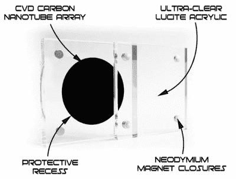

# 最黑的黑色，现在在方便的口袋大小

> 原文：<https://hackaday.com/2019/02/08/the-blackest-black-now-in-handy-pocket-size/>

如果你认为“碳纳米管”只是一些不久的将来用于太空电梯的不可获得的元素，不要担心，你肯定不是唯一一个。事实上，虽然这项技术还有很长的路要走，但碳纳米管的产量已经超过了每年几千吨，而且今天你可以买到使用这种绝对超前的神奇材料的产品。现在你甚至可以把它放在口袋里。

 由英国设计师【西蒙】创造，这个小小的碳纳米管阵列被描述为“一个模拟的黑洞”，因为表面吸收了 99.9%的撞击它的可见光。在透明丙烯酸外壳的保护下，这种材料的样品形成了一个黑色的圆圈，给人一种你正在向外太空看的感觉。不幸的是，在正在进行的 Kickstarter 活动中，任何级别的支持都不包括时间膨胀的重力；但考虑到它在短短几个小时内就获得了 100%的资金，似乎大多数人都接受了这种交易。

[西蒙]很清楚创造“最黑的黑”的不同方法之间正在进行的战争，他认为他把自己的钱(推而广之，他的支持者的钱)押在了赢家身上。奇点正在使用与独家授权的 Vantablack 类似的技术，[而不是像“黑色 3.0”](https://hackaday.com/2019/01/31/this-is-a-kickstarter-for-none-more-black/)那样的超深色涂料。事实上，他非常有信心，奇点将会比黑色 3.0 更暗，以至于他提到目前正在进行面对面的比较。

如果奇点中使用的碳纳米管阵列有一个缺点，那就是你实际上无法触摸它。[Simon]警告说，虽然丙烯酸外壳只能用磁铁固定在一起，可以打开进行更仔细的检查，但实际上绝对不建议触摸表面。他说，即使灰尘进入材料，也会对其吸收光线的能力产生不利影响，所以你应该尽可能地把它扣好。

虽然奇点看起来是一种体验近乎完美的黑暗的有趣方式，但这个概念本身远非新奇。一种基本上能吸收所有入射光的材料有重要的科学、军事，当然还有艺术应用；因此，弄清楚如何实现这一目标已经成为一件大事。