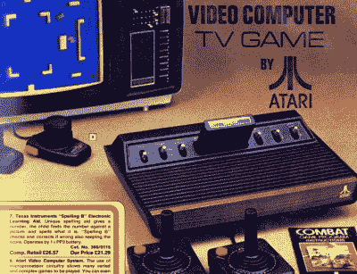

# 梦之书带回了你所有的记忆

> 原文：<https://hackaday.com/2019/11/16/the-book-of-dreams-brings-back-all-your-memories/>

英国社交媒体复古的一面在过去的几天里被目录零售商 Argos 的一个非常简洁的营销方式所热议:他们从 1975 年开始将所有的目录数字化并放到网上。虽然这包含了四十多年来的风格、时尚和昙花一现的横截面，但它也让浏览器从当代的角度，而不是通过 2019 年的玫瑰色眼镜，迷人地看待一系列复古技术。它可能不是黑客，但我们保证你会花一段时间浏览它！

正如你所料，1975 年版没有任何电脑，因为 Altair 8800 可能不是为英国零售市场设计的。当我们看到[打字机](http://argosbookofdreams.co.uk/1974-75.html#page=132)时，有一种旧时代即将崩溃的感觉，尽管少数[计算器](http://argosbookofdreams.co.uk/1974-75.html#page=136)确实暗示了未来会发生什么，即使它们确实包括计算尺和几个奥利韦蒂机械模型。即使是电子数字手表也太新奇了，还不足以装点这些页面。娱乐完全是模拟的，有大量的黑胶唱片和磁带，加上[我们前阵子在](http://argosbookofdreams.co.uk/1974-75.html#page=178)上拆过的那个 8 轨播放器。

It’s difficult to explain in 2019 how mind-blowing seeing one of these for the first time was.

到了 1977 年，变化并不大，因为在很大程度上，我们仍处于 20 世纪 70 年代英国的模拟世界中，但有一些迹象表明未来会发生什么。电视游戏已经出现，虽然只是作为单游戏*乒乓*风格的游戏机，而不是我们所认为的游戏机。那要等到 1979 年，[Atari 2600 出现在玩具区，而不是电视机旁边。1980 年，米尔顿·布拉德利的 BigTrak](http://argosbookofdreams.co.uk/1979-80.html#page=34)[和 1981 年的 Mattel intelli vision](http://argosbookofdreams.co.uk/1980-81.html#page=220)加入了他们的行列。

令人惊讶的是，1982 年并不完全是关于 Sinclair ZX81 和 ZX 光谱，而是我们看到了第一台带键盘的计算机，这可能是一个你从未听说过的名字。飞利浦 G7000 是 Magnavox Odyssey 的欧洲名字，在 Argos 拥有它的时候，它已经有四年历史了。如果这是出乎意料的，那么它可能与 20 世纪 80 年代早期家用电脑的销售方式有关，更传统的零售商店如 WH·史密斯报摊与制造商有独家交易，并将它们作为教育工具卖给父母，而不是作为玩具卖给孩子。当我们在 1982 年时，值得注意的是[CB 收音机的短暂出现](http://argosbookofdreams.co.uk/1982-83.html#page=231)，因为 CB 的繁荣正处于明确的下坡路。

在 1983 年，家用电脑猫已经完全不存在了。美泰、准将和[德州仪器](http://argosbookofdreams.co.uk/1983-84.html#page=235)都和早期的控制台在一起，这些控制台在 1984 年随着 [ZX 光谱和雅达利 600](http://argosbookofdreams.co.uk/1984-85.html#page=237) 加入阵容而消失。我们与近十年前的第一份目录相去甚远，这个世界再也不会是原来的样子了。接下来的几年将带我们回顾家用电脑和游戏机的历史，翻开任何目录，你都会发现它们与 VHS 录像机和永恒的 Beau breadbins 放在一起。

浏览这个档案将为许多读者提供一个机会，再次审视他们年轻时拥有的或希望他们年轻时拥有的技术。作为一名作家，这是一次特别有趣的旅程，不仅是通过曾经渴望的产品，而且是那些十年前被一个十几岁的硬件黑客送来修理或拆卸的产品。这花了一个小时浏览网页来编译，如果它们也占用了你类似的时间，不要责怪我们！