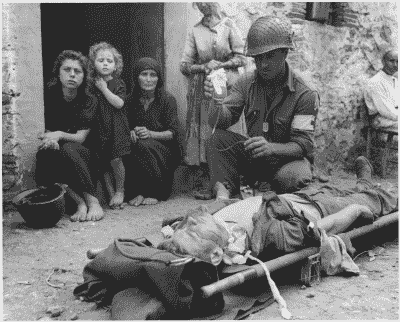
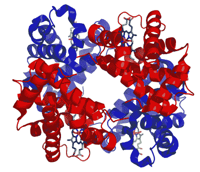

# 寻找人类血液替代品的挑战

> 原文：<https://hackaday.com/2021/12/09/the-challenges-of-finding-a-substitute-for-human-blood/>

纵观历史，人体一直是无休止的审查和奇迹的主题。许多人对体内所有这些器官和液体的功能感到困惑。这包括血液的目的，它认为自己交替地被忽视，仅仅是为了“冷却身体”，负责调节身体的体液，导致放血和其他有问题的补救措施的做法。然而，随着医学的进步，我们有了完全不同的观点。

简而言之，我们的循环系统和其中的血液，是让我们大型多细胞有机体存在的原因。它将氧气和营养物质运送到细胞中，同时能够清除废物，并为组成我们免疫系统的细胞提供一条简单的路径。我们的血液和与之相关的组织对健康生存至关重要。当我们谈到涉及严重失血的受伤和手术时，这一点变得非常明显。

虽然从捐献的血液中输血的做法已经在这里产生了巨大的变化，但保持每一种类型的血液储备并不总是容易的，尤其是在偏远的医院、救护车上或在战区中。在这里，人造血的使用——没有复杂的储存要求和平衡血型的需要——可能是革命性的，可以拯救无数的生命，包括那些其宗教禁止输入人类血液的人。

尽管在这一领域已经取得了很多进展，但实际产品的数量有限，然而事实证明，找到一种替代品来满足所有需要使其通用和安全的要求是一个挑战。

## 不是任何液体

Private Roy W. Humphrey of Toledo, Ohio is being given blood plasma after he was wounded by shrapnel in Sicily on August 9th, 1943\. (Source: NARA)

虽然早在 16 世纪就有印加人在人类之间进行输血的报道，但直到 17 世纪威廉姆·哈维(1578-1657)描述了人类的循环系统和血液的特性，人类生理学这一方面的现代观点才开始形成。与此同时，输血实验主要在动物之间进行。

1665 年，医生 Richard Lower 在两只狗之间进行了一次粗制的输血，在上述过程之后，显然对任何一只动物都没有不良影响。大约在这个时候，也尝试了从动物到人的输血(异种输血),许多人类受试者没有在该过程中存活，大概是由于身体对这种外来血液的排斥。

人类之间的输血也出现了与异种输血类似的问题:虽然有时这可能有效，但其他时候受血者会受到不良影响，有些人会因此而死亡。这导致输血在 19 世纪名声不佳。直到 1901 年，卡尔·兰德斯坦纳发现了人类的三种血型(A、B、O ),对这些结果的解释才变得清晰。

当不相容的[血型](https://en.wikipedia.org/wiki/Blood_type)混合在一起时，人们可以清楚地观察到红细胞是如何凝结在一起的。在这一点上，很容易想象如果在输血过程中发生这样的反应，人体内会发生什么。这一见解导致了许多革命中的第一次，使输血像今天一样安全和普遍。

## 从母版复制

试图复制人类血液功能的明显复杂性是，我们试图在一个更大的系统(身体)内重建已经进化了数百万年的东西，这个系统依赖于它的许多方面来正常运行。即使不打算让它在体内停留超过需要的时间，直到自然血液水平恢复，也不能让它造成比它预防的更多的伤害。

在人类中，血液约占总体重的 7%。其密度在 1060 kg/m ³ 左右，与水的 1000 kg/m ³ 非常接近。一个成年人平均约有 4.5 升血液，其中约 45%为红细胞，约 54.3%为血浆，约 0.7%为白细胞。一般来说，这三种物质构成了血液的三个主要功能组。

红细胞包含结合氧气的血红蛋白，白细胞(以及抗体)构成免疫系统的主要部分，血浆包含维持细胞并允许通过[凝固](https://en.wikipedia.org/wiki/Coagulation)修复损伤的营养物质、电解质和凝血因子。由此我们可以推断出血液替代品需要什么:红细胞的关键功能，以及类似于血浆的载液(约 95%是水)。

虽然后者以[晶体溶液](https://nurse.plus/become-a-nurse/4-most-commonly-used-iv-fluids/)(例如盐水溶液)的形式相对简单，但替换红细胞的功能性带来了复杂性。在这里，有两种方法得到了大量的研究和(有限的)使用:基于全氟化碳和血红蛋白的氧载体(分别是 PFBOC 和 HBOC)。

## 松散地结合氧

Structure of human hemoglobin. α and β subunits are in red and blue, respectively, and the iron-containing heme groups in green. (Credit: Richard Wheeler)

具有红细胞特征的氧载体变得复杂的地方在于，这些分子不仅应该与氧结合，还应该容易地使其被身体组织利用。一个显而易见的想法是合成血红蛋白并直接利用它。问题是血红蛋白本身具有很高的氧亲和力，在血液中的半衰期很短，并且会损害肾脏。在红细胞(RBC)中，血红蛋白仅占细胞质量的 33%，其余质量用于稳定血红蛋白。

因此，使用普通血红蛋白的 HBOC 是没有用的，因为它不能给组织提供足够的氧气。为了解决这个问题，血红蛋白必须以一种仍然允许与氧结合的方式稳定，同时不抑制向组织的分布。许多公司都在努力将这种 HBOCs 推向市场，HemAssist(Baxter health care)、Hemolink (Hemosol，Inc .)和 Hemopure (Biopure Corp .)等公司要么在试验中失败，要么在进入商业销售后不久就失败了。

观察到的常见问题包括血管收缩，可能是由于血红蛋白与一氧化氮结合所致。这些 HBOCs 大多用于非人类动物，死亡率的增加导致这些产品无法通过医学试验，或在几年内退出市场。

相比之下，有一种 FDA 批准的 PFBOC: Fluosol-DA，例如， [Sutherland 等人(1984)](https://www.ahajournals.org/doi/pdf/10.1161/01.STR.15.5.829) 报告了其对猫的有效性， [Ohyanagi 等人(1984)](https://onlinelibrary.wiley.com/doi/abs/10.1111/j.1525-1594.1984.tb04238.x) 报告了 20% Fluosol-DA 输注对耶和华见证会患者的有效性。因为后一个群体的宗教信仰导致他们拒绝输血和类似的事情，这可能是[医疗保健的问题](https://www.ncbi.nlm.nih.gov/pmc/articles/PMC4260316/)。

尽管如此，Fluosol 的复杂性——患者必须呼吸纯氧环境才能给 PFBOC 分子“加载”足够的氧气——及其复杂的储存(冷冻)和处理要求导致其在 1994 年停产。

## 还没有失血过多

尽管多年来在将固体血液替代品推向市场方面遇到了许多挫折，但对这种解决方案的需求太大了，因此研究不能停止。这让我们想到了当前的发展，美国军方是这些血液替代品的买家之一。不仅适用于氧载体，还适用于合成血小板(用于凝血)和干燥血浆。

这里的主要卖点是延长保质期，消除复杂的血型匹配，减少过敏反应的可能性，等等。尽管我们已经从早期的输血走了很长一段路，但我们仍然依赖献血和处理血液的系统。虽然这是一个每年拯救无数生命的系统，但它也存在物流复杂、保质期短和血液可能被污染的缺点。

人造血的优势在于，它可以在严格控制的条件下生产任意数量的人造血。例如，PFBOCs 的一个额外优势是，它们的分子比 RBCs 小得多，这使得它们甚至可以绕过动脉中的堵塞和收缩。这将允许组织氧化，否则最终会缺氧并死亡，这可以防止坏死、截肢和其他创伤并发症。

## 科幻，直到它成为现实

尽管在过去几十年经历了如此多的挫折后，20 世纪末对血液替代品的乐观情绪似乎已经平静下来，但我们已经了解了许多事情，不仅是什么不起作用，还有什么起作用。我们还获得了许多关于人体生理学方面的重要信息，这些信息有助于增加我们对心血管系统的了解。

几百年前，人们认为羊血甚至葡萄酒或尿液会成为人血的良好替代品。今天，我们了解了血型鉴定的许多复杂性，可以处理捐献的血液，只使用红细胞、血浆或血小板，以治疗许多医学疾病，等等。随着血液替代品被简化为一个医学工程问题，我们有可能在不久的将来看到这方面的进展。