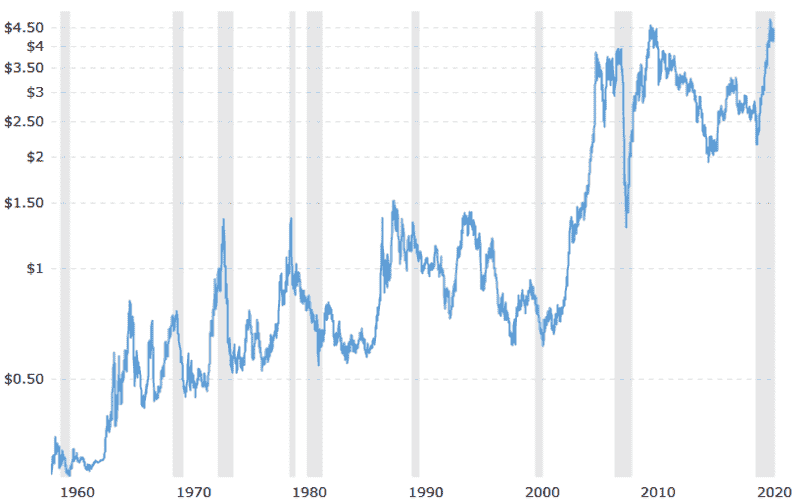
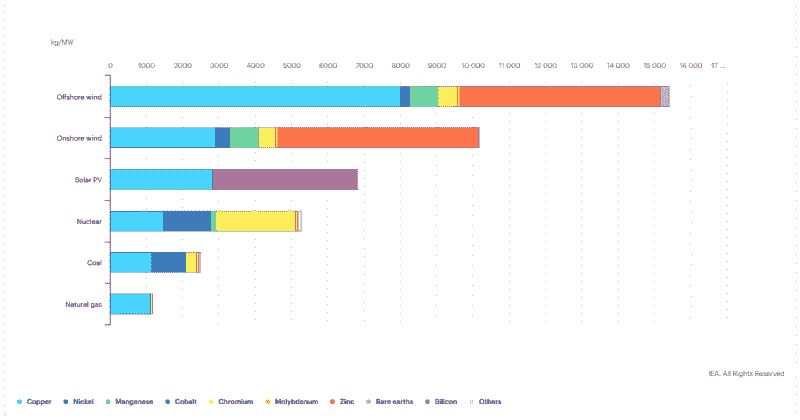
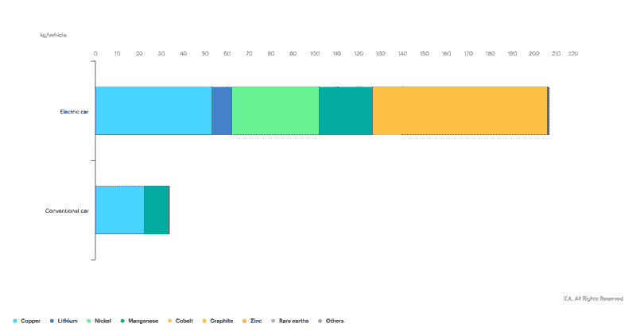
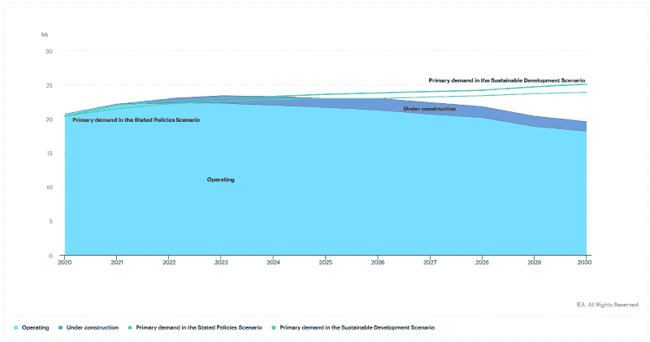
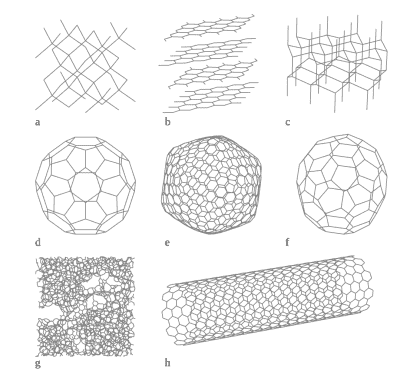

# 即将到来的铜短缺:铝还是碳纳米管可以拯救？

> 原文：<https://hackaday.com/2021/09/30/the-coming-copper-shortage-aluminum-or-carbon-nanotubes-to-the-rescue/>

在线路中使用铝不太可能让任何一个在 20 世纪 60 年代或 70 年代初不得不与铝打交道的人脸上露出笑容。火灾和其他事故背后的原因是多方面的，包括未能处理铝的较高热膨胀、氧化铝的电绝缘性质以及铝在扭曲时的普遍脆性。

然而，尽管铜在导电性和易于安装方面优于铝，但自上世纪 70 年代以来，铜价一直在飙升，即将飞向月球。很大一部分原因是由于风力涡轮机和电动汽车的大规模部署，从电子产品和电机到发电机，铜的使用越来越多。

随着世界大规模扩大电动汽车的使用和风力涡轮机的安装，预计铜需求将超过目前的铜供应。由于铝可能会因此获得巨大回报，因此有必要看看现代铝基布线，包括铜包铝和碳基替代品的使用。

## 如何让铜变贵

事后看来，铜价在 20 世纪 60 年代和 70 年代还没有那么糟糕，正如我们在下面的过去 45 年铜价图表中看到的那样:

Copper prices per pound – 45 year historical chart. (Source: Macrotrends.net)

这些价格上涨很大程度上是由对更多电动汽车和风力涡轮机的需求增加所驱动的，在未来几年，这种需求将会加速，给现有的供应带来进一步的压力。虽然[美国地质勘探局已经确定](https://pubs.usgs.gov/fs/2014/3004/)可能未发现的铜矿资源，但这确实需要建立采矿作业，而且并非所有铜矿都能经济开采并转化为粗铜。

今年早些时候，国际能源署(IEA)发布了一份关于关键矿物在能源向低碳来源过渡中的作用的报告。从该报告中，在下图中，我们可以看到每种能源、每种额定输出容量的相对金属需求，以及与传统(ICE)汽车相比，电动汽车(ev)的材料需求:

Minerals used in clean energy technologies compared to other power generation sources (Source: IEA)

Minerals used in electric cars compared to conventional cars. (Source: IEA)

同时，根据当前的可持续发展政策，与当前铜矿产量和预期的新采矿作业相比，预计铜的预期需求曲线将类似下图。

Committed mine production and primary demand for copper, 2020-2030\. (Source: IEA)

不足为奇的是，自许多此类政策在 2000 年左右生效以来，随着其他行业需求的增加，铜价一直在稳步上涨，远远超过了上世纪 60 年代的高点，当时，准房主需要决定是安装铜线还是铝线。

按照这种速度，我们可能会在几年内看到铜的普遍使用和容易获得的终结。与此同时，由于铜的特性使其成为某些应用的理想选择，其他可能适合替代品的用途可能不得不另寻他处。这很有可能意味着，从房屋布线到消费电子产品，所有东西都可能很快发现自己被铜市场挤出了价格。有哪些替代品，它们与铜相比如何？

## 努力超越最好的

铜是最受欢迎的电线材料，原因有很多，其中一个重要的原因是它优异的导热性和导电性。这就是为什么铜是散热器以及房屋和电气设备中电线的首选材料。相比之下，纯铝的横截面电导率只有铜的 61%。

然而，铝比铜有一个主要优势，那就是它的导电质量是铜的两倍，因为铜在室温下的密度为 8.96 克/厘米 3，而铝的密度为 2.70 克/厘米 3。因此，重量更受关注的应用，如[传输和分配布线](https://aluminiumleader.com/application/electrical_engineering/)。特别是当在塔架之间运行大量电缆时，铝的较高电导重量比提供了主要优势。

Cross section of copper-coated aluminium (CCA) wire. (Source: Fujikura Ltd.)

正确安装和使用时，铝是电导体的良好选择，但这并不意味着它是唯一的选择。自 20 世纪 70 年代以来，在布线中常见的是铜包铝( [CCA](https://en.wikipedia.org/wiki/Copper-clad_aluminium_wire) )线。这基本上就是它的名字所表达的意思:一个铝芯被包在铜里，使它成为一个双金属。CCA 的主要目标是将铜和铝的优点结合在一根电线中，这意味着更接近类似铜的导电性，同时避免铝的缺陷，因为安装方法与铜线相同。

如果我们看一下藤仓为 CCA (也称为 CAW)列出的规格，我们可以看到，虽然 CCA 不如实心铜线好，但它明显优于实心铝线。如果我们再加上铜皮在几乎消除热蠕变以及与铜兼容端接方法和技术的兼容性方面的主要优势，它似乎是两者的良好替代方案。

有趣的是，CCA 已经与铜和铝布线竞争了一段时间，特别是在建筑布线方面，正如《IAEI 杂志》关于铝建筑布线历史的精彩文章中提到的。本文补充的一个重要细节是，CCA 的创建是相当劳动密集型的，这意味着它的受欢迎程度一直依赖于当前的铜价。

IAEI 指出，直到 2005 年底，铜价仍然相当低(如早先的历史铜价图所示)，但此后铜价已上升到铜业公司现在与铜具有高度竞争力的水平。

## 少量的碳

The various allotropes of carbon.

就电导体而言，铬化砷酸铜并不是材料科学的巅峰。碳基结构，如碳纳米管(CNTs)的电导率比铜高得多，T2 石墨烯的电导率也比铜高得多。主要问题是用它们制作电线并不简单。然而，如果它们能与铝之类的金属融合，或者甚至被纺成丝，那会怎么样呢？

由 [Lekawa-Raus 等人](https://onlinelibrary.wiley.com/doi/10.1002/adfm.201303716)于 2014 年发表的一篇题为*基于碳纳米管的纤维的电特性及其在电线中的未来用途*的文章研究了当时关于碳纳米管纤维生产的研究文献，碳纳米管纤维可以被纺成碳纳米管线。根据这项研究，这些电线将具有优异的导电性和重量，在所有方面都轻松超过铜和铝。

连接这些碳纳米管线可以用碳焊料来处理，当时剑桥大学正在开发这种焊料。即使如此，在生产具有适当形态的无瑕疵碳纳米管方面仍然存在许多挑战，特别是当从实验室转移到工业环境时。2020 年，当 [Cesano 等人](https://www.frontiersin.org/articles/10.3389/fmats.2020.00219/full)进行另一项回顾性研究时，许多这些担忧仍然存在。他们指出，尽管在这期间已经取得了进展，但是全碳电线仍然是一个未来的前景。

即便如此，碳纳米管纤维也能以不太昂贵的价格买到，碳纳米管 T2 复合材料也能买到，包括铜和其他金属，如银和金。最近由[张等人(2018)](https://www.sciencedirect.com/science/article/abs/pii/S0925838818311071) 、 [Pradhan 等人(2020)](https://aip.scitation.org/doi/10.1063/5.0008786#) 和 [Chyada 等人(2017)](https://www.sciencedirect.com/science/article/pii/S1876610217325973) 进行的研究表明，石墨烯-铝复合材料的热导率和电导率以及拉伸强度分别有所提高。

碳纳米管的添加还可用于其他应用，如铝零件的机械增强，Nyanor 等人(2020 年)详细介绍了一种用碳纳米管和微米级碳化钛(TiC)颗粒增强的铝基体。这种材料的硬度是纯铝的 2.3 倍，耐磨性显著提高。

日本 Yazaki 公司已经申请了多项铝碳纳米管复合材料的专利，这些材料将用于未来的电线产品中。 [Tirupati Graphite Plc](https://www.bloomberg.com/profile/company/TGR:LN) 同时对一种 Al-graphene 复合材料提出了权利要求[声称](https://ir.wrendesign.agency/tirupati/regulatory-news/news/34)具有类似铜的导电性、比铜更好的导热性和比铜更好的显微硬度。

## 令人震惊的变化

鉴于未来几年铜价可能高企，认真研究一下现有的替代方案似乎是恰当的。铬化砷酸铜是否是铜的可接受替代品取决于许多因素，但根据过去 50 年来房屋布线和其他应用的实际使用数据，它至少是一个已知的数量。

或许更令人兴奋的是石墨烯和碳纳米管布线的前景，与铜相比，这不仅仅是一种权衡。相反，这些可能导致铜的替代品，实际上在所有方面都更好，对于给定的横截面和重量，具有更好的导电性、更高的拉伸强度、更高的耐腐蚀性和更高的导电性。

从业余爱好者的角度来看，基于成本和易于操作，铬化砷酸铜可能是最有可能的替代品。因为它的行为和处理方式与铜线相似，包括使用标准焊料合金进行焊接，所以它可以用直径较小的凸点来代替铜线，以补偿较差的导电性。

然而，如果未来几代人用碳纳米管线和碳基焊料来连接他们的项目，那将会非常酷。为我们未来更多的碳干杯。