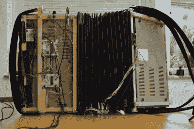

# 指挥官把两个 c64 变成了一个仪器

> 原文：<https://hackaday.com/2022/10/22/the-commodordion-turns-two-c64s-into-a-single-instrument/>

Commodore 64 成为 20 世纪 80 年代标志的主要原因之一是它的 MOS 6581“SID”声音芯片，使它的音频能力远远超过了 8 位时代的其他微型计算机。SID 在 chiptune 爱好者中已经成为了一个传奇，一些电子乐器已经被设计出来通过 SID 芯片产生声音。然而，这些乐器中没有多少看起来像传统乐器，所以我们很高兴看到[Linus kesson]的新项目:两个 Commodore 64s 用风箱背靠背连接起来，形成一种奇妙的新乐器，称为 commodor ion。它的演奏方式与传统手风琴相似:右手弹奏旋律，左手弹奏和弦，通过改变风箱的压力来调节音量。

 这两台电脑基本上都是未经改装的，而且开机时 Commodore 基本跟平时一样。定制电路板模拟盒式磁带播放器，并提供要加载到内存中的软件。两台计算机运行相同的程序，并且可以通过按特定的组合键在左右手角色之间切换。这个有问题的软件叫做 [Qwertuoso](https://linusakesson.net/software/qwertuoso/index.php) ，基本上将 SID 芯片的笔记和各种功能映射到 Commodore 键盘上的按键。

当然，是风箱使这种乐器成为手风琴家族的真正成员。它由 5.25 英寸的软盘和胶带制成，形成了一个或多或少的连接两台计算机的气密系统。风箱中的气流通过放置在进气口旁边的麦克风来测量:产生的噪音量大致与排出或吸入的空气量成比例。该信息随后被用于调节由两个 SID 芯片产生的音量。

[Linus]自己承认这不是最符合人体工程学的乐器，所以我们对他在下面的视频中展示的技巧印象深刻。这也不是他第一次把 Commodore 64 变成乐器了:他之前制作过一个教堂管风琴和一个 T2 特雷门琴。虽然 Commodordion 看起来很复杂，但它实际上比机械手风琴[简单得多。](https://hackaday.com/2017/02/01/converting-an-acoustic-accordion-to-midi-oh-the-complexity/)

 [https://www.youtube.com/embed/EBCYvoC4muc?version=3&rel=1&showsearch=0&showinfo=1&iv_load_policy=1&fs=1&hl=en-US&autohide=2&wmode=transparent](https://www.youtube.com/embed/EBCYvoC4muc?version=3&rel=1&showsearch=0&showinfo=1&iv_load_policy=1&fs=1&hl=en-US&autohide=2&wmode=transparent)

