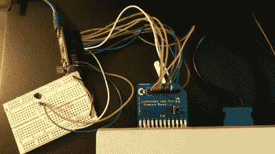

# Commodore 64 智能手表现在可以与您的 Commodore 64 台式机同步

> 原文：<https://hackaday.com/2022/07/18/the-commodore-64-smartwatch-can-now-sync-with-your-commodore-64-desktop/>

如果你的手腕上戴着智能手表，那么你很有可能在附近也有一个与之相连的设备。大多数现代手表都会很高兴地与 Android 设备或 iPhones 同步，有些还会与 Windows PCs 对话。但是如果你运行的是另一种操作系统呢？比如说，准将基本款？在这种情况下，你可能想看看[Nick Bild]的最新项目，[，它可以让你的智能手表与你的 Commodore 64 同步。](https://github.com/nickbild/c64_watch_sync)

遗憾的是，你不能只使用任何旧的智能手表:该项目是我们之前介绍的[尼克]的[Commodore 64 智能手表](https://hackaday.com/2021/06/02/commodore-inspired-watch-puts-basic-on-your-wrist/)的延伸。由于定制的软件堆栈，这款手表可以运行 Commodore 64 程序，但像大多数典型的智能手表一样，它也包括一个加速计，可以计算你的步数。将计步器与电脑同步非常简单:每天跑步回家后，你只需点击手表上的“sync ”,在 Commodore 64 上输入`LOAD"SYNC.PRG",8,1`,电脑就会显示你的总步数。

C64 手表通过内置的红外端口与主机通讯。经典的 Commodore 计算机没有红外接收器，所以[Nick]用连接到 C64 用户端口的 Arduino 微处理器自己做了一个。自定义程序读出数据，并在屏幕上显示步数。

虽然这款应用的功能集有点有限，但[Nick]的项目展示了在当今世界，优秀的旧 Commodore 64 如何仍然可以执行有用的任务。这并不是说我们需要太多的提醒:毕竟，我们甚至已经看到它使用 TensorFlow Lite 运行 AI 应用程序。

 [https://www.youtube.com/embed/CAOlCtSZ5kg?version=3&rel=1&showsearch=0&showinfo=1&iv_load_policy=1&fs=1&hl=en-US&autohide=2&wmode=transparent](https://www.youtube.com/embed/CAOlCtSZ5kg?version=3&rel=1&showsearch=0&showinfo=1&iv_load_policy=1&fs=1&hl=en-US&autohide=2&wmode=transparent)

