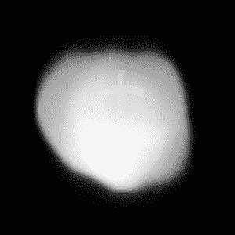

# 在太空中移动原子的成本；解开价值 10 万亿美元的太空小行星的可疑声明

> 原文：<https://hackaday.com/2020/11/23/the-cost-of-moving-atoms-in-space-unpacking-the-dubious-claims-of-a-10-quintillion-space-asteroid/>

上个月，其他媒体都在报道一颗价值 10 万亿美元的名为 16 Psyche 的小行星。奇怪的是，他们在 2019 年 7 月和 2018 年 2 月报告称，同一颗小行星价值 700 万亿美元，因此太空岩石市场似乎类似于加密货币的疯狂投机。这些数字是荒谬的，但它让我们思考太空运输的经济性，以及原子基于它们的位置的价值。让我们来分析重力井、距离和套利是如何运作的，以计算出这 1000 亿到 7000 亿美元中有多少是我们可以利用的。

分配给每样东西的价值与一个东西在哪里有关，以及某人有多需要那个东西在别的地方。如果他们在不同的地方需要它，必须有人支付运输费用。

在国际(和星际)贸易中，这就是国际贸易术语解释通则的用武之地。这些术语用于描述在货物所处的位置和需要的位置之间，谁为货物付费并对货物负责。在这种情况下，所有这些材料都在一颗小行星上，有人必须支付所有的运输、保险和关税。请注意，在小行星上，这些材料也需要开采和提炼；他们不只是坐在某个空间码头的箱子里。在光谱的另一端，从亚马逊订购一些东西，亚马逊会照顾一切，直到它被送到你的家门口。无论哪种方式，买家支付运费；这只是一个成本是包含在价格中还是单独处理的问题。另一个重要术语是套利，即从一个市场拿一件东西，然后在另一个市场以更高的价格出售。在这种情况下，两个市场是地球和太空。

## 10/700 亿美元是从哪里来的？

以下是我们所知道的:

*   现在最好的质量估计是(2.41±0.32)×10^(19)kg([来源 PDF](https://www.aanda.org/articles/aa/pdf/2018/11/aa34091-18.pdf) )。
*   10 万亿分之一等于 1×10 ^(19) (是的，1 万亿分之一等于 1×10 ^(18) ，但这样计算出来的单位更好)。
*   据估计，这颗小行星的成分是金属，主要是铁和镍，大约 10%是硅酸盐岩石，里面还有少量其他元素。这是从[表面光谱分析、](https://iopscience.iop.org/article/10.3847/PSJ/abb67e)以及对其密度的计算得出的，但据我们所知，它可能装满了牛轧糖和黄金。
*   在撰写本文时，铁矿石(在地球上)的当前价格为 0.1235 美元/公斤。
*   镍的当前价格为 14.857 美元/千克。
*   目前用猎鹰 9 号将一公斤物质送入近地轨道的成本约为 2700 美元。

这些事实的便利之处在于，我们可以取消一些单位，假装有 2.4 千克的东西，价值 10 美元。从硅酸盐岩石中减去 10%，你得到 2.16 千克。如果全是铁，它就值 0.27 美元。如果全是镍，它就值 32.09 美元。如果是 50/50，那就是 16 美元。因此，10 万亿美元只是一个巨大的猜测，使用了小行星上可能存在的金属的当前市场价格，并假设这些材料已经在地球上。事实上，想出这个数字的[作者说的正是](https://science.howstuffworks.com/psyche-16-asteroid.htm)。

为了得到 700 万亿美元，考虑这样一个事实，质量已经在空间中，我们想把它保持在那里。这意味着已经在那里的每公斤价值 2700 美元/公斤的运输成本，然后我们根据它在地球上的价值加上任意指定的 10 万亿美元，所以小行星的价值是 5842 万亿美元。好吧，我不知道他们是怎么得到 700 万亿美元的，但这是一个毫无意义的点击诱饵的数字。

## 我们为什么要把它放在这里？

一颗直径为 100 公里的小行星进入我们的大气层，通过释放足够的能量煮沸海洋，将彻底消灭地球。仅仅 10 公里的岩石就可能是灭绝级别的事件。在 200 公里的直径上，我们真的不希望所有的质量都砸向我们，特别是如果它是像 16 Psyche 这样的特别重的金属野兽，不会在大气层中分裂或燃烧。这将真正损害铁或镍的市场。即使它被分解成许多碎片，任何比一辆汽车大的物体，如果没有减速装置，都会在它降落的地方造成相当大的破坏。这种风险，以及任何控制它的国家或组织的安全威胁，使得在地球轨道上停放小行星极其令人不安。除此之外，地球轨道上已经有一块充满铁的巨大岩石(直径 3474 公里)，我们之前已经在上面着陆过。

地球上有更多的铁和镍，而且在各大洲都很容易找到。从一颗小行星上获得这些矿石并把它们带到地球上，就像从一个外国岛屿上用方形瓶子装着你的饮用水，当你附近有自来水时，再把它空运回来给你。

目前全球铁矿石产量为 2.6×10 ⁹ 公斤/年。镍不到其中的 1%。按照我们目前对这些材料的消耗速度，我们只需要 83 亿年就能消耗完，在此期间，这些矿石的价值可能会下降。

## 怎样才能把它带回来？

我的轨道力学生疏了，所以这下一点可能会偏离几个数量级，但要将小行星从目前的位置移动到地球的轨道需要大约 10 公里/秒的[δ-V](https://planet4589.org/jcm/pubs/sci/papers/2018/Taylor18.pdf)。`E=1/2mv²`，所以`1.2x10^(19)*10000² = 1.2x10^(27) joules`，或者`3.3x10^(20) kWh`。这当然是荒谬的(本文的一个主题)。也许你甚至可以把它向后扔，用质量换速度。你也不会想一次移动整个东西；你可能会一次开采一大块。在小行星上建立精炼厂是最有意义的，这样只有最有价值的材料才能被运回。那么，假设你可以在小行星上建立一个提炼材料的站，把它捆成一个漂亮的包裹，然后扔向地球。

接下来，你需要能够让它在地球上足够好地坠毁，将它的返回范围缩小到几百英里的半径，最好是在海洋中间，以免摧毁整个城市。它着陆时可能不会浮起来，所以你必须有设备在它下沉前把它收回来。

如果里面的东西只是铁，你必须能够以低于 0.1235 美元/公斤的价格做到这一切，否则你就无法与本土矿石竞争。即使它是钯或铂，一旦你考虑到把所有的采矿和运输设备都运上去，把材料拿回来，并进行回收，你可能就几乎没有利润了。

## 16 心理的真正价值

16 Psyche imaged by the Very Large Telescope’s adaptive optics SPHERE imager with a Richie Rich filter. (CC BY 4.0 [https://commons.wikimedia.org/wiki/File:Psyche_asteroid_eso_crop.jpg](https://commons.wikimedia.org/wiki/File:Psyche_asteroid_eso_crop.jpg))

16 Psyche 对我们有用的地方是它已经在太空中了。如果人类的未来是摆脱我们正在迅速破坏的岩石，那么这意味着将材料移出地球的重力井或利用已经存在的资源。大多数小行星都是不太实用的岩石，但 16 Psyche 已经被确定为拥有许多我们喜欢用来建造建筑的材料。如果我们把适当的提炼设备送到这颗小行星上，它可能成为建造宇宙飞船的可行起点。然后，每公斤 2700 美元可以用于电子产品、塑料和其他无法从其他地方获得的原材料，从而降低太空飞船的总成本。回到套利术语，太空中的铁市场与地球上的铁市场非常不同；试图在地球上出售太空铁将是一个糟糕的财务决策。有[个任务去拜访](https://www.jpl.nasa.gov/missions/psyche/)这颗和其他类似的小行星，以弄清楚它们到底是由什么组成的。如果它们是建造太空栖息地和运载工具的宝贵材料，那么开采它们可能是有意义的。但是，这种材料在小行星上丰富而在地球上不丰富的可能性很低，并且在地球上足够有价值，以至于从地球以外的地方获取并将其带回是商业上的最佳选择。

最终，某样东西的价值不仅仅在于它本身，还在于把它送到你想要的地方的成本。在外太空的一颗小行星上投入 10 万亿美元是完全没有意义的，因为没有人想要所有的材料现在就在那里，这将需要数十亿年才能全部使用，而且这是一种在地球上已经很容易获得的丰富材料。但是如果你对这个数字仍然感兴趣的话，我有一个当地的 star，输出 3.846×10 ^(26) 瓦，按 0.12 美元/千瓦时计算，大约是 4.6×10 ^(22) 美元或每小时 46 亿美元。你所要做的就是建造一个[戴森球](https://en.wikipedia.org/wiki/Dyson_sphere)。