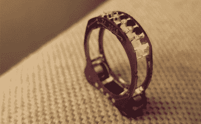

# 最疯狂的现场焊接演示是电子人戒指

> 原文：<https://hackaday.com/2019/02/01/the-craziest-live-soldering-demo-is-the-cyborg-ring/>

你可以用无数种方式定义疯狂这个词。有人会说，使用 SMD 电阻和 QFN 微控制器作为结构元件是疯狂的。有些人会说手工焊接 QFN 是疯狂的，更不用说尝试在边缘而不是在足迹设计的方向上做了。当然，在舞台上，在早餐吃通量的人面前现场表演也是疯狂的。但扎克还是这么做了，我很高兴他这么做了。

[这是电子人戒指](https://hackaday.io/project/34160-cyborg-ring)，这是想象力中独一无二的飞跃——这种飞跃人们已经开始期待扎克·弗雷丁[在 PCB](https://hackaday.io/project/3339-neurobytes)上模拟神经元，减少 SMD LED 矩阵[并无线连接](https://hackaday.com/2016/11/21/showing-off-the-badge-hacks-from-supercon/)，以及[用 ARM 调试器端口](https://hackaday.io/project/27272-tp-bmp)取代他的 ThinkPad 指纹读取器。这种结构利用了制造零件的精确特性:驱动环的 ATtiny85 正好是 0805 部件宽度的两倍。这意味着他可以用 QFN 微控制器桥接组成环的两个电路板，然后在环周围的几个地方使用两个 10 欧姆的电阻作为结构隔离物。这个项目中的宝石是红色的发光二极管，可以用动画模式来处理。

有一句谚语说，所有的现场演示都注定会失败，事实上，这个项目中的 uC 不想在 9 分钟的展示结束时与程序员交谈。但扎克确实设法在舞台上现场将戒指的两半焊接在一起，值得忍受这个直播开始时的相机问题和低启动音量，看他表演一些疯狂的魔术。扎克，你做得很好，让大家知道堆叠电阻的方法不止一种。

如果这个演示让你想听更多扎克的冒险，我们建议看看他 2016 年关于神经细胞发展和制造过程的超级演讲。

 [https://www.youtube.com/embed/hiBTvdMfvWo?version=3&rel=1&showsearch=0&showinfo=1&iv_load_policy=1&fs=1&hl=en-US&autohide=2&wmode=transparent](https://www.youtube.com/embed/hiBTvdMfvWo?version=3&rel=1&showsearch=0&showinfo=1&iv_load_policy=1&fs=1&hl=en-US&autohide=2&wmode=transparent)

