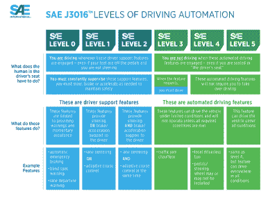
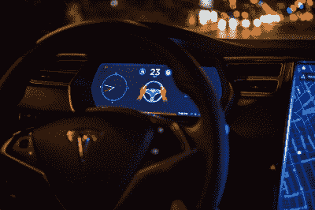
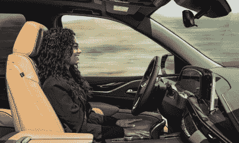
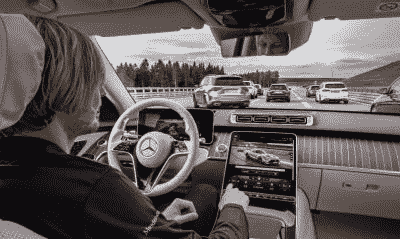
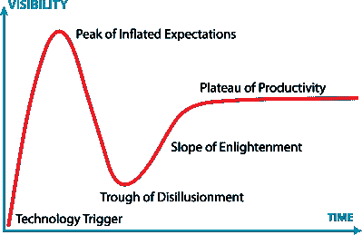

# 自动驾驶汽车的现状

> 原文：<https://hackaday.com/2021/12/29/the-current-state-of-play-in-autonomous-cars/>

近年来，围绕自动驾驶汽车的出现的咆哮已经成为汽车世界的一个常数。所有参与者都做出了很多承诺，但现实世界的结果——以及客户可用的技术——在市场上仍然稀缺。

今天，我们将深入了解一下游戏的现状。自动驾驶汽车是由什么组成的，主要参与者离我们有多近，我们可以期待在拐角处出现什么？

## 自治程度

A graphic breaking down the various levels of driving automation, as defined by the SAE. Credit: SAE

“自动驾驶汽车”这个词可能看起来很简单，但对不同的人来说，它可能意味着许多不同的事情。技术限制也是一个因素，因此汽车工程师协会加快了分类，明确了任何给定的自动或半自动汽车的能力。

下面是一个完整的分解，但是如果你很着急，可以这样想。0 级汽车没有自动化，而自适应巡航等基本功能属于 1 级。2 级自动驾驶系统可以为你处理转向和油门命令，但你应该随时对危险保持警惕。第三级系统更上一层楼，当汽车在指定的区域和条件下自动驾驶时，你可以将视线从路上移开。第 4 级系统引入了汽车在出现问题时自行安全逃生的能力。2 级、3 级和 4 级系统都是有条件的，只在特定区域或特定交通或天气条件下工作。与此同时，5 级车辆完全消除了限制，基本上可以自动驾驶到人类可以到达的任何地方。

## 我们在哪里

目前，市场上的大多数新车都有某种形式的 1 级自动化，通常是巡航控制或一些基本的车道保持辅助。然而，通常情况下，对自动驾驶的谈论涵盖了目前市场上第二级系统的扩散。特斯拉、通用汽车和福特是这一领域的一些大玩家，已经在向市场推出产品。与此同时，本田(Honda)和梅赛德斯(Mercedes)分别在市场上和即将推出 3 级系统。与此同时，Waymo 的目标甚至更高。

**特斯拉**

Keeping hands on the wheel is required when using Tesla’s Autopilot system, but many have found workarounds to cheat this.

特斯拉的自动驾驶和“全自动驾驶”系统因其营销方式受到了全面批评。该系统严格属于 2 级类别，因为驾驶员需要持续注意危险，并准备随时接管。

可悲的是，并不是每个人都认真对待这一点，在特斯拉运行自动驾驶仪时，没有人坐在驾驶座上，已经发生了致命的事故。 [水瓶](https://drivetribe.com/p/tesla-autopilot-water-bottle-hacker-e9twZs6kSsiSc3nuNT3wnA)和其他设备经常被用来欺骗系统，让它认为有人还在握着方向盘。截至 2021 年 4 月，特斯拉在 Autopilot 下驾驶已经发生了至少 20 起死亡事件，该系统以[高速直接驶入障碍物而闻名。](https://www.ntsb.gov/investigations/AccidentReports/Reports/HAR1702.pdf)

特斯拉还做出了一个有争议的决定，开始逐步淘汰其车辆上的雷达。该公司计划使用相机[作为其自动驾驶系统的唯一传感器](https://www.tesla.com/support/transitioning-tesla-vision)，其中一个论点是，迄今为止，人类只能用我们的眼睛。

不过，特斯拉已经推进了这项技术，去年发布了有限公开测试的[“全自动驾驶”测试版](https://hackaday.com/2020/10/23/tesla-begins-full-self-driving-public-beta-as-waymo-and-cruise-go-unattended/)。该系统现在可以处理高速公路和路面上的驾驶。它还具有与导航系统一起工作的能力，引导汽车从高速公路入口匝道到出口匝道，处理立交，并沿着道路选择必要的出口。

不管更新，特斯拉的系统是第二级，仍然需要司机保持警惕，手放在方向盘上。[有人呼吁](https://www.latimes.com/opinion/story/2021-12-20/editorial-slam-the-breaks-on-teslas-self-driving-madness)重塑或限制该系统，网上有大量视频显示该系统未能识别出[前进道路上的明显障碍(语言警告)](https://www.youtube.com/watch?v=EHljMEQA5WA)。

**GM**

GM’s system lets you take your hands of the wheel, but requires you to keep your eyes on the road. Credit: Cadillac

一段时间以来，通用汽车一直在销售配备其 2 级超级巡航自动驾驶系统的车辆，*消费者报告称赞其比特斯拉的产品更安全。*该系统通过摄像头直接监控驾驶员，以确保注意力集中，2022 年推出的最新版本允许[全自动变道](https://www.theverge.com/2021/7/23/22589285/gm-super-cruise-automatic-lane-change-gmc-chevy-silverado)，甚至支持牵引。该系统允许司机不用手，但仍必须注意道路，否则系统将被禁用，手控制回到司机。

超级巡航可以在美国超过 200，000 英里的高速公路上使用。然而，与特斯拉的产品不同，通用汽车的汽车不会在城市街道上自动驾驶，直到几年后 [Ultra Cruise](https://www.theverge.com/2021/10/6/22712566/gm-ultra-cruise-adas-hands-free-driving) 发布。目标是在推出时覆盖 200 万英里的美国和加拿大道路，Ultra Cruise 系统依靠激光雷达和雷达传感器以及摄像头来实现城市环境中的安全驾驶。

**福特**

福特即将推出的 BlueCruise 系统刚刚上市，其功能水平与通用汽车早期的超级巡航系统相似。该系统落后于福特在美国的主要竞争对手，因为 BlueCruise 只能在美国 13 万英里的高速公路上使用。它也缺乏更先进的功能，如自动变道，通用汽车在后来的软件版本中加入了这些功能。

BlueCruise 也缺乏像通用汽车系统的方向盘灯条这样的用户界面功能，这可以提高系统当前操作状态的清晰度。尽管从根本上来说，这是蓝色椭圆形的第一步，更多的更新肯定会到来。目前，这是一个结合车道保持和自适应巡航控制的基本系统，但还没有提供更多的功能。

**奔驰和本田**

The Drive Pilot system from Mercedes will allow drivers to take their eyes off the road. It’s one of the first true Level 3 systems available. Credit: Mercedes-Benz

梅赛德斯和本田是首批向市场交付 3 级系统的两家公司。这些功能允许驾驶员在激活时放松，尽管在地理围栏区域之外或在异常情况下，他们可以被要求及时接管。

本田的系统是首次推出，并已在本田传奇自今年早些时候可用。该公司的 SENSING Elite 技术可以实现交通堵塞试点功能，在高速公路交通繁忙时接管驾驶任务。在这些有限的条件下，驾驶员可以在导航屏幕上观看视频或承担其他任务，而不必关注前方的道路。

梅赛德斯将于明年交付其 Drive Pilot 系统，最初用于 13，191 公里的德国高速公路。该系统同样可以在高密度交通中工作，最高可达法律允许的最高时速 60 公里。驾驶员可以享受“次要活动”，如浏览互联网或看电影。

这两个系统都依赖于传感器的组合，梅赛德斯特别提到了激光雷达、雷达和相机在他们系统中的使用。在这两种情况下，如果系统要求，驾驶员必须随时准备接管，但他们不需要保持 2 级系统所需的持续警惕。通过将系统限制在拥堵的高速公路的更可预测的环境中运行，这一壮举尤其得以实现。

**Waymo**

作为一家技术公司而非汽车制造商，Waymo 没有什么动力将产品推向市场。该公司事实上已经放弃了 2 级和 3 级系统的开发，原因是警戒任务中经常出现的问题。即使在该公司的 3 级努力的情况下，它也有测试期间[员工睡着](https://cleantechnica.com/2017/11/01/googlewaymo-stopped-testing-level-3-self-driving-tech-testers-literally-fell-asleep-using-switched-full-autonomy/)的问题，主要是因为他们与汽车驾驶本身几乎没有关系。特斯拉不顾一切地推进这种系统，并吸引了[NHTSA 的调查。](https://www.thedrive.com/tech/42013/feds-open-official-investigation-into-tesla-over-autopilot-crashes)首席执行官 John Krafcik 指出，Waymo 认为这样的系统会招致太多的责任。

相反，该公司正在稳步推进一个将达到 4 级或更高水平的系统，旨在消除司机交接这一有争议的问题。截至 2017 年，该公司在其改装的克莱斯勒 Pacifica 车队中运行了一个界面非常简单的系统。可以按下一个按钮开始行驶，另一个按钮会指示汽车安全靠边。

该公司已经开始向有限的客户提供无人驾驶 robotaxi 服务，测试其无人驾驶汽车。该公司的汽车经常在无人驾驶的情况下行驶，尽管人类从远程指挥中心监控行程，以在汽车出现混乱或面临问题的情况下提供帮助。在开发期间，这些汽车在特定的地理围栏区域内运行，这项技术距离在所有路况下推广还有很长的路要走。

## 摘要

The Gartner hype cycle. Credit: JeremyKemp, [CC-BY-SA-3.0](https://en.wikipedia.org/wiki/Gartner_hype_cycle#/media/File:Gartner_Hype_Cycle.svg)

就目前的情况而言，无人驾驶技术将陷入许多人幻想破灭的低谷。尽管我们都做出了承诺，但在现阶段，自动驾驶系统仍然受到严重限制。

然而，这项技术正在慢慢地向真正有用的方向发展。像梅赛德斯和本田这样的努力已经将驾驶员从痛苦的警戒任务中解脱出来，并让他们将注意力从驾驶上移开，这是这项技术从一开始的首要目标。其他系统只是试图将汽车保持在车道线之间，同时要求人类不断扫描危险。

这项技术达到成熟还需要一段时间，我们会毫不犹豫地让无人驾驶汽车带我们离开。与此同时，成千上万的工程师每天都在努力工作，以实现这一目标。