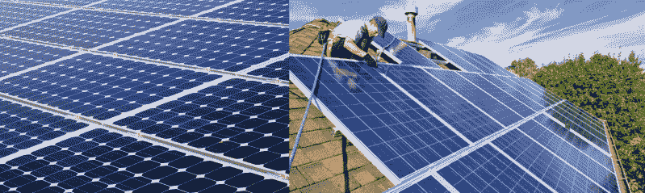
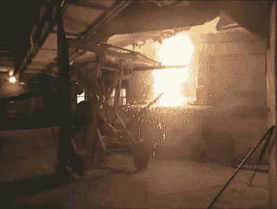

# 太阳能的阴暗面

> 原文：<https://hackaday.com/2020/12/02/the-dark-side-of-solar-power/>

每个人都喜欢太阳能，对吗？这是一种美好、清洁、可再生的能源，几乎在阳光普照的任何地方都可以获得。要是面板不那么贵就好了。更好的是，根据国际能源署的说法，太阳能现在是公司建造最便宜的电力形式。但是太阳能并不全是苹果和阳光——还有你可能不知道的黑暗面。[制造太阳能电池板从头到尾都是一个肮脏的过程。开采石英中的硅会导致肺病硅肺病，生产太阳能电池需要消耗大量的能源、水和有毒化学物质。](https://spectrum.ieee.org/green-tech/solar/solar-energy-isnt-always-as-green-as-you-think)

另一个问题是，太阳能电池的预期寿命约为 25 年，平均效率损失为每年 0.5%。如果 25 年后才开始更换，那么在 21 世纪初的繁荣时期安装的所有面板的时间就不多了。国际可再生能源机构(IREA)预计，到 2050 年，我们将看到 7800 万公吨的庞大电子垃圾。IREA 还认为，到那时，我们每年也会产生 600 万吨新的太阳能电子垃圾。不幸的是，几乎没有回收太阳能电池板的措施，至少在美国是这样。

太阳能电池板到底是怎么制造的？为什么回收它们如此困难？让我们解释一下这个问题。

## 制造方法:太阳能电池板

Monocrystalline and polycrystalline panels. Images via [AZoCleantech](https://www.azocleantech.com/article.aspx?ArticleID=603) and [HaHaSmart Solar](https://www.hahasmart.com/blog/187/advantages-and-disadvantages-of-polycrystalline-solar-panels)

太阳能电池板有三种基本类型——单晶、多晶和薄膜。单晶太阳能电池板的每个电池都是由单晶硅制成的。这些是太阳能电池板的单一麦芽威士忌，通常是黑色的。

多晶体面板看起来杂乱，多面，因为它们是由几个硅晶体制成的。这些面板通常是蓝色的，这是因为涂层使它们表现更好。薄膜太阳能电池板是你在太阳能计算器和手表中看到的那种类型，它们提供的效率最低。这些是由非晶硅制成的，这就是为什么它们看起来与其他两个如此不同。

Extracting silicon from quartz requires an insanely hot furnace and a long pole. Image via [How It’s Made](https://www.youtube.com/watch?v=qZgWC-Cxd44)

不管是哪种类型，太阳能电池都是从沙子开始的，通常是经过高温喷砂处理的高纯度石英。石英首先被提炼为冶金级硅，然后被提纯为多晶硅。这就产生了一种叫做四氯化硅的剧毒化合物。这种东西本身就够糟糕的了，但是当它被倾倒并到达当地水体时，就会释放出盐酸。

由此产生的多晶硅被收集到岩石中，一起熔化成锭。添加硼(称为[掺杂](https://en.wikipedia.org/wiki/Doping_(semiconductor)))以赋予硅正极性。然后，这些铝锭被切成像纸一样薄的薄片，薄片上涂有一种物质，使它们能够吸收阳光，而不是反射阳光。

电池经过磷涂层处理，表面带负电荷，完成 pn 结，使太阳能转化为电能成为可能。电池在熔炉中烘烤，然后焊接成电池板。正面是一层保护玻璃，背面是耐用的聚合物，可以阻挡灰尘和碎片。

## 所以…回收它们？

如果清洁和维护得当，太阳能电池板可以使用几十年。但是随着太阳能电池板的退化，它们的效率会大大降低，最终会完全停止工作。显而易见的解决办法可能是回收所有的太阳能电池板，但这并不简单。人们不会去大卖场直接购买太阳能电池板，他们会从安装太阳能电池板的公司购买。跟踪电池板，回收它们，并确保它们得到回收，这些都是公司的责任。问题是，并不是每个人都意识到它们首先可以回收，而且在美国，将它们倾倒在垃圾填埋场并没有受到多少监管。

在电子垃圾回收方面，欧洲确实处于领先地位。欧盟有一项法律要求太阳能电池板生产商在电池板寿命结束时收回电池板并回收利用。英国有一个精炼厂，用微生物代替氰化物来分解电子垃圾并提取贵金属。法国是世界上唯一的商业规模光伏回收工厂威立雅的所在地。2017 年，他们的合作伙伴 PVCycle 在法国各地收集了 2400 吨报废面板。威立雅表示，他们能够实现 95%的回收金属和玻璃的再利用率。在下面的视频中查看他们的过程。

 [https://www.youtube.com/embed/PaUlSZ2biI8?version=3&rel=1&showsearch=0&showinfo=1&iv_load_policy=1&fs=1&hl=en-US&autohide=2&wmode=transparent](https://www.youtube.com/embed/PaUlSZ2biI8?version=3&rel=1&showsearch=0&showinfo=1&iv_load_policy=1&fs=1&hl=en-US&autohide=2&wmode=transparent)

在美国，没有回收太阳能电池板的联邦法令，只有华盛顿州和纽约州有相关的法律。[因此，只有大约 10%的美国面板被回收](https://www.wired.com/story/solar-panels-are-starting-to-die-leaving-behind-toxic-trash/)。其余 90%被运到没有再利用授权的国家，或者最终被填埋，将铅和其他有毒化学物质浸出到土壤中。

目前在美国，回收太阳能电池板很困难，回收银、铜和硅需要定制解决方案。废弃铝框架和金属浆料中的银并不能带来多少净收益，而且每块面板的回收成本为 12-25 美元，再加上运输成本。将它们倾倒在垃圾填埋场，每块电池板只需 1 美元。

很难将太阳能电池板制造过程造成的损害与燃烧化石燃料获取能源造成的损害相提并论。两者都不好，那么我们是在解决一个问题的同时制造另一个问题吗？如果我们找不出一个全球回收太阳能电池板的方案，我们肯定会面临一场危机。