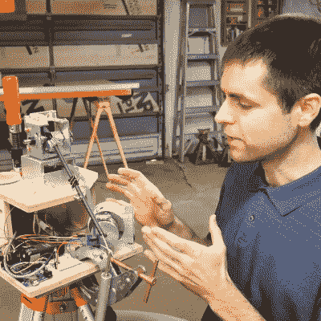

# 细节决定成败

> 原文：<https://hackaday.com/2021/07/03/the-devil-is-in-the-details/>

如果你上过物理课，你肯定听说过像无质量弦、无摩擦轴承和完美球体这样的神话般的野兽的故事。如果你正在设计新的东西，从这些抽象概念开始思考并不总是错误的，只是为了得到基本的框架和事情进展的第一顺序。但是一旦你开始建造，你最好准备好放弃你的幻想，一个 6 毫米的钉子将适合一个 6 毫米的洞。

 理论和实践是一回事，在理论上。但是一旦你付诸实践，你的“周末建设”很容易[变成一个 500 小时的项目](https://hackaday.com/2021/07/01/sub-mm-mechanical-3d-scanner-with-encoders-and-string/)，充满障碍、发现、实验和最终的成功。我不打算在这里重复[Scott Rumschlag]的项目——你真的应该看看他的详细视频——但足以说明的是，在构建亚毫米精度 3D 测量设备时，轴承*是否有摩擦，弦*是否有非零质量，这些都很重要。**

当你开始做一个“在纸上看起来不错”的项目，或者不管什么原因，结果并不像你希望的那样精确，你可以做得更糟，而不是遵循[斯科特的]例子:从量化你的目标开始，然后确定过程中每个错误积累的地方，以阻止你实现它们。做精确的工作并不容易，但是如果你知道所有的误差来自哪里，这也不是不可能的。你至少有一系列可以考虑的改进，如果你设定了现实的目标，你也知道什么时候停止，这几乎同样重要。

如果有人有无限的完全导电的材料，我就在市场上。

This article is part of the Hackaday.com newsletter, delivered every seven days for each of the last 200+ weeks. It also includes our favorite articles from the last seven days that you can see on [the web version of the newsletter](https://mailchi.mp/hackaday.com/hackaday-newsletter-649368). Want this type of article to hit your inbox every Friday morning? [You should sign up](http://eepurl.com/gTMxQf)!