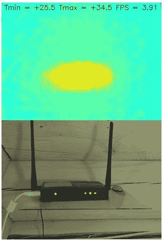

# 你见过的最简单的热感摄像机

> 原文：<https://hackaday.com/2019/03/01/the-easiest-thermal-camera-build-youll-ever-see/>

热感相机是我们都想要的工具之一，但不能证明实际购买的合理性。你真的不知道你会用它做什么，当即使是便宜的也要几百美元时，这有点超出了冲动购买的范围。所以你只能继续等待，希望最终它们会降到你自己也能拥有一台的价格。

 嗯，今天可能就是你期待的日子。虽然它可能不是最漂亮的建筑，[我们认为你会同意，它不可能比【vvkuryshev】组装的](https://habr.com/en/post/441050/)更容易了。他的作品只有两个组件:一个树莓派和一个热感相机模块，他在网上花了大约 80 美元买的。甚至不涉及任何布线，摄像头正好安装在 Pi 的 GPIO 头上。

当然，如果他所要做的只是购买一个模块并将其焊接到 Pi 的头部，您可能不会在 Hackaday 上看到这一点。与大多数廉价进口设备一样，[vvkuryshev]购买的 GY-MCU90640 模块附带了一些粗糙的 Windows 软件，这些软件不会给他带来多少好处。但是在与卖家反复沟通之后，他能够获得一些设备的文档，这让他走上了正确的道路，开始编写 Python 脚本，让它在 Linux 下工作。

这个令人惊讶的简单 Python 脚本通过串行每秒四次从相机读取一帧，并通过 OpenCV 运行它。它甚至在图像顶部添加了一些有用的数据，如帧中的最低和最高温度。通常情况下，脚本会输出到 Pi 的主显示器上，但如果你想远程使用它，[vvkuryshev]说他在 VNC 运行它的运气非常好。事实上，他说，通过手机上的 VNC 应用程序，你甚至可以在旅途中使用这种设置，尽管目前的设置有点尴尬。

这不是我们见过的第一个 DIY 热感相机，也不是我们见过的第一个利用商业成像模块的[。但是](https://hackaday.com/2018/06/08/who-said-thermal-cameras-werent-accessible-to-the-masses/)[除了买一个交钥匙相机](https://hackaday.com/2018/11/07/teardown-of-a-relatively-cheap-thermal-camera/)，我们看不出还有什么比这更容易把热视觉添加到你的锦囊妙计中了。