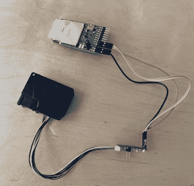

# 电动小精灵嗅出加州的野火

> 原文：<https://hackaday.com/2018/11/20/the-electric-imp-sniffs-out-california-wildfires/>

加州的野火现在是该州有史以来最大的一次。50 000 多人流离失所，数百人失踪，说到底，财产损失肯定会达到数十亿美元。对于这种规模的灾难，直接影响是难以想象的，更不用说间接损失了。

 虽然没有暗示他们的情况与那些失去家园或家庭的人类似，但 Electric Imp 首席执行官【Hugo Fiennes】最近在他们的博客[上发表了一篇文章，呼吁人们关注他们在洛斯阿尔托斯](https://connect.electricimp.com/blog/office-air-quality-reporting-on-slack)办公室看到的空气质量问题。为了量化问题，以便有呼吸问题的员工在上班前了解情况，他们很快就在 Slack 服务器上开发了一种显示颗粒物数量的方法。

该系统的关键是一个激光粒子传感器，由于最近该技术的价格下降，我们开始看到更多的激光粒子传感器。一个小风扇将待测空气吸入设备，一个非常灵敏的光学传感器检测颗粒通过激光束时反射的光。该设备不仅能报告通过它的粒子数量，还能报告粒子的大小。[Hugo]在他的博客文章中链接到的传感器版本包括一个适配器板，使其更容易连接到您最喜爱的微控制器，但我们之前已经看到过实现相同目标的 DIY 构建。

[Hugo]然后继续为电动 Imp 板提供固件，该板从传感器读取当前的颗粒计数，并创建一个简单的网页，可以在世界任何地方查看，以了解办公室的实时情况。从那里，这些数据可以插入一个 Slack webhook，每当用户在频道中键入“空气”时，它就会提供即时的空气质量读数。

这些年来我们已经覆盖了[数量的空气质量传感器](https://hackaday.com/2012/04/19/monitoring-air-quality-with-a-12-sensor/)，随着时间的推移，它们看起来不会变得[更少。如果说有什么不同的话，那就是我们看到了一种走向分布式污染传感器](https://hackaday.com/2018/07/12/air-quality-readings-at-a-glance/)网络[的趋势，这样市民就可以收集他们呼吸的空气的数据。](https://hackaday.com/2015/12/07/globally-distributed-sensor-net-monitors-air-quality-and-radiation/)

【感谢 DillonMCU 的提示。]