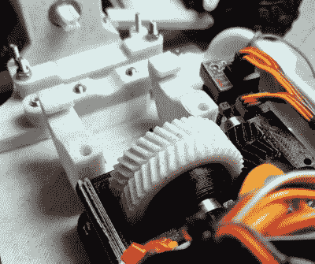

# 3D 打印越野遥控汽车的演变

> 原文：<https://hackaday.com/2020/04/09/the-evolution-of-a-3d-printed-off-road-r-c-car/>

自从黑客和制造商使用桌面 3D 打印机以来，就一直有批评称，他们生产的塑料部件除了玩具和装饰品之外，没什么用处。他们声称，打印部件太脆弱，没有任何实际用途，更适合作为原型占位符，直到真正的部件可以注射成型或铣削。当然可以。试着告诉[工程废话]。

他最近写了(顺便说一下，其他几个人也写了)[来分享他令人难以置信的 3D 打印遥控车](https://docs.google.com/document/d/1hfrpDU1DQm6QKrioJsxxcMdq8ormYTlwAHaiswDuSHI)的最新版本，看到它在休息后的视频中四处撕裂，“脆弱”肯定不是我们用来描述它的词。尽管这不是一夜之间的事。Tarmo4 代表了一年的开发，顾名思义，是该设计的第四个版本。

 我们知道那里的纯粹主义者会抱怨这辆车不完全是*3D 打印的，但老实说，很难想象你能比这更接近了。除了电子设备、紧固件、轮胎和减震器，Tarmo4 全部是塑料的。这包括变速箱和传动轴。[工程废话]甚至在视频中提到，他对市场上发现的轮胎不满意，未来它们也可能被印刷版本取代。*

 *虽然汽车肯定是一项令人难以置信的技术成就，但同样令人印象深刻的是在如此短的时间内围绕它发展起来的社区。在视频的最后，他展示了一些基于 Tarmo 之前迭代的定制构建。我们确信，来自社区的兴趣在推动设计向前发展方面发挥了作用，看到一次性项目变得更大总是好的。希望在不久的将来，我们能从这个充满激情的社区中看到更多。

[就像开放的 R/C 项目](https://hackaday.com/2016/02/19/the-openrc-project/)一样，Tarmo 证明了 3D 打印零件不仅仅是一个新奇的东西。如果这些小型发电站可以用印刷齿轮和驱动轴运行，那么当你为下一个项目运行零件时，你就不必担心什么了。

 [https://www.youtube.com/embed/MKqQPTEXJpI?version=3&rel=1&showsearch=0&showinfo=1&iv_load_policy=1&fs=1&hl=en-US&autohide=2&wmode=transparent](https://www.youtube.com/embed/MKqQPTEXJpI?version=3&rel=1&showsearch=0&showinfo=1&iv_load_policy=1&fs=1&hl=en-US&autohide=2&wmode=transparent)

*