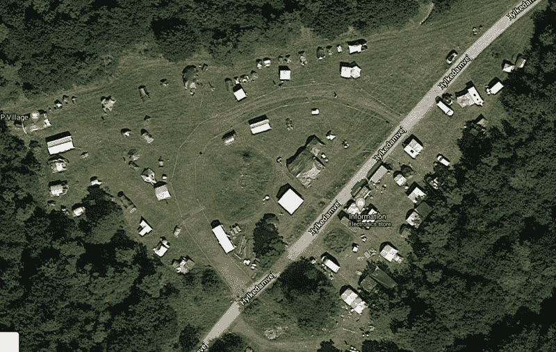

# 第一个出现在谷歌地图上的黑客阵营

> 原文：<https://hackaday.com/2021/02/14/the-first-hacker-camp-to-show-up-on-google-maps/>

我们在黑客训练营的夏季聚会转瞬即逝，期待了几个月，但结束得太快了。之后，我们只剩下记忆，或许还有偶尔的日志。我们认为丹麦的 BornHack 2020 是唯一一个没有被强制上线的黑客阵营——仅在去年被疫情强制上线，现在据我们所知，它也成为了唯一一个通过被谷歌地球捕捉下来留给后人而在更广阔的世界留下印记的黑客阵营。

在森林里可以看到人烟稀少，社会距离远的主要领域是一个比正常情况下小得多的营地，以及在单独的空地上的扬声器帐篷和响亮的领域。也许在向外界解释什么是黑客阵营时，它没有一张更大的照片那么有帮助，但它至少是一个明显的提醒，即我们去年并没有完全被扼杀。

对于我们这些在谷歌地图上看到 BornHack 2020 的人来说，这是一个怀旧的时刻，但也许所有这一切的意义是花一点时间考虑 2021 年类似事件的可能前景，因为疫情。英国的 [EMF Camp](https://www.emfcamp.org/) 和美国的 [Toorcamp](https://toorcamp.toorcon.net/) 都不得不取消他们去年的活动，应该会在 2022 年回归，塞尔维亚的[balcon](https://2k20.balccon.org/index.php?title=Main_Page)和意大利的 IHC 还没有关于 2021 年的消息，我们对卢森堡的 HaxoGreen 的最新更新是[它仍然会继续前进到 2021 年](https://blog.haxogreen.lu/2020/05/haxogreen-2020-2021-update/)，目前还有 [BornHack](https://bornhack.dk/bornhack-2021/) 和荷兰的[MC](https://mch2021.org/#/)

在撰写本文的疫情第三次野蛮浪潮的控制下，2020 年的取消可能不会重演，这绝不是一个既定的结论。没有严格的检疫要求，穿越国际边界仍然很困难。如果你今年能去露营，你可能是少数幸运儿之一，如果我们没能去，我们会有理由嫉妒。不要失去希望，我们会再次相遇…最终。

如果你想仔细看看博恩哈克 2020，[看看我们的报道](https://hackaday.com/2020/08/24/running-a-successful-hacker-camp-in-a-pandemic-bornhack-2020/)。