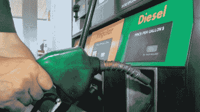
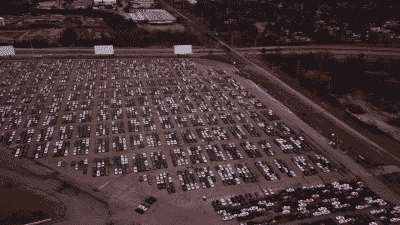
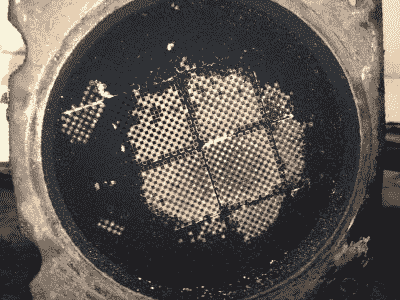
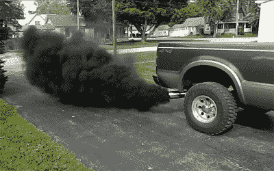

# 柴油的未来岌岌可危

> 原文：<https://hackaday.com/2019/09/26/the-future-of-diesel-is-on-shaky-ground/>

柴油是一种有着复杂历史的燃料，世界各地消费者的接受程度各不相同。在运输领域，柴油发动机提供了比同类汽油发动机更好的燃油经济性和扭矩。柴油在欧洲特别受欢迎，在小型通勤车以及卡车和公共汽车等重型车辆中都建立了强大的消费者基础。

尽管如此，潮流正在改变，对于普通驾车者来说，柴油时代可能屈指可数了。为什么会这样，争夺 diesel 桂冠的潜在替代者有哪些？

## 很多优点，但也有很多缺点

Diesel remains a fuel with a varied uptake around the world. It has enjoyed great popularity in Europe in small commuter cars.

柴油是一种碳氢化合物燃料，与汽油相比有几个优点。它不易挥发，这使得它可以在压缩点火模式下使用，柴油发动机可以在贫燃料空气比下运行。它还具有比汽油更高的体积能量密度，由于挥发性低，柴油发动机可以在明显更高的压缩比下运行，而不会有爆炸的风险。这些优点使柴油发动机比同等大小的汽油发动机产生更大的扭矩，并且可以节省超过 15%的燃油。

不幸的是，柴油也有它的缺点。当涉及到功率重量比时，柴油发动机通常很差，因为它们的高压缩比和扭矩输出在其结构中需要更重的材料。然而，柴油发动机的主要问题是它的排放。尽管燃油效率更高，但柴油发动机的二氧化碳排放量通常远远低于同等的燃气发动机。此外，它们的稀薄燃烧特性导致高水平的氮氧化物(NOx)的产生，这具有重大的负面环境影响。还有微粒污染的问题，这是造成人类呼吸系统伤害的原因。在所有这些方面，柴油车都比汽油车差很多。它已经开始给行业带来形象上的头痛，也给公众带来文字上的头痛。

## 重大错误创造了一个不祥的未来

Volkswagen was forced to buyback thousands of cars in the wake of the Dieselgate scandal. Customers who instead elected to have their cars fixed experienced degraded performance and decreased fuel economy.

柴油表现不错，在 21 世纪初，随着汽车制造商吹捧其最新技术的燃油经济性优势，柴油迎来了复兴。原则上，NOx 问题可以通过使用[选择性催化还原](https://www.thoughtco.com/adblue-and-clean-diesels-85601)来解决，但这增加了制造商的成本，并且当驾驶员踩到底时会影响性能。

当研究人员发现大众汽车集团的许多车辆公然违反排放法规时，裂痕突然出现。在其他技巧中，这些汽车被发现使用不同的燃料/空气混合物，并在测试条件外对 NOx 净化催化剂使用不足，以大幅增加排放为代价提供了更多的动力。突然间，数十万辆柴油车面临召回和回购。召回车辆的发动机管理软件进行了修改，以经济和性能为代价改善了排放。几乎在一夜之间，购买的公众了解到柴油并不是它所宣传的环保灵丹妙药。柴油车突然被视为肮脏、污染的车辆，成为一桩重大国际丑闻的焦点。

几年后，汽车行业仍在处理后果，柴油的形象仍然受到玷污。[许多城市都在排队禁止柴油车上路，](https://www.businessinsider.com.au/cities-going-car-free-ban-2018-12?r=US&IR=T)而[德国正在讨论现金奖励](https://www.reuters.com/article/us-germany-emissions-factbox/factbox-german-cities-ban-older-diesel-cars-idUSKCN1NK28L)以鼓励高污染车辆的车主更新换代。

## 导致更多问题的解决方案

A clogged DPF can cause loss of performance, engine damage, or even fire if not rectified in a timely fashion.

让柴油发动机更清洁的尝试产生了副作用。为了满足日益严格的排放标准，汽车制造商采用了新技术，类似于在汽油发动机中引入催化转换器。许多车辆现在安装了柴油微粒过滤器(DPF)，以帮助减少微粒外流。这些装置安装在排气管上，从燃烧过程中捕获颗粒物质。随着时间的推移，这些过滤器开始被烟灰堵塞，增加了排气系统的背压，降低了发动机的性能。当这种情况发生时，过滤器必须*再生，*在这个过程中，排气温度升高，以烧掉烟灰。这可以在高速公路行驶过程中随着排气热量的增加而被动实现，但许多在走走停停的城市环境中行驶的汽车必须求助于其他方法。这被称为主动再生，将额外的柴油注入废气中，或者发动机在静止一段时间后以高转速运行。

[DPF 滤波器在实践中被证明是有问题的](https://procarreviews.com/dpf-problems/)。对于许多居住在市中心地区的人来说，安装 DPFs 的柴油机可能不切实际，因为发动机被迫定期运行主动再生循环，以弥补高速公路里程的不足。由于经销商沟通不畅，许多车主完全没有意识到现代柴油车的这一怪癖，导致经常对 DPF 堵塞感到沮丧。使问题更加复杂的是，一些制造商努力在一些车辆中正确开发再生程序，[导致消费者沮丧和集体诉讼。](https://www.abc.net.au/news/2019-08-01/toyota-faces-class-action-over-hilux-prado-filter-issues/10821680#targetText=Company%20offers%20customer%20service%20campaign%20rather%20than%20recall&targetText=%22Toyota%20dealers%20will%20reprogram%20the,the%20DPF%20will%20be%20replaced.)

## 售后市场没有帮助

A pickup truck rolling coal in a suburban driveway. Such pollution is linked to a long list of negative health effects.

尽管有缺陷，diesel 仍然有它的死忠粉丝。这些司机是那些经常牵引重物或长途公路驾驶的人的宠儿，他们珍视强大柴油发动机的扭矩传递。调整柴油发动机已经成为一个主要的售后市场行业，各公司都在宣传他们的产品提高了动力输出以及更好的燃油经济性。

当然，没有什么是免费的，获得更好的性能通常需要在其他地方进行权衡。通常情况下，调整库存柴油发动机会导致车辆不再符合排放标准。这引起了美国环境保护局的愤怒，该局对销售调音设备的公司处以重罚。这主要是因为调谐器经常使用软件和硬件工具来绕过氧传感器和颗粒过滤器等排放控制，以寻求更大的功率。

柴油调节的极端做法是“滚煤”。这涉及欺骗车辆的电子控制单元向发动机中倾倒过量的燃料，以便从排气管中排出大量的烟灰。[这样做是为了好玩，或者是为了骚扰其他道路使用者。虽然这是一小部分人的消遣，但它并没有赢得 diesel 的任何粉丝，并且已经在马里兰州](https://www.nytimes.com/2016/09/05/business/energy-environment/rolling-coal-in-diesel-trucks-to-rebel-and-provoke.html)[和科罗拉多州被定为非法。环保局一直声称这种做法明显违反了《清洁空气法》。](https://jalopnik.com/colorado-just-explicitly-banned-rolling-coal-after-an-i-1794900970)

## 暗淡的前景

展望未来，柴油的前景并不乐观。减少碳排放的努力有望影响所有的化石燃料。然而，排放大量氮氧化物、微粒和二氧化碳的柴油，看起来将比大多数人更快地被扔进垃圾箱。清洁柴油发动机的努力导致了可靠性可疑的复杂排放系统和试图规避法规的制造商。随着电动汽车迅速获得市场份额，以及像氢这样的替代品争夺相关性，情况很艰难。更糟糕的是，[欧洲](https://www.roadtraffic-technology.com/features/european-countries-banning-fossil-fuel-cars/)和[亚洲国家](https://www.roadtraffic-technology.com/features/asian-countries-banning-fossil-fuel-cars/)都计划完全淘汰化石燃料汽车。在这种令人担忧的环境下，汽车制造商似乎不太可能愿意进行必要的投资来进一步推动柴油技术，让它随着监管的收紧而慢慢消亡。一如既往，时间会证明一切。