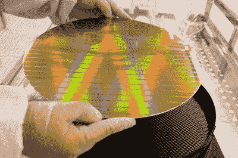
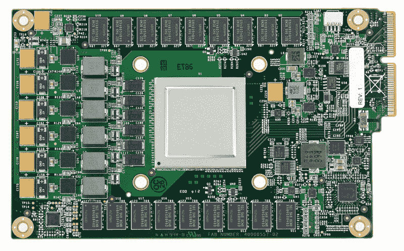
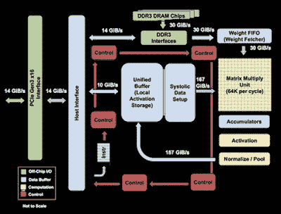

# 不断变化的计算机体系结构的黄金时代

> 原文：<https://hackaday.com/2019/11/27/the-golden-age-of-ever-changing-computer-architecture/>

鉴于摩尔定律对多年来集成电路发展的准确性，人们会认为我们今天的时期在计算机体系结构设计方面与过去几十年没有什么不同。然而，在 [2017 年 ACM 图灵奖获奖演讲](https://www.youtube.com/watch?v=3LVeEjsn8Ts)期间，约翰·l·轩尼诗和大卫·a·帕特森将现在描述为“计算机架构的黄金时代”。

与 MS-DOS 的早期相比，当设计用户空间和内核空间的交互仍然是一个正在进行的实验时，感觉我们已经不再处于这个领域的初级阶段。然而，随着公司获得更多计算资源以在大量数据上运行昂贵的机器学习算法的压力越来越大，智能计算机架构设计可能正是该行业所需要的。

摩尔定律预测了集成电路中晶体管数量的翻倍，但它并没有预测集成电路设计的发展方向。在 1965 年做出这一观察时，很难甚至不可能想象我们今天的状况，因为工具和流程联系如此紧密，并且可以广泛获得，以至于我们构思处理器设计的方式本身正在成倍增加。

## 一旦极高的开发成本变得天价

在过去，计算机体系结构的创新对于企业来说可能是一个冒险的举动，尤其是如果没有任何好的理由来解释为什么必须超越行业标准的话。充其量，他们可以在 R&D 投资一大笔钱，输出一个改变游戏规则的设计。在最坏的情况下，他们可能会让自己的公司破产，最终留下大量卖不出去的股票。虽然像增加高速缓存大小或缓冲区大小这样的想法可以优化架构的一个瓶颈，但制造的物流或生产的成本可以超越这些重新调整的症结。在超大规模集成电路出现之前，在一个芯片上包含如此多的进程是非常困难的，大型组件之间的长线会降低计算速度。

无可争议的是，随着 Mead 和 Conway 的平民化芯片设计以及 RISC 体系结构、分支预测和使用它们的高级编程语言的发展，20 世纪 80 年代迎来了计算机体系结构的重大创新。这就引出了一个问题，顶峰在哪里？ [Dennard scaling](https://en.wikipedia.org/wiki/Dennard_scaling) (一种比例定律，表明随着晶体管变得越来越小，它们的功率密度保持不变，从而导致频率显著增加)可能已经在 2006 年结束，摩尔定律看起来在不久的将来会被打破，但随着主要行业对机器学习中更快计算的支持，以及对更高级语言、特定领域架构和定制芯片的重新兴趣，似乎正在为计算机架构的不同观点带来创新。专注于超级计算机和利基芯片可能有助于提高计算速度[甚至比摩尔定律预测的还要快](https://conferences.oreilly.com/artificial-intelligence/ai-ca-2018/public/schedule/detail/70344)。

## 揭开硅生产的瓶颈

中国半导体制造业的新浪潮已经不是秘密——2014 年，中国国务院发布了《国家集成电路(IC)产业发展和促进指导方针》,这是一项旨在提高中国半导体生产的国家政策。他们增加投资，采取基于市场的方法，并通过改变行业收入、产量和技术进步来专注于打造国家冠军企业。随着对中国智能手机(华为、联想、魅族、小米)和中国消费者需求的激增，提高制造业产能受到了很多鼓励。

尽管中国芯片制造商可能没有生产出最先进的架构设计，但他们在工艺的可承受性和效率方面仍在挤掉竞争对手。对纳米科学的资助、廉价劳动力、工厂维护和材料成本的降低都有助于降低中国产品的成本，尽管台湾和越南等国家的其他制造商也在提供类似的廉价制造服务。

为了了解硅产品已经走了多远，看看专用集成电路(ASICs)是很有意思的。专用集成电路是一种芯片，设计用来执行一组特定的操作，比一般的 CPU 更好(在功率或速度方面)。

在 20 世纪 80 年代，ASICs 的制造是一个需要独立的设计者和制造商的过程，因为第三方设计工具和半导体工艺之间没有直接的联系。从那以后，定制芯片的制造工艺有了很大的改进。结果显而易见。例如，比特币挖矿的流行推动了许多新的 ASIC 设计，因为专用硬件将以更低的价格提供更大的哈希功率，这转化为更大的电力利润。下龙矿业、比特大陆和 BitFury 等公司生产并继续向希望获得比特币的人出售一系列采矿硬件。许多人意识到，GPU 高效处理大量视觉数据的能力与新算法的资源需求密切相关，ASICs 也可以做到这一点，但成本和功耗预算更低。你可能会猜测，现在推动行业发展的算法专注于机器学习。

## 机器学习的架构

Google Tensor Processing Unit Board

2016 年，谷歌宣布了他们的[商用 TPU](https://cloud.google.com/blog/products/gcp/an-in-depth-look-at-googles-first-tensor-processing-unit-tpu) ，这是第一批专门为运行机器学习算法而创建的芯片之一。TPU 在公司内部用于谷歌搜索、街景、谷歌照片和谷歌翻译等产品背后的神经网络计算。与 RISC 架构相比，RISC 架构侧重于用于更大部分应用程序(加载、存储、加法、乘法)的更简单的指令，TPU 基于 CISC(复杂指令集计算机)架构，该架构实现更高级别的指令来运行更复杂的任务(例如用于矩阵乘法的许多乘法和加法)。

其他一些标志着 TPU 优于 CPU 和 GPU 的差异是脉动阵列、确定性设计和量化选择。心脏收缩阵列模仿心脏泵血的方式，因为数据以波的形式流经芯片。对于矩阵乘法，这尤其有用，因为相同的输入可以重复使用多次，而无需存储回寄存器。导线仅连接执行固定模式乘法和加法的相邻 alu，从而简化了它们的设计并缩短了所需的导线。

Google’s [Tensor Processing Unit](https://cloud.google.com/blog/products/gcp/an-in-depth-look-at-googles-first-tensor-processing-unit-tpu) block diagram

确定性设计最终将最小化，不需要支持比神经网络模型更广泛的应用。由于芯片的性质，预测更加可靠，因为只有神经网络预测在运行。控制器的设计比 CPU 和 GPU 容易得多，虽然 TPU 需要更多的 alu 和片内存储器，但它们往往比其他芯片更小。 这有降低成本(面积立方的函数)和增加产量的好副作用，因为较小的芯片不太可能有制造缺陷。

在给定最大值和最小值的情况下，量化使用 8 位整数来近似一个值。该技术有助于减少计算中的噪声，因为神经网络预测不需要 32 位或 16 位值的浮点精度。即使是 8 位的值也足以满足所需的精度水平，从而极大地减小了模型的大小。

还有灵活性的问题。因为 TPU 是可编程的，所以它能够加速许多不同类型的神经网络模型的计算。所使用的计算资源包括矩阵乘法器单元(MXU)、作为寄存器工作的统一缓冲器(UB)或 SRAM，以及用于硬连线激活功能的激活单元(AU)。十几个高级指令与这些资源接口，例如与数据和权重相乘或卷积，从内存中读取权重，以及应用激活函数。

## 微芯片不再那么微小

Cerebras compared to NVIDIA GV100

最流行的隐形公司之一，脑波强化器公司，一直在研究有史以来最大的硅芯片。它由 46，225 毫米厚的硅制成，拥有 1.2 万亿个晶体管。与最大的 GPU 相比，它的大小接近 100 倍。该芯片是围绕处理张量运算和更有效地移动数据而设计的。通过芯片上的 SRAM 存储器，它简化了通常需要在集群内长距离传输才能在同一芯片上进行通信的操作。虽然有支持控制处理的常规操作，但也有用于数据处理的优化张量操作。就与高功耗和发热相关的材料低效率而言，硅和 PCB 之间的连接器层处理热膨胀产生的机械应力，同时冷板从晶片芯片带走热量。

该芯片拥有 1.2 万亿个晶体管，40 万个人工智能优化的核心，18 Gb 的片上内存和 9 PB/s 的内存带宽。与拥有 182 亿个晶体管、4，352 个 CUDA 内核、11 Gb 片上内存和 616 GB/s 内存带宽的 Nvidia GeForce RTX 2080 Ti GPU 相比，显而易见，即使是最优秀的商用 GPU，Cerebras 也有了巨大的改进。随着硅制造技术的进步，曾经是制造业噩梦的事情已经变成了现实。

## 不断变化的风景

随着摩尔定律的不断出现，研究人员一直在寻找减少计算延迟的新方法。像神经形态计算、概率计算和量子芯片这样的概念正在从理论走向发展。神经形态计算使用低功耗人工突触来模拟人脑的神经结构，尽管匹配人类的认知灵活性可能具有挑战性。量子芯片有大量必须控制的因素，以保持量子位的完整性——量子位最常见的是由约瑟夫森结(由薄绝缘屏障组成的弱连接耦合的超导体)产生的。

正如 Dennard 可能无法预见多核处理器一样，Moore 很可能无法预测机器学习的到来及其对硬件制造的影响。即使是对计算机架构的未来最有创意的愿景，也很难预测计算将走多远，以及新公司将在多大程度上利用内存和指令集操纵来争取未来十年不断增长的速度。