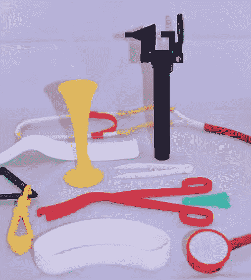

# Hackaday 奖:Field Ready 正在改变人道主义救援的面貌

> 原文：<https://hackaday.com/2020/06/09/the-hackaday-prize-field-ready-is-changing-the-face-of-humanitarian-relief/>

这是人道主义援助动员的持久画面之一:军用运输机排列在跑道上，准备接收每一个可以想象的供应托盘。那些收缩包装托盘上的纸箱装满了从婴儿配方奶粉到饮用水的一切东西，并将加入装满工具和材料的板条箱，这些工具和材料是为那些由于灾难(有时是自然的，但往往是人为的)而突然陷入文明短缺的地方的人们提供住所、衣服、食物和治疗所需要的。

如果事情不需要那样呢？如果我们不需要一次又一次运送物资去帮助重建，而是只需要一次飞行，一次装满我们行业的工具:3D 打印机、Arduinos、电子元件、机床和使用它们的专家。这当然不能弥补短期内对食物和水的需求，但是进口制造当地所需物品的能力将大大有助于修复灾区的基础设施。

反思灾难响应是 [Field Ready](https://www.fieldready.org/) 的核心任务，它是我们与 2020 年 Hackaday 奖合作的团体之一。通过介绍这个具有潜在改变世界使命的非营利组织，并帮助那些参加[2020 年黑客奖挑战](https://prize.supplyframe.com/#section-challenges)的人，这里有一些关于现场准备的信息——他们做什么，他们如何看待数字制造适合他们的使命，以及他们未来的方向。

## 供应线

如果说 2020 年上半年教会了我们什么，那就是这个世界的生死取决于供应链。“链”这个词可能有点矛盾，因为它意味着力量和稳定。但是我们都知道，我们的供应链更像是线，容易断裂，难以修补。全球分布的供应链在大量提供廉价商品的同时也可能带走它们，尤其是在灾区。

正是考虑到这些瓶颈，Eric James、Dara Dotz 和 Nick Haan 在 2012 年构思了 Field Ready。他们的想法是利用柔性制造的力量来转变救灾的物流，从本质上为灾难带来一个“什么都可以造”的工厂。自 2014 年注册并获得非营利身份以来，他们已经通过对各种人道主义危机的现场响应测试了他们的系统，从 2015 年尼泊尔地震开始。

在评估了受灾国家的需求后，Field Ready 帮助在加德满都建立了一个数字制造实验室，为大量涌入灾区的援助机构制造任何需要的东西。实验室制造的医疗仪器和维修零件本来是可以订购的，但由于道路被地震破坏，供应线磨损，在现场制造它们更快更容易。2016 年，Field Ready 生产了 5000 多种产品。此外，他们培训了 600 多人如何在实验室操作机器，使尼泊尔有能力继续重建，更不用说让尼泊尔有能力通过建立自己的个人防护设备来应对当前的新冠肺炎危机。

正在进行的叙利亚内战为菲尔德准备创新提供了另一个机会。从被火箭和大炮摧毁的建筑物中进行救援和恢复行动通常需要使用提升袋，这是一种坚固灵活的气囊，在高压空气下膨胀。起重袋可以举起巨大重量的混凝土板和钢梁，但在这个饱受战争蹂躏的国家，它们供不应求，因此 Field Ready 创造了一种利用当地材料制造安全气囊的方法。他们制作了 100 多个袋子，并广泛分发；到目前为止，这些工具已经帮助拯救了七个人的生命，而且，这种设计是免费提供的，所以任何人都可以制作一个包来拯救一个生命。

[https://player.vimeo.com/video/237820598](https://player.vimeo.com/video/237820598)

## 公开挑战

2020 年 Hackaday 奖的公开挑战邀请任何人提出他们的想法，以解决我们四个非营利合作伙伴概述的主题。这些挑战基于他们通过实地工作确定的需求，满足这些需求的设计有可能对他们的救生工作和其他非政府组织的救灾工作产生巨大影响。Field Ready 考虑了一些高度集中的设备。

第一个挑战是生产一种可靠、低成本的输液加温器。在最好的情况下，包括输液在内的医学治疗绝不是微不足道的。静脉注射治疗总是需要无菌用品和程序，这在灾难情况下可能难以获得，并且静脉穿刺本身是侵入性的并且容易感染。但是注射疗法的一个鲜为人知的风险是由于没有适当地加热注射液而导致体温降低。

为了避免患者在注射大量冷液体时面临的风险，通常使用液体加温器。通过以可控和可靠的方式将液体加热到接近体温，可以避免体温过低和红细胞破裂或溶血的风险。问题是，商用液体加温器价格昂贵，而且在严峻的临床条件下很难买到。这项挑战旨在通过设计一种可由现成零件组装而成的液体加热器来纠正这一问题。最重要的是，流体加温器的设计需要考虑安全性，并着眼于使其易于由可能没有制造医疗设备经验的响应者制造。

In April, Dries Verbruggen experimented with [welding PPE with a defocused laser cutter](https://hackaday.com/2020/04/27/defocused-laser-welding-fabric-proves-theres-many-ways-to-slice-it/). Field Ready seeks a welder design that can be built on scene and produce similar results.

公开挑战赛中的另一个设备是热封机和塑料焊接机。这种设备在医疗响应领域有大量应用，从密封样品袋到快速制作隔离服。在过去的几个月里，随着个人防护用品库存的减少，我们已经看到世界各地的医院都在与后者作斗争。在灾难情况下，有效的个人防护设备可能会少得可怜。一种可以用作合成纺织品(如特卫强和纺聚丙烯)焊接机的热封机可以让响应者以远快于印刷或缝制的速度制作隔离服、眼罩甚至面罩。

Field Ready 公开挑战的最后一个设备是用于固化粘合剂的多功能紫外线棒。紫外线固化树脂的范围很广，涵盖了从半导体制造到人造指甲的应用。在灾难应对中，利用这些多功能粘合剂的能力经常受到交联未固化树脂所需的 UV 固化站的费用的阻碍。任何接受这一挑战的人都需要设计一种能够发出固化树脂所需水平的 UV-A 光的东西，使用容易获得的材料，并使其具有足够的通用性，以适应许多不同的制造过程。

## 梦之队挑战

在跟踪产品和确保客户物有所值方面，集中运营的传统制造商拥有广泛的质量控制和质量保证计划。许多制造商通过批号和序列号来跟踪产品；对产品的随机样本进行测试也是一种常见的做法，目的是在产品到达客户手中之前，发现制造或组装过程中的任何缺陷。

All these things need to be tracked

但是对于 Field Ready 应用于其灾难响应工作的分散制造模型，传统的质量保证方法不需要应用。零件通常直接从 3D 打印机的底座上送到最终用户手中，甚至没有序列号或标识让人们知道这个部件是在哪里制造的。这导致了下游的问题，不仅仅是因为他们做得好而获得了荣誉。除了自我推销，没有标签，需要更多部件的最终用户不知道联系谁来获得另一个部件，而经历部件故障的人没有追索权。缺少跟踪可能会导致浪费，因为 Field Ready 无法获得关于现场哪些工作正常以及哪些需要修复的反馈。

申请今天截止，选拔过程正在进行中，将选出三人在未来两个月内为 Field Ready 的梦之队工作。他们每个人每月将获得 3000 美元的津贴，与该组织合作开展梦之队挑战，旨在解决缺乏可追溯性的问题。他们的任务是组装一个质量控制系统，该系统可用于跟踪 Field Ready 在紧急响应部署期间制造的每个零件。这将是一个巨大的挑战，因为小到用于产科的 3D 打印脐带夹，大到便携式庇护所和厕所等全尺寸结构，都必须进行跟踪。材料的多样性带来了另一层困难，因为 Field Ready 使用他们能使用的任何东西来建造他们需要的东西。因此，任何标志、序列号、二维码或标签都需要与木材、金属、玻璃、塑料、陶瓷或任何其他可以想象的材料配合使用，并且必须足够坚固，能够在恶劣条件下持续使用。最后，该系统需要可远程访问，以便 Field Ready 可以保护他们的用户并不断改进他们的产品。

## 我们开始吧！

无论您是加入了梦之队，还是更喜欢参与公开挑战项目，Field Ready 都能让您的努力得到充分利用。这个世界并没有变得更加安全，总是需要有人伸出援助之手。他们必须携带的东西越少越好，在您的帮助下，Field Ready 正在实现这一愿景。

通过此视频问答环节，花些时间了解现场就绪挑战。

 [https://www.youtube.com/embed/dHSDr44bdPc?version=3&rel=1&showsearch=0&showinfo=1&iv_load_policy=1&fs=1&hl=en-US&autohide=2&wmode=transparent](https://www.youtube.com/embed/dHSDr44bdPc?version=3&rel=1&showsearch=0&showinfo=1&iv_load_policy=1&fs=1&hl=en-US&autohide=2&wmode=transparent)

[专题图片:红队部署在南苏丹实地打印水泵配件；用车载 3D 打印机在美属维尔京群岛打印医疗用品。礼貌领域就绪]