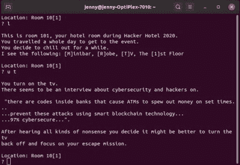
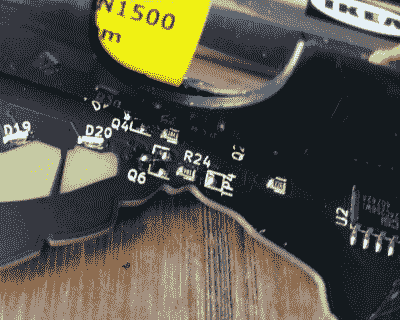

# 黑客酒店 2020 徽章

> 原文：<https://hackaday.com/2020/03/12/the-hacker-hotel-2020-badge/>

电子会议徽章的技术在过去十年或更长时间内已经发展，使得对于值得注意的单个例子，现在必须包括一些特殊的特征。也许是一个以前在徽章中被认为不可能实现的功能，也许是一个异常漂亮的设计，一个有趣和引人注目的功能，或者它只是以一种异常巧妙的方式推动了一个原本有限的设备的功能。最近的 Hacker Hotel 2020 的徽章来自创建了从 SHA 2017 徽章派生的软件平台的同一徽章团队[，它通过将真正的艺术作品与一组令人愉快的复杂谜题结合起来，在足够的水平上引起所有参与者的兴趣，从而选中了许多这些盒子。](https://hackaday.com/2019/02/20/badge-team-badges-get-a-platform/)

## 古埃及主题拼图的精美艺术品

The badge, fresh out of its bag.

徽章包装在一个纸袋中，外面有一个卡通图案，为该设备的拼图设置场景。badger 和 python 前往埃及，在那里他们被困在金字塔中，徽章拼图将他们解救出来。将它从包中取出，露出一个大约 140 毫米(5.5 英寸)乘 80 毫米(3.2 英寸)的哑光黑色和无电镀镍镀金(ENIG)板，上面有徽章的艺术作品。团队设计师 Nikolett 展示了一只古埃及风格的猫——代表神[巴斯泰托女神](https://en.wikipedia.org/wiki/Bastet)——周围有一排透明的 FR4 面板。还有一个带有象形文字的挂绳，和一副廉价的耳塞耳机。徽章大量使用透明 FR4，背后有 led 提供漫射光。

把它翻过来，电路板的大部分中间被一对 AA 电池座占据，表面贴装微控制器就在它们下面。在电路板的底部是一个 3.5 毫米耳机连接器，它的右边是带电源开关的 PSU 组件，左边是一个傻逼插件连接器。徽章的上半部分有那些透明的 FR4 面板，可以清楚地看到它们后面的表面贴装 led

A text adventure game on a badge, this is going to be fun!

装上电池，扳动开关，让一些 led 闪烁，猫的项圈亮成一排红灯。稍微摆弄一下四个微型瞬间动作按钮，玩家就可以开始游戏了；徽章是一系列的拼图，每个拼图的完成都会点亮猫项圈的另一部分绿色。第一个很简单，一个西蒙说最好用耳机玩的游戏。然后是一个涉及挂绳上象形文字的谜题，以及一个需要玩家通过 3.5 毫米音频电缆与其他徽章进行物理连接的徽章通信游戏。

之后，谜题真的变得有趣了，因为在硬件黑客区，他们提供了一个装满 USB 转串行适配器的大盒子。将一个连接到 SAO 连接器上，设置一个终端与之对话，你马上就进入了一个文本冒险游戏。你在酒店的大厅里，你需要弄清楚这一切。

这款游戏异常曲折，让许多参与者彻夜难眠。徽章装有一系列传感器，所以有些任务必须在黑暗中完成，其中一项需要加热，还有一项涉及磁力计和一些放置在活动周围的照片。最终一个勇敢的三人组解决了这个问题，这比我做的还要多。

## 他们如何从灾难中抢走一枚工作徽章

Some very neatly-executed bodge wires to cover for the missing MOSFETs.

徽章诞生的完整过程可以在下面 Bas Oort 的演讲中看到。早期的想法包括一个超便宜的红木微控制器，但板载是最终的选择，一个 ATtiny1617。还有一个 24C256 32k EEPROM，一个霍尔传感器，光传感器和 30 个 led。ATtiny 板上有 16k 的闪存和 2k 的 RAM。

在中国组装公司的英勇努力下，制造部门在中国春节前才得以进入，但不幸的是，当电路板到达欧洲时，没有一块能工作。故障出在 led 上，由于读取其数据手册时出错，所有的 led 都装反了。手工返工 30 个 SMD LEDs 是可能的，但这不是一项轻松的任务。

该团队设计了许多解决方案，包括改变驱动它们的 MOSFET 的极性，但最终制定了一个完全移除 MOSFET 并将其从 ATtiny 中驱动的计划。这使处理器超出了其规格，导致 led 变暗，但幸运的是，还没有到停止徽章工作的程度。随后在荷兰黑客空间进行了 10 个小时的焊接血汗工厂会议，接着是另一个编程和包装徽章的会议。

有趣的是，该编程平台由阿沙 2017 徽章提供支持，既证明了该平台的多功能性，又提供了一个奇怪的圆。[badge.team 孵化中心](https://hatchery.badge.team/projects/i2cflasher)已经提供了用于此的软件，因此如果您有多个运行 badge . team 固件的 ESP32 徽章，您可以自己更新您的 Hacker Hotel 2020 徽章。

[![[Myrtle]'s winning badge, with all the LEDs green.](img/acc3bfc1fdbd591f0297783b42706749.png)](https://hackaday.com/wp-content/uploads/2020/02/hh2020-badge-winner.jpg) 

【桃金娘】的获奖徽章，所有 led 为绿色。

转到[软件](https://github.com/badgeteam/hackerhotel-2020-software)，Benadski 的一些英勇的组装工作使它变成 16k 可用，只有两个字节空闲。正是这种文本冒险游戏使这种徽章比一般的徽章多一点，因为它提供了一种适合资源有限的微控制器的格式的全文游戏引擎。由 Sake Blok 编写，它将游戏定义为一个 JSON 文件，该文件经过处理以适应 EEPROM 芯片的微薄空间，最初用 Python 编写的引擎已经移植到 ATtiny。这可以用一个完全不同的游戏来复制，使它适合所有种类的基于徽章的冒险游戏。[Python 版本甚至通过其串口运行在 badge.team badge](https://hatchery.badge.team/projects/gametest) 上。

这个徽章与欧洲大型活动上的趋势不同，在徽章上有一些接近通用计算机的东西，当然也与去年黑客酒店提供的 ESP32 完全不同。但它成功地将顶级艺术作品与极其复杂和多层次的谜题集结合在一起，除了本身完全可以被黑客攻击之外，它还让这个文本冒险游戏引擎成熟到任何人都可以尝试。

也许它最重要的成功在于它所达到的互动水平。除了铁杆硬件黑客，许多营地徽章在活动期间几乎没有用处，除了参考活动日程，也许是一些游戏的片刻消遣。这个徽章让相当多的人把一个串行端口连接到一个微控制器上，并在终端上进行黑客攻击，在某些情况下，这可能是他们一生中的第一次。如果这说明了什么，那就是创造性的设计和功能不需要哇！因素硬件，使一个难忘的结果。我们期待看到 BadgeLife 社区的其他人如何采纳这些想法。

 [https://www.youtube.com/embed/tQkBal95aCQ?version=3&rel=1&showsearch=0&showinfo=1&iv_load_policy=1&fs=1&hl=en-US&autohide=2&wmode=transparent](https://www.youtube.com/embed/tQkBal95aCQ?version=3&rel=1&showsearch=0&showinfo=1&iv_load_policy=1&fs=1&hl=en-US&autohide=2&wmode=transparent)

