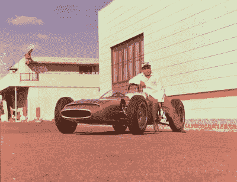
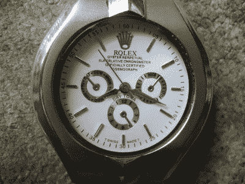
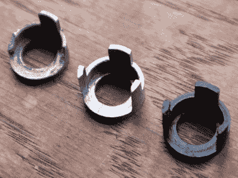
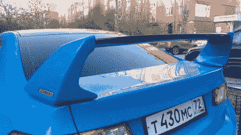

# 本田的垮台:一个全球品牌如何未能读懂房间

> 原文：<https://hackaday.com/2022/04/21/the-honda-takedown-how-a-global-brand-failed-to-read-the-room/>

也许 3D 打印世界的当下故事与一家日本汽车和摩托车制造商有关。本田[向流行的 3D 打印模型库网站 Printables 发送了一份下架通知，要求移除以单词“Honda”](https://www.reddit.com/r/3Dprinting/comments/txqg8y/honda_is_deleting_3d_models/i3nlnmg/)开头的模型。它留下了困惑、失望和一些愤怒，但到底发生了什么？也许是时候检查发生了什么，并思考这对那些将汽车或任何其他由大公司制造的物品的可打印零件和附件放在网上的人意味着什么。

## 如果你做了什么东西，你有什么权利？

Soichiro Honda, famous for being an engineer rather than a serial litigator. Roderick Eime, [CC BY 2.0](https://commons.wikimedia.org/wiki/File:Soichiro_Honda_in_1963.jpg).

据我们从网上报道中收集到的信息，撤下通知只发给了本田欧洲分公司的印刷品，而且范围相当广泛，包括了本田所有相关车型。Printables 遵从了它，但是在撰写本文时，从 Thingiverse 和其他模型库站点可以获得大量这样的模型。

任何从事内容创作的人都必须具备版权和知识产权法的工作知识，因为粗心的人很容易成为恶意信件的主题，所以在 Hackaday，虽然我们不是律师，但这是一个我们有一些专业经验的主题。接下来是我们对那次经历的看法，我们对本田动机的看法，以及你们中那些制作 3D 模型的人是否有什么可担心的。

如果你创造了某样东西，你就拥有它的版权。不管是什么，不管是音乐作品、黑客作品还是 3D 模型。你可以转让所有权，就像我对 Hackaday 所做的那样，用这些话来换取报酬，但这并不能改变所有权的存在。如果你创造的东西是一项发明而不是一段内容，也有专利，设计专利保护一些创作的独特外观和感觉。

Technically this isn’t a fake Rolex, but and “[Rqlex](https://commons.wikimedia.org/wiki/File:Illegally_copied_wristwatch_which_shall_look_like_Rolex_Daytona.jpg)“. Gdead, Public domain.

如果你创造的东西使用了其他人拥有版权或专利的东西，其他人可以主张这些权利。通常你会在音乐方面听到这种说法，如果我的最新歌曲是艾德·希兰的样本，那么要么我应该在发布之前获得这些样本的许可，要么我应该期待他的律师的来信。

因此，很明显，如果你上传了一张没有其他人作品的原创 3D 照片，那么它就是你的，没有人可以以版权为由要求删除它。这听起来很明确，但当涉及到本田的情况下，这显然不是那么简单，存在一些灰色地带。

我有一个朋友，他在泰国市场上花了几美元买了一块假劳力士手表，作为新奇的东西。它从正面看起来很棒，但从侧面看，它缺乏真实物体的厚重，当然它有一个非常便宜的机械装置。这是一个明显的假货，如果他把一个集装箱的假货进口到伦敦，他无疑会面临迅速的法律制裁。正如你所料，同样的情况也适用于假的汽车零件，如果那个集装箱里装满了带有假本田包装的本田思域门把手，那么汽车公司就完全有理由把他拿下。

## 什么时候思域零件不再是本田思域零件

Which VW Polo lock part is infringing, the broken genuine one on the left, the aftermarket one in the middle, or my 3D-printed one on the right?

这可能看起来像是一个现成的 3D 打印机模型的 Civic 门把手，但这是我们进入灰色区域的地方。标有“官方本田思域门把手”的把手的精确模型就像假劳力士一样，它被冒充为真货，因此将成为一封信的合理接收者。但问题是，在什么情况下，思域门把手不再是思域门把手，因此不再是受版权保护的本田设计，而开始成为一个恰好适合思域的不同门把手，或者实际上是一个通用门把手？

时尚界也有类似的情况，一名设计师可以设计一件高级定制服装，但另一名设计师可以设计一件看起来很像但又不完全相同的服装，而不用担心法律威胁；这就是小明星在奥斯卡红毯上穿的裙子可以在颁奖典礼后几个小时内买到参加一个豪华派对的原因。那个设计师就是不能把“古驰”印在上面。

在可打印可拆卸的情况下，它不仅延伸到零件，还延伸到附件，除了思域门把手，它可能会抓住一个旨在与思域通风口接合的夹式手机支架。因为手机支架是它的创造者的发明，所以不可能有版权取代部分本身的索赔，所以剩下的就是假冒的可能性。然而，一个“官方本田思域通风口手机支架”将被冒充为真实的东西，但断言任何此类旨在适应本田的配件被冒充为本田产品是极其站不住脚的。

本田似乎在对知识产权的灰色地带进行创造性的解释，并将这种创造性的解释推向了极限。他们不拥有第三方设计的版权，只是因为它们看起来有点像本田的零件，除非它们是有版权的本田零件的直接副本，而且像门把手这样普通的东西，他们不太可能寻求专利侵权索赔。

鉴于他们已经瞄准了“本田”一词的任何使用，他们的角度可能不是零件本身的知识产权，而是假冒和冒充本田产品。我再一次认为，这家汽车制造商已经将灰色地带延伸到了临界点，因为“官方本田……”车型和声称它适合本田的车型之间的差异如此之大，甚至是埃维尔·克尼维尔自己都无法跨越的鸿沟。

## 我们认为本田正在采取一些自由

A Mugen spolier made for a Honda Accord. Having gone after 3D printing, we now await Honda’s takedown of their entire aftermarket parts ecosystem. RG72, [CC BY-SA 4.0](https://commons.wikimedia.org/wiki/File:Honda_Accord_(2007)_en_Tjumeno_03.jpg).

因此，我认为，本田公司一名过于热情的公司律师认为，他通过一次站不住脚的投机性收购中了大奖，鉴于自大众市场汽车问世以来，一家庞大的汽车零部件和配件售后企业一直在合法地为本田和无数其他汽车提供零部件，他这样做可能会使该公司与一个价值数十亿美元的行业发生碰撞。

当然，他没有，因为本田知道这永远不会出现在法庭上，很容易对付一个拥有 3D 模型的小人物，但很难对付一个巨大的汽车配件制造商。你应该担心你放在网上的那个汽车零件模型吗？可能不会，因为我们认为其他制造商不太可能鲁莽地效仿。

我们认为重要的是，到目前为止，这仅延伸到本田欧洲和 Printables，他们作为 Prusa 研究的一部分，总部设在欧洲。要么这是一次试水，看看他们能逃脱什么，他们知道类似的策略对像 Thingiverse 这样的美国网站来说会更加困难，或者可能他们毫无头绪的律师只是在他们的欧洲办公室工作。无论是哪种可能性，这都是一个令人遗憾的举动，我们认为本田现在应该为此付出负面宣传的代价。

与此同时，我们会对其他制造商说:不要像本田[那样，而要像福特](https://hackaday.com/2021/10/12/ford-maverick-welcomes-diy-spirit/)那样。

横幅图片:[“本田 Ridgeline Sport Grille”](https://commons.wikimedia.org/wiki/File:2017_Honda_Ridgeline_Sport-grille.jpg)by【McChizzle】，公共领域。