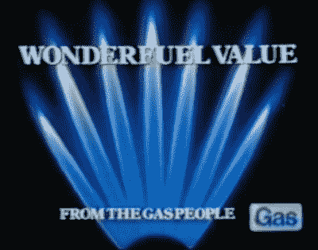

# 氢经济可能会从你的炊具中出现

> 原文：<https://hackaday.com/2018/12/17/the-hydrogen-economy-may-be-coming-through-your-cooker/>

距离本文写作的地方大约一个小时的车程，有一个汽车制造厂，当你开车经过它的入口时，你可能会注意到一个不显眼的标志和一条额外的车道，上面有神秘的路标“H2”。这家工厂是本田在斯温登的工厂，它生产一些欧洲供应的民用汽车，道路上的车道通向英国甚至是世界上为数不多的公共加氢站之一。本田是一批精选的制造商之一，他们将赌注押在了氢燃料电池技术的环境可持续驾驶的未来上。

[![The hydrogen-powered Honda Clarity FCV, a car most of us will probably never see. Lcaa9 [CC BY-SA 4.0].](img/43aed7905196363b7874b4ad163f1356.png)](https://hackaday.com/wp-content/uploads/2018/12/1024px-2018_honda_clarity_fuel_cell.jpg) 

氢动力本田 Clarity FCV，一辆我们大多数人可能永远也不会见到的汽车。Lcaa9 [ [CC BY-SA 4.0](https://commons.wikimedia.org/wiki/File:2018_Honda_Clarity_Fuel_Cell.jpg) 。本田和其他公司的麻烦在于，如果你在世界上任何地方看到本田 Clarity FCV 或者任何氢动力汽车行驶在路上，那么你就属于一个相对较小的群体。如果没有像 Swindon 这样的氢气站综合网络，就没有购买氢气汽车的动力，当然，如果道路上没有汽车，燃料公司就没有投资氢气生产基础设施的动力，例如 [ITM 电力电解装置](http://www.itm-power.com/sectors/clean-fuel)，这些装置似乎驱动着如此多的现有装置。相比之下，电动汽车是更安全的选择；虽然充电点网络无法与加油站网络相媲美，但足以为电动汽车驾驶员提供服务，而且大多数国内供应都可以进行缓慢充电。

## 实现白日梦的管道？

The 1970s, [when a shiny new gas cooker solved everything](https://www.youtube.com/watch?v=Z79eT4qxuvY).

那时，氢经济对环保主义者来说是一种白日梦，它有望成为无污染的能源，但对它的可能采用来说，障碍太大了。令人高兴的是，我们的注意力最近通过[一篇 *Ars Technica* 的文章](https://arstechnica.com/science/2018/11/natural-gas-distributors-outline-proposal-to-convert-home-heating-to-hydrogen/)被吸引到了一个关于[的氢气分配试点计划](https://northerngasnetworks.co.uk/h21-noe/H21-NoE-23Nov18-v1.0.pdf)的计划上，该计划是由英国和挪威国内天然气公司联合产生的。他们建议将覆盖英格兰北部大部分地区的家用天然气分配网络从甲烷完全转换成氢气，氢气来自催化重整，并且产生的二氧化碳被封存在北海下面的枯竭的油气田中。它被销售为天然气行业脱碳的蓝图，虽然它仍然依赖化石原料，而不是环保主义者的可持续电解海水的梦想，但它有望最大限度地减少大气二氧化碳排放，这是其他项目如氢混合项目所不具备的。

这份报告深入研究了该项目的经济效益，但这只是一天的工作。我们更感兴趣的是相关的技术，以及这种发展对未来的意义。为了充分理解这一切，我们首先要快速回顾一下天然气行业的过去。

[![A miracle of 1970s technology: a platform of the Frigg gas field in the Norwegian part of the North Sea. Knudsens Fotosenter / DEXTRA Photo [CC BY 4.0]](img/bfefd01a298d6c9c1b7d7ef0b5def696.png)](https://hackaday.com/wp-content/uploads/2018/12/frigg_dp2_dex_kf_000690.jpg)

20 世纪 70 年代技术的奇迹:北海挪威部分的弗丽嘉气田的一个平台。knudsens foto senter/DEXTRA Photo[[CC BY 4.0](https://commons.wikimedia.org/wiki/File:Frigg_DP2_(DEX_KF_000690).jpg)]

当我们想到家用燃气时，几乎可以肯定是甲烷，即所谓的来自地下化石矿床的天然气。通过无数的电视广告，我们已经习惯了它的蓝色火焰，向我们展示了清洁和高科技的新锅炉，舒适的家园和令人垂涎的食物，这些食物来自闪闪发光的新炊具，但这不是我们的祖父母所知道的气体。他们的天然气来自煤炭，每个城镇都将有一个天然气工厂，实际上是一个小型的化学工厂，在当地生产天然气，没有任何国家或地区电网。这种气体本身是一种主要由一氧化碳和氢气组成的混合物，通过一系列的净化步骤，由煤制成，在有限的空气供应下交替加热，产生一氧化碳，然后用高压蒸汽喷射，产生氢气。老一代人似乎有很多关于煤烟和不稳定的煤气设备的故事，煤气厂本身是出了名的肮脏和污染的环境，其以前的场所直到今天仍然经常被污染。

在 20 世纪下半叶，随着甲烷天然气的大量供应，工业转向了这种新的来源。安装了新的配电网，并开展了一项大规模的工作，工程师们走访了每一个燃气客户，为他们的设备更换新的喷嘴或燃烧器，以适应新供应的不同燃烧特性。例如，在英国的大部分地区，这一过程是在 20 世纪 60 年代和 70 年代完成的，并且建议将氢气作为最终网络和设备的一部分来替代甲烷。

## 易碎的炊具和不那么易碎的管道

从表面上看，网络从甲烷到氢气的转换应该类似于 50 年前的那次尝试。事实上，它甚至应该更简单，因为转换到甲烷所需的天然气网格已经存在。但是有一个问题，它源于氢的一个不寻常的性质。在这种情况下，氢分子很小，很容易插入大多数金属的晶格中。在某些情况下，这是一种理想的特性，例如，已经对以这种方式在金属钯中储存氢的可能性进行了大量研究，但在气体管道或配件的情况下，存在灾难的潜在可能。

在形成实际上是金属和氢的合金的过程中，金属的性质发生了根本的变化；这种现象被称为氢脆。在英国，当地的低压天然气管道是一种独特的黄色聚丙烯，这种材料不会变脆，而且足够坚固，已经被用作战斗机器人盔甲，但是长距离的高压管道是金属的。如果高压燃气总管的金属以这种方式脆化，结果可能是灾难性的，例如，如果它发生在设计用于甲烷的家用烹饪炉的金属部件上，它可能是燃气泄漏的原因。试点方案的文件详细说明了如何选择碳钢作为最合适的管道材料，但令人惊讶的是，对于在用户端可能发现的任何金属配件，该文件对同一主题的论述却很少。

对于任何对绿色能源感兴趣的人，特别是对氢能源感兴趣的人来说，这个提议是一个引人入胜的读物。作为天然气网络的脱碳解决方案，它无疑是大胆的，它概述了一个世纪后将被期刊文章和历史学家引用的项目类型，作为对不知情者的氢能计划的介绍，它无疑是全面的。

回到本文的开头，那些氢动力汽车，它会提供氢动力驱动吗？诚然，现成的氢源将使建立加油站网络变得更加容易，但尽管我们承认这可能是那些经不起时间考验的预言之一，但我们无法完全看到这一点。早期的承诺，即现有的内燃机汽车将很容易转换为氢已被证明是过于乐观，燃料电池汽车，如本田是昂贵的，在其发展的早期，与此同时，电动汽车的吸收似乎已经跨越了这两项技术。正如你所料，我们愿意相信，但我们更有可能通过电力而不是氢能源前往 21 世纪 30 年代的黑客营地。到那时，我们的家将使用新的燃料取暖，这似乎是一个明显的可能性。

标题图片:Bexim [ [CC BY-SA 4.0](https://commons.wikimedia.org/wiki/File:ITM_Power_Hydrogen_station_in_Teddington.jpg) 。