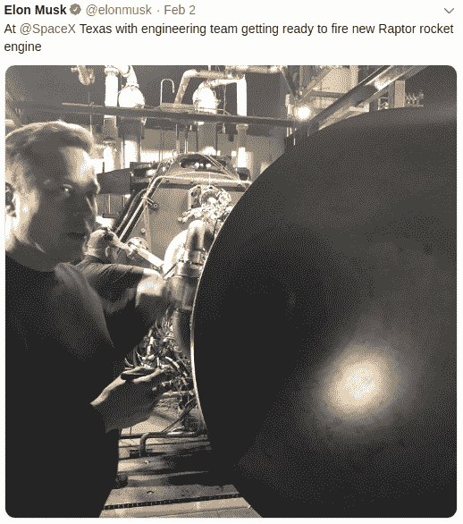
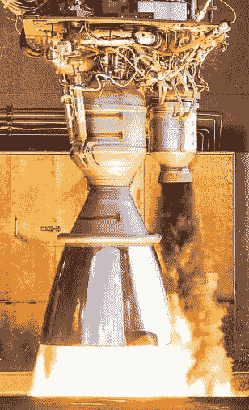
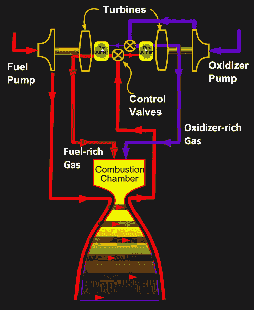
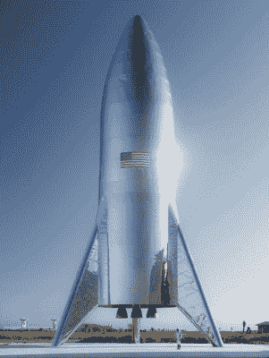

# SpaceX 新发动机背后的“不可能”技术

> 原文：<https://hackaday.com/2019/02/13/the-impossible-tech-behind-spacexs-new-engine/>

埃隆教会的追随者无疑已经知道 SpaceX 的最新技术胜利:第一台全尺寸猛禽发动机的测试点火。当然，这不是什么秘密。正如他经常做的那样，埃隆一直在他的 Twitter 账户上“泄露”幕后信息、图片，甚至是活动的视频。结合 SpaceX 一开始的相对透明性，这让我们格外清楚地看到字面上的火箭科学是如何在加州霍桑公司进行的。

 这种开放性是 SpaceX 在互联网上受欢迎的一个关键部分(以及大型火箭)，但它在“猛禽”上尤其具有启发性。这种下一代发动机背后的技术被称为“全流分级燃烧”，几十年来一直被传统的航空航天公司认为几乎是不可能的。尽管苏联和美国对这种技术进行了广泛的研究，但还没有使用这种复杂燃烧系统的发动机被试飞过。然而，就在埃隆宣布 SpaceX 正在设计猛禽六年后，他们已经完成了第一台可飞行的发动机。

全流式分级燃烧发动机通常被认为是火箭技术的“圣杯”，因为它有望从液体推进剂中提取尽可能多的能量。在一个每盎司都很重要的领域，能够从飞行器中挤出哪怕多百分之几的推力都是值得争取的。特别是如果像 SpaceX 一样，你计划将这些新的全流式发动机放入世界上最大的运行中的助推火箭*和*航天器。

但是，是什么让全流式分级燃烧更有效，为什么建造一台利用它的发动机如此困难？为了理解这一点，我们需要先仔细看看更传统的火箭发动机，以及从一开始就定义它们的设计范例。

## 开式循环发动机:故意浪费

许多最著名的火箭都使用了基于气体发生器循环的发动机，包括土星 5 号、联盟号、德尔塔 4 号，甚至猎鹰 9 号。事实上，除了航天飞机之外，你可能会说航天史上的几乎每一个里程碑都是由气体发生器循环发动机完成的。这项技术可以追溯到 V-2 火箭，是使液体燃料火箭成为可能的关键突破之一。尽管这项技术取得了令人难以置信的成功，但它也不是没有缺点。

Merlin engine with black preburner exhaust

简而言之，气体发生器产生气体，推动涡轮旋转，进而驱动推进剂泵。在某些发动机中，燃气发生器的工作原理不同于发动机本身，它有自己独立的燃料供应。例如，V-2 火箭的涡轮是用蒸汽旋转的，蒸汽是由过氧化氢和温暖的高锰酸钠之间的化学反应产生的。

这种方法的缺点是气体发生器的辅助燃料系统增加了额外的重量和复杂性，这是火箭发动机最不希望出现的情况。在猎鹰 9 号的梅林等发动机中使用的更现代的方法是通过燃烧相对少量的与主发动机相同的燃料和氧化剂来为涡轮提供动力。在这种情况下，气体发生器通常被称为预燃烧器。

但是，如果预燃室被赋予与发动机本身相同的燃料和氧化剂，以及相同的比例，它基本上只是一个更小的火箭。废气温度太高，无法通过涡轮机。为了解决这个问题，预燃室使用富含燃料的混合物，这导致不完全燃烧和较低的排气温度。

所谓的开式循环发动机的定义特征是，预燃室的废气作为废物被排放到船外。在一些火箭中，这种未燃烧的燃料可以被看作是一条黑色的条纹，旁边是明亮的排气羽流。关闭循环可以提高性能，这从来都不是什么秘密，也就是说，收集预燃室的废气并将其送入发动机的燃烧室。但是未燃烧的煤油产生的黑烟不适合通过发动机再循环。最终，简单地建造更大的火箭比试图获取这些损失的燃料更容易。

## 找到正确的搭配

在 20 世纪 50 年代，苏联科学家想出了一个折中的办法。他们没有在预燃室中使用富含燃料的混合物，这种混合物产生的废气无法安全地再循环到发动机中，而是尝试在富氧条件下运行预燃室。不幸的是，这个想法解决了一个问题，同时又产生了另一个问题，因为没有金属能够经受住预燃室产生的极其高温的富氧气体。事实上，美国科学家认为这是不可能的，并认为他们的苏联同行正在研究这个概念的说法是冷战宣传。

最终，苏联人掌握了制造涡轮所需的冶金技术，并开发了几款基于富氧预燃室概念的发动机。废气通过管道进入发动机的燃烧室，回收了至少一部分推进剂，否则这些推进剂会被丢弃到船外。美国 Atlas V 目前使用的现代俄罗斯 RD-180 发动机是这项技术的延续。

美国工程师走的是相反的方向。他们认为，只要使用氢气代替煤油作为燃料，预燃室中的富燃料混合物是可能的，并且可以用现有的金属合金来实现。这最终导致了航天飞机主发动机的发展，至今仍是有史以来飞行效率最高的液体燃料火箭发动机。虽然航天飞机早已退役，但发动机本身的一种变体将继续为[太空发射系统](https://www.nasa.gov/exploration/systems/sls/overview.html)提供动力。这将是美国宇航局有史以来建造的最强大的火箭，计划于 2020 年开始执行任务。

## 结束循环

无论是哪种方法，无论是回收氧化剂还是富含燃料的预燃室废气，都明显优于将一切都丢弃到船外。但两者都不是理想的解决方案，因为仍有潜在的可燃产品被浪费。基本上，苏联和美国都解决了同一问题的不同方面；为了真正封闭循环，富燃料和富氧化剂预燃室设计需要在同一台发动机中同时使用。

合乎逻辑的最终结果是全流量分级燃烧发动机。这种发动机有两个独立的氧化剂和燃料泵，由两个涡轮驱动，由各自专用的预燃室提供动力。但是，与在预燃室中仅燃烧少量燃料和氧化剂的气体发生器循环不同，在全流式分级燃烧发动机中，所有的燃料和氧化剂都通过它们各自的预燃室。换句话说，燃料燃烧两次:一次是在预燃室中以较低的效率燃烧，以产生旋转涡轮所需的能量，另一次是在燃烧室中以最高的效率燃烧，以产生推力。虽然发动机的设计和测试异常困难，但它完全消除了燃气发生器循环的浪费。

但是提高燃油效率并不是这种设计的唯一优势。例如，分隔涡轮和泵的密封件不太重要，因为不用担心污染泵送的液体；最终他们会去同一个地方。此外，燃料和氧化剂以气体形式进入燃烧室的事实，相对于将它们以液体形式喷射的传统设计，进一步提高了发动机的效率。

与传统火箭发动机中使用的单个涡轮相比，全流式分级燃烧发动机上的单个涡轮往往在更低的温度和更低的压力下运行。这减少了涡轮叶轮上的压力，并允许它们在需要检查和更换之前运行更长时间。鉴于 SpaceX 对可重复使用性的关注，这可能被视为与提高燃料效率同等重要。

## 等待即将结束

SpaceX Starship Prototype

虽然 SpaceX Raptor 将是第一台飞行的发动机，但它实际上并不是第一台全流量分级燃烧发动机。RD-270 于 1967 年由苏联完成，作为他们登月计划的一部分，并进行了几次静态测试。但在美国于 1969 年登上月球，有效地赢得了太空竞赛后，发动机(以及它本来打算提供动力的火箭)被取消了。不太复杂，最终更便宜的发动机被用于苏联航天计划的剩余部分。

在 20 世纪 90 年代，美国政府表达了对开发家用全流式分级燃烧发动机的兴趣。虽然承包商 Rocketdyne 和 Aerojet 开发了有前途的涡轮和预燃室，但空军和 NASA 都没有选择提供完成整个发动机所需的资金。

那么 Raptor 什么时候才能最终成为第一台离开地球的全流量分级燃烧发动机呢？如果你相信推特，很快。Elon Musk 声称，猛禽动力星际飞船的原型将在未来几个月内在德克萨斯州布朗斯维尔附近的测试设施周围进行低空“跳跃”。当然，从现在到那时会发生很多事情，所以日期完全有可能会错过。但即使如此，2019 年似乎仍将是火箭发动机“圣杯”最终升空的一年。希望等待是值得的。