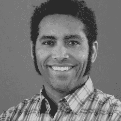
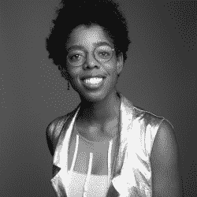
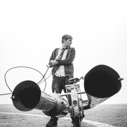

# Hackaday 奖不可思议的评委们

> 原文：<https://hackaday.com/2018/10/08/the-incredible-judges-of-the-hackaday-prize/>

黑客大奖的最后一次挑战刚刚结束。在过去的几个月里，我们已经看到了一千多个令人惊叹的项目，从开放硬件到人机界面。然而，这是一场竞赛，为了决定获胜者，我们邀请了硬件领域的一些大师来评判这些令人惊讶的项目。

以下是今年 Hackaday 奖评委的预览。在接下来的几周内，我们将向他们发送评审表，统计结果，并且在不到一个月的时间内，我们将在帕萨迪纳举行的 [Hackaday 超级大会上宣布 Hackaday 奖的获奖者。这是一个不容错过的活动，我们不仅将听到硬件大师们精彩的技术演讲，还将看到谁将赢得 50，000 美元的大奖。](https://hackaday.io/superconference/)

* * *

### 基普·布拉德福德

基普·布拉德福德是麻省理工学院媒体实验室的生物医学工程师和研究科学家。他的工作重点是重塑酷。他是创客运动的领导者，创办了各种初创企业。他是去年 Hackaday 超级会议的一名演讲者，在会上他谈到了建设无聊项目的重要性。这是一个关于控制气候的装置，或者简单地说，一个 HVAC 系统的精彩演讲。这绝不是一个华而不实的项目——制冷已经存在了一百年，空调已经普遍使用了五十年。尽管如此，关于建设基础设施还有很多东西要学，考虑到气候控制系统的不确定性，小的效率提升可以累积成巨大的影响。

### 麦迪逊·马克西

麦迪逊马克西是国际知名的技术专家和多学科的创意。作为 LOOMIA 的创始人，Maxey 在将灵活、鲁棒的电路规模化方面进行了开创性的工作，这是一种将柔软、灵活的电路植入外套和夹克的技术，可以加热、照明、感应和跟踪数据。如果你正在寻找不是由铜和 Kapton 制成的可穿戴技术，那就别再找了。《商业内幕》、《福布斯》和《赫芬顿邮报》都对卢米亚进行了专题报道。这一点点硬件可以作为加热器，让你温暖，或作为照明照亮汽车的顶篷或让你在晚上可见。Maddy 是福布斯 30 under 30 杂志的成员，Thiel Fellow，Lord and Taylor Rose 奖获得者。

### 马克·罗伯

Mark Rober 是前美国国家航空航天局工程师，发明家，目前拥有近三百万用户的 YouTuber，他们都对科学和工程感兴趣。他已经在 Hackaday 上多次出现，因为[设计了跳过湖中岩石的完美投掷](https://hackaday.com/2018/08/02/engineering-the-perfect-throw-for-rock-skipping/),[在热水浴缸](https://hackaday.com/2017/12/08/fill-your-hot-tub-with-sand-for-science/)中装满沙子，然后在里面游泳，建造了一个总能抓住你的飞镖以获得完美靶心的飞镖板，以及建造了[世界上最大的超级酒鬼](https://hackaday.com/2017/07/21/worlds-largest-super-soaker-is-dangerously-good-clean-fun/)(是的，这是经典的原始超级酒鬼)。他的作品已经在互联网上的数十种出版物中出现。马克充满了令人敬畏的想法，并通过他的 YouTube 频道能够向全球数百万人清楚地解释科学和工程。

###  柯林·福尔泽

柯林·福尔泽是一个住在棚子里的疯狂英国人，他以前是一名水管工，现在创造了惊人的发明和令人难以置信的车辆。他的 YouTube 频道有超过 500 万用户，他的视频被观看了超过 6 亿次。他制造了一辆真正的气垫自行车，总有一天会被带到恩多的森林卫星上；世界上最快的碰碰车，T2，实际上用作碰碰车也非常不安全；还有 T4，一把当你切面包时可以烤面包的刀，T5。当然，他最令人印象深刻的成就是横跨英吉利海峡的巨大脉冲喷气式飞机。所有这些都不会烫坏他的安全带。

这些只是我们选出的四位杰出的评委，他们将决定今年 Hackaday 奖的获胜者。获胜者将在 11 月 3 日的超级黑客大会上宣布。现在还有票，如果可以的话你真的很想去。尽管如此，我们仍将直播一切，包括颁奖仪式，其中一个团队将获得 50，000 美元的大奖。这不是一个可以错过的事件。

The [HackadayPrize2018](https://hackaday.io/prize) is Sponsored by:     