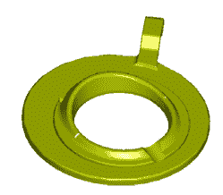

# 国际空间站得到了一个新的厕所

> 原文：<https://hackaday.com/2020/07/01/the-iss-is-getting-a-new-wc/>

每个家几十年后都需要装修，国际空间站也不例外。今年秋天，他们将得到一个新的通用垃圾管理系统(UWMS)，也就是一个新的厕所。

尽管这一消息恰逢国际空间站的运输量增加，但这一举动源于长期太空旅行中更严重的细菌污染问题。今天的国际空间站厕所已经将尿液回收成饮用水，并在固体废物被压缩和储存时净化回收的空气。新的 UWMS 将更像一个食物脱水器，尽可能减少水含量以节省空间，并将粪便石化以灭活细菌。

目前国际空间站美国一侧的马桶是在 20 世纪 90 年代设计的，基于航天飞机的设施。它有一个带有尿液软管的漏斗和一个带有固体废物座的袋内衬罐，这两者都是高度真空辅助的。

尽管现在的厕所仍然做着它应该做的一切，但仍有改进的空间。例如，女性发现很难同时使用系统的两个部分，几乎每个人都喜欢俄罗斯马桶上的脚趾杆，而不是美国宝座上更累赘的大腿杆。此外，目前的马桶界面比它需要的更复杂，这占用了宝贵的船员时间。

Check out that cheek cleaver! Via [NASA](https://redirect.viglink.com/?format=go&jsonp=vglnk_159301423828010&key=ce074976249105acf14d8c9cf69bdcd1&libId=kbtjfnso01003n6p000DL1d9kvm4hgxpzl&loc=https%3A%2F%2Fwww.cnet.com%2Fnews%2Fnew-iss-toilet-provides-increased-crew-comfort-and-performance%2F&v=1&out=https%3A%2F%2Fntrs.nasa.gov%2Farchive%2Fnasa%2Fcasi.ntrs.nasa.gov%2F20130011635.pdf&title=New%20ISS%20toilet%20provides%20%27increased%20crew%20comfort%20and%20performance%27%20-%20CNET&txt=detailed%20review) (PDF)

最贴心的变化大概就是座椅设计了。在失重环境中，它更像是一个悬停区，而不是王座。根据白皮书 (PDF)，UWMS 座椅有归位脊，并且“包括尾骨部分，以鼓励机组人员脸颊分离”。也许真空不利于分离？我们不确定。

虽然这个新厕所不是专门为国际空间站设计的，但是宇航员们将会制作优秀的豚鼠来测试新功能。他们不需要把它送回或做任何事情——它会一直呆在那里，直到它坏掉，或者直到国际空间站退役，无论哪个先发生。第二个单元正在为这些长期任务而建造，将安装在猎户座太空舱上，该太空舱定于 2024 年返回月球。