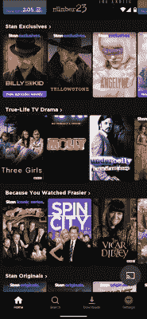

# 广播媒体的快乐与选择的悖论

> 原文：<https://hackaday.com/2022/05/25/the-joy-of-broadcast-media-vs-the-paradox-of-choice/>

互联网上流媒体服务的兴起是媒体世界的一次革命性转变。内容将不再以单向的方式，由大型企业集团和政府运营的组织广播，注入家庭。取而代之的是，个人可以在“尽情观看”的基础上，自由搜寻符合自己欲望的内容。

它导致了我们消费媒体方式的范式转变。然而，由于提供了大量的内容，这也导致了巨大的挫败感。让我们来看看这是为什么，以及一些创造性的方法可以解决这个问题。

## 选择的悖论

Many find the masses of content on streaming services to be overwhelming to choose from. Credit: author screenshot

传统上，当涉及到媒体时，有两个主要的交付部门:广播和家庭媒体。人们可以听收音机，或者打开电视，或者旋转唱片，或者选择一部电影在磁带上观看。如果这些选项都不够，你可以去当地的音像店租一些更吸引人的东西。

从根本上说，这是一个选择有限的时代。有几个电视台可供选择，如果没有什么好节目，你甚至可以找到一些可以看的录像带或者不看。许多人会记得下午和晚上观看重播或周五晚上的电影，这部电影已经上映了一百万次。从《辛普森一家》的*到《T2》的【M * A * S * h】*，一些剧集因其似乎永无止境的重播而成为传奇

然而，随着互联网的发展，游戏开始改变。种子网站和流媒体服务出现了，免费提供世界文化产出的总和，或者对那些反对盗版的人收取象征性的费用。突然之间，当选择一部电影来看时，人们不再局限于当地电影院上映的五部左右的电影，也不再局限于当地录像带出租店货架上剩下的电影。相反，几乎任何电影，从格式的发明，可以是你随时可以观看的。

面对如此多的选择，我们中的许多人发现很难做出选择。这是一个广为人知的观点，叫做[选择的悖论，这个术语是由美国心理学家巴里·施瓦茨在 2004 年推广开来的。当我们的选择仅限于少数几个，选择是容易的。他们可以很快进行比较和排名，并选择一个理想的选项。](https://thedecisionlab.com/reference-guide/economics/the-paradox-of-choice)

增加数以千计的选择，工作的复杂程度会升级到令人难以招架的地步。有这么多不同的选择来对比和比较，找到神话般的正确选择变得几乎不可能。

任何曾经跳上流媒体服务寻找可看的东西的人都会熟悉这种麻痹的感觉。一排排彩色图标流过，几乎无法辨认的标题飘过。每一个卷轴都在寻找一个简单的突出的选择，但只是揭示了更多的选择。压力来自于这样一种认识，即当几乎所有拍摄的东西都是一种选择时，做出错误的选择肯定是不可原谅的。无论你是想看一部电影，还是只想从数百部《T2》、《T3》电影中挑选出一部《干杯》的老剧集，选择之多令人应接不暇。

## 喘息即将来临

Builds like [the Simpsons TV](https://hackaday.com/2021/08/26/a-simpsons-tv-for-a-golden-age/) replicate the broadcast television experience, where your only choice is to watch what’s on, or not. credit: [HAD article](https://hackaday.com/2021/08/26/a-simpsons-tv-for-a-golden-age/)

当然，有一些变通办法。其中一个方法是记住选择一部电影并不是生死攸关的选择(通常是这样)，仅仅[找到足够好的东西](https://edu.gcfglobal.org/en/digital-media-literacy/why-we-cant-just-pick-a-movie/1/)通常就足够了。流媒体世界还有另一个好处，那就是不需要承诺。如果这部电影不值得一看，你总是可以选择另一部。

然而，如果这是你面临的一个更常见的问题，你可能会考虑完全放弃选择的价值。许多黑客都渴望有一天，他们可以打开电视，看到他们最喜欢的节目，而不必自己从整个备份目录中挑选。像《辛普森一家》电视这样的构建在树莓派上堆积了一系列黄金剧集。连续随机回放，类似于当年有线电视上流行的 24 小时马拉松。为了更加真实，你可以使用射频调制器来输出视频，就好像它是从[自己的电视频道传来的一样。](https://hackaday.com/2020/02/07/raspberry-pi-serves-up-24-hour-simpsons-channel/)

[Date Night Movies](https://datenightmovies.com/beverly-hills-cop+love-actually) lets two people input a movie choice each, and presents a series of middle-ground options. Credit: screenshot

还有一些服务可以帮助你选择要看的电影。像[随机电影选取器](https://randommer.io/random-movies)和 [PickAMovieForMe](https://pickamovieforme.com/) 这样的网站在给出观看建议之前会问一系列简单的问题。[网飞轮盘](https://reelgood.com/roulette/netflix)也做了同样的事情，专注于在特定服务上实际可用的游戏。与此同时，[约会夜电影](https://datenightmovies.com/beverly-hills-cop+die-hard)采纳了两个建议，提供了一系列折中的电影。

总的来说，在这些系统中有一些价值，这些系统将整个电影目录提取出来，浓缩成少数几个选项供我们选择。通常，当我们挑选一些要看的东西时，我们希望放松和放松。在这些时刻，费力地通过无数的选择是不愉快的，有一种方法来减少它是一件伟大的事情。

理解选择悖论的好处是，你可以认清形势，并做出相应的反应。无论是运用心理学技术来简化你的选择，还是利用工具来帮助你摆脱选择，当你对工作有了策略后，处理起来会容易得多。看的开心！