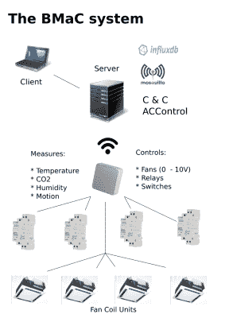
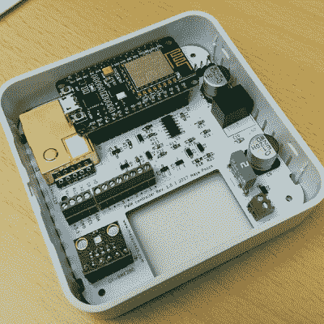
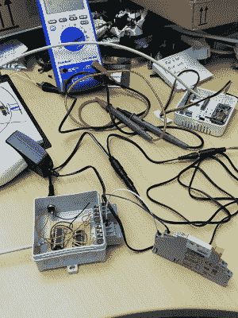
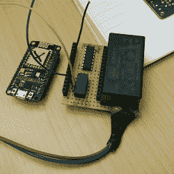
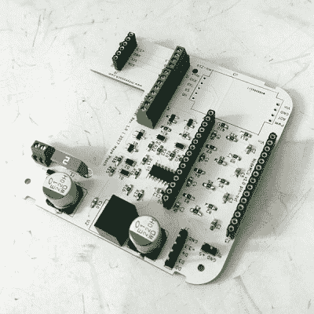

# 设计合理的嵌入式系统的乐趣

> 原文：<https://hackaday.com/2019/03/20/the-joy-of-properly-designed-embedded-systems/>

家庭自动化的古老梦想从未如此接近现实。由于 ESP8266 支持 WiFi 的微控制器等廉价构建模块，创建物联网设备甚至整个建筑范围的联网嵌入式设备集合变得“容易”。然而对于任何大规模的项目，在开始之前有一个计划真的很有帮助。但是更重要的是，如果你的计划在你工作的过程中会发生变化，那么计划的灵活性是很重要的。实际上，这意味着扩展头和空中(OTA)固件升级是必须的。

我想用我几年前参与的一个项目来说明这一点，这个项目叫做 [BMaC](https://github.com/MayaPosch/BMaC) ，它的复杂性和范围几乎每个月都在增长。这让我们不得不努力跟上变化，同时教会我们如何通过拥有一个可适应的系统架构来节省时间和金钱。

## 如何设计灵活的嵌入式生态系统

一个灵活的系统是一个能够适应新的要求，并纳入新的软件和硬件没有重大困难的系统。因为通常不可能知道最终的需求集是什么样的，所以最好保持选项开放，以防以后需要它们。选项意味着像扩展模块连接器这样的功能，比严格必要的更灵活的电源，以及刷新固件的方便方法。

当该项目在几个月后开源时，它已经从简单的收集温度数据扩展到使用定制硬件监控咖啡机和空调设备，并对许多后端服务上运行的逻辑做出反应。由于事先没有任何计划，开发过程涉及大量的即兴创作和对硬件的多次修改。

正如该项目现在所知，[建筑管理和控制](https://github.com/MayaPosch/BMaC) (BMaC)系统包括用于室温、气压、相对湿度、CO2、运动和土壤湿度的传感器，以及用于阀门、咖啡机、风机盘管装置(FCU)风扇以及泵等的致动器控制。虽然扩大项目范围并非没有困难，但通过留有选择余地，它仍然允许系统得到扩展。

核心硬件由 ESP8266 微控制器(ESP-12E/F 模块)组成，这些微控制器价格便宜且供应充足，同时还通过其单个 32 位内核和通过 WiFi 的轻松连接提供了强大的处理能力。这使我们能够快速部署硬件并尝试迭代，而不必到处铺设以太网电缆。

该图涵盖了环境控制和监视，以及后端服务，后者存储节点配置(命令和控制)，提供 MQTT 代理(Mosquitto)，存储传感器数据(InfluxDB)和控制 FCU(ACControl)。中间的白色外壳是安装在天花板上的 BMaC 节点，包含 ESP8266 微控制器和一个定制 PCB。

该 PCB 为各种环境传感器、外部 I2C GPIO 扩展器、可变 DC 电压输出的四个通道以及采用 3.3 V、5 V 和 12 V 电源供电的多个器件提供安装位置。PCB 上的开孔用于运动传感器，它将连接到自由引脚接头。

是的，DC-DC 模块的足迹是错误的，这就是为什么模块最终翻转到主板上。DC 电压的电路也经历了一些调试，因为射极跟随器部分不允许电压下降到零。这是更多未经充分验证就匆忙通过设计的例子。

如前所述，最初的目标只是在建筑物周围放置一些传感器，并存储通过 MQTT 报告的数据。接下来，还增加了读取咖啡机的 EEPROM 的想法，这需要定制硬件来与这些机器接口。这升级到控制这些机器，然后是监控会议室的运动，最后也控制空调设备。

 很明显，将安装在天花板上的节点用于咖啡机并不太实际，因为所需要的只是一个可以放在咖啡机后面的小盒子，连接到机器背面的串口(！)，这也将通过 TTL 串行连接的 5 V 线路向“咖啡节点”供电。

然后，所有这些节点通过同一个 MQTT 代理进行通信，来自传感器的数据被集成到后端服务中。由于使用了 MQTT，任何 MQTT 客户机都能够与任何其他客户机通信，从而形成一个高度灵活的网络。随着 WiFi 的使用，这意味着节点可以安装在建筑物的任何地方，传感器和执行器几乎可以随意放置。

## 逆向工程设备来控制它们

然后是范围蔓延——咖啡机控制器将控制大楼的空调。虽然咖啡机接口显然是一件“为了好玩”的事情，但不起作用的空调会造成极大的干扰和不愉快。另一方面，重建空调控制系统的最初动机也是因为当前的系统无法正常工作，部分房间结冰，而其他房间闷热，主要是因为缺乏颗粒温度监测和控制。所以还有很大的改进空间。

 这些要求意味着我们只需对整个空调系统进行逆向工程，找出在每个房间安装新硬件的位置，与空调系统对接，编写并扩展后端服务以支持新功能，更新 ESP8266 节点上的固件以完成所有新功能，在需要的地方开发定制硬件，并将所有内容集成到一个包中，即使是普通的软件开发人员也可以在最终用户控制方面使用该包。

由于原来的节点 PCB 不能容纳所有的阀门控制，已经有四个 GPIO 引脚用于四个 FCU 的风扇控制器，因此需要一个 GPIO 扩展器来切换控制 24 VAC 热膨胀阀的四个继电器。这里，节点 PCB 上的 I2C 分线接头起了作用。为了控制 FCU，我们连接了一个结合了 MCP23008 GPIO 扩展器和 ULN2003 的外部 PCB。

对于在冷却和加热之间切换建筑部分的开关，必须开发另一个基于 ESP8266 的板，该板能够根据来自后端的命令选择所需的模式。因为我们不需要经常更换，所以闭锁继电器是完美的解决方案。即使断电，它也能保持最后的状态，并且有两个边，第二个边可以用作单比特存储单元。这导致了这个美丽的原型。

该板的一个有趣的特点是，它使用交流 DC 转换器模块直接连接到 230 伏电源。然后，整个电路板将被塞进原来安装开关的位置，主电源线将在墙内朝着它延伸。

像这样的逆向工程的有趣之处在于，你永远不知道在这个过程中会遇到什么。如果我们先进行逆向工程，然后制定计划并实施，我们就可以跳过许多疯狂的变更和计划。因此，这一部分的寓意显然是，尽可能提前进行逆向工程是值得的，而不是在开发过程中半途而废。但是当那不可能的时候，开始制作分离板。

## 什么有效，什么无效

随着硬件或多或少的完成，它在前三个 FCU 和该部分的交流模式开关上安装了几个星期。安装硬件被证明是复杂且容易出错的，有许多地方安装本可以简化。这包括像安装在天花板上的印刷电路板上的螺丝端子这样的东西，当站在梯子上时，使用这些东西是一种痛苦。

理想情况下，基于天花板的安装只需在吊顶上钻一个洞，将电缆穿过洞并插入节点，然后将节点安装到天花板上。安装硬件所需的劳动越少越好。消除安装过程中更换电线的可能性也是非常理想的。这意味着大而笨重的连接器无需工具即可轻松安装。

在基本节点板的开发过程中，当它还是一个简单的温度监控器时，我决定在板上安装一个 I2C 接头，以防万一。这被证明是一个救命恩人。在我们知道 FCU 如何工作或我们需要什么之前，它允许这个硬件的简单扩展来完全控制 FCU。像这样容易获得扩展接口是必不可少的。为意料之外的事情做打算。

 坚持所有节点都采用单一硬件设计，除了 coffee 节点工作得很好，因为它们可以在完成原型阶段后快速部署。这让我们可以使用一个统一的固件映像，其中的模块可以针对特定的功能打开和关闭。这使得代码库小而有序，构建和更新过程简单，不必管理哪个映像适合哪个节点。

这些节点还配置了空中下载(OTA)更新，rBoot 引导加载程序在两个 ROM 插槽之间切换。这意味着尝试新的固件映像相对容易，不需要拆除天花板上的节点，也不需要每次有更新时从咖啡机后面捞出节点。

尽管如此，尝试新的更改仍然非常复杂，必须将 OTA 固件映像推送到 HTTP 服务器，然后发送 MQTT trigger 命令，接着检查和验证节点是否正确地更新了自身，以及更改实际上是否具有预期的效果。

AC 控制后端基于 C&C 服务，具有为 FCU 和温度传感器实现的闭合反馈回路。由于没有时间写任何花哨的东西，所以使用了一个直接的循环，然后在几周的时间里进行了调试，涉及无数的 OTA 和后端更新，在梯子上刺激硬件，以及其他各种各样的肌肉疼痛诱导的乐趣。

## 从这里去哪里

回顾这个项目，这是一次很好的学习经历。然而，如果我必须再做一次，知道我今天所知道的？应该有一组明确的目标，一个要开发的硬件设备列表，以及固件和后端需求。我也会使用虚拟硬件平台和构建开始软件的集成测试。BMaC 平台的当前版本已经获得了这种测试，这将使未来的开发更加容易。对我来说晚了几年，但对你来说正是时候！

BMaC 项目仍在发展中。希望有一个新的机会来测试新的办公环境或类似环境的变化。