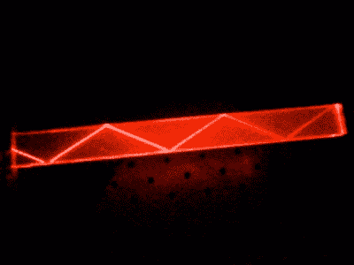

# 隐藏在你挤压中的光导

> 原文：<https://hackaday.com/2022/03/08/the-light-guide-hiding-in-your-extrusion/>

应该有这样一行笑话，开头是“一个物理学家和一个工程师走进一家酒吧…”。就我而言，我是一名工程师，我的室友是一名物理学家，所以随机对话有时会发生有趣的变化。举一个前几天的例子，当一个人说话时，她拿起放在我们咖啡桌上的一块铝型材，在她手中翻转。它的中心有一个洞，很自然地往下看，这时她的注意力被一系列同心光环吸引住了。我们的话题转到了可能导致这种现象的机制上，一路上我们谈到了照相机、波导和光纤。

光沿着一个直的窄管传播后到达我们这里，粗略地看应该是沿着直线传播的，事实上，当我把挤出物指向窗外向下看时，我可以看到我所指向的远处的一小段树。我们很快就得出结论，同心环是光线从偏离中心的角度进入端孔的连续反射。

实际上，这种挤压就像一个针孔照相机，图像被投射到一个远离针孔的圆柱体内部，而不是投射到一个平坦的胶片上，我们看到的是由此产生的扭曲图像的连续反射，它们沿着管子向我们来回反弹。这很可能是铝墙形成的不完美的镜子让我们看到了每一个图像，因为光是朝着我们的方向扩散的。添加一段末端带有小针孔的胶带可以加强这种效果，随着投影图像变得不那么模糊，圆圈变得更加清晰。

## *出血明显的纪年*

Total internal reflection of a HeNe laser beam in a piece of acetate. Sai2020 ([Public domain](https://commons.wikimedia.org/wiki/File:TIR_in_PMMA.jpg)).

太好了，我们发明了针孔照相机，我们的诺贝尔奖呢？我们在受人尊敬的科学杂志《流血明显的年鉴》中的位置显然是确定的。但另一方面，我们已经探索了光导管和光纤通信使用的机制，即光通过内壁的连续反射沿着波导传播。

这对于一块挤压材料来说没有太大的用处，因为它体积大且不灵活，但是当介质转换为一块激光切割的丙烯酸材料时，同样的技术可以用于产生很大的效果。侧光式丙烯酸显示屏算不上什么新创意，但在 LED 时代，或许更贴切地说是昂贵的数码管时代，[，它们似乎又卷土重来了。](https://hackaday.com/2016/12/22/light-pipes-and-leds-team-up-for-a-modern-take-on-the-nixie-tube/)

更有趣的是，这些同心环中的每一个都是针孔投射的图像的连续反射。在我们围着咖啡桌闲扯的讨论中，我们推测，通过一些图像处理或合适的镜头，可以将柱面反射像映射成平面反射像，就像我们都熟悉的照片一样。这样的图像能在光导管中沿曲线传播并用于遥感吗？科学杂志又打电话来了，我们刚刚发明了内窥镜。

你最近改造了什么？