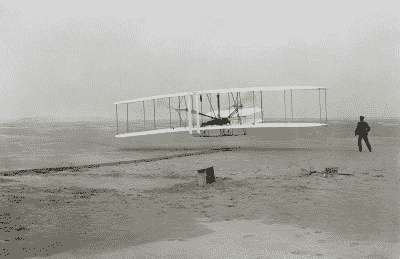

# 发明的小大狗

> 原文：<https://hackaday.com/2022/05/18/the-little-big-dogs-of-invention/>

这是我知道的两只狗的故事。这也是一个关于美国海军、航空和核武器的故事。有时很容易在狗或其他人身上看到某些东西，但很难在我们身上看到同样的东西。据我们所知，狗不识字是件好事，因为这对博士来说是一个有点尴尬的故事。他是一只可爱的好脾气的狗，也是一只相当大的拉布拉多犬。他偶尔会去看看另一只通常脾气很好的狗洛奇——一只比多克小得多的谢尔蒂狗。

我说洛奇脾气好，对人好，他就是这样。但他对其他狗没那么在意。我经常怀疑他没有意识到他是一只狗，他对其他狗的行为感到困惑。你会认为当医生来看你时，大狗会对小狗称王称霸，对吗？结果是，医生没有意识到他比洛奇块头大得多，而且——很明显——洛奇没有意识到他应该害怕医生。所以洛奇欺负多克到了尴尬的地步。例如，洛基会把他挡在门外，而多克会坐在那里发抖，无法鼓起勇气越过令人生畏的洛基。

  Big Doc…  Somewhat smaller Rocky….

这让你想知道，除了我们“知道”我们做不到这一点，我们还能做多少次。或者我们相信告诉我们不能的人。如果他想的话，医生可以直接从洛奇身边经过，他也可以把洛奇放到他的位置上。但是他没有意识到那些事情是可能的。

在技术和创新领域，你会看到很多这样的例子。通常，巨大的进步来自于那些不知道专家说某件事是不可能的或者不相信他们的人。例证:20 世纪初，人们渴望坐飞机。从远古时代开始，人们就梦想着飞行，现在看来这似乎真的有可能实现。像阿尔贝托·桑托斯-杜蒙特、莱特兄弟、克莱门特·阿德和古斯塔夫·怀特黑德这样的人都声称他们是第一个飞行的人。其他人，如乔治·凯莱爵士、威廉·亨森、奥托·李林塔尔和奥塔夫·夏努特，甚至更早些时候都在试验滑翔机和动力飞行器，并取得了一些成功。

## 在海军

在未来，美国海军将成为飞机的大量使用者。但是，1901 年海军的总工程师少将·乔治·梅尔维尔为《北美评论》写了一篇关于人们渴望飞行的文章。他认为这个想法是幼稚的，是浪费精力，他说没有哪个领域“播下了如此多创新的种子，却得到如此少的回报。”海军在这个问题上显然是错误的，因为美国海军天文台台长在 1902 年指出，“用比空气重的机器飞行是不切实际和无足轻重的，如果不是完全不可能的话。”

Thankfully, the Wright brothers were too busy building to read the papers.

1903 年，也就是莱特兄弟首次飞行的九周前,《纽约时报》刊登了一篇关于飞行失败的文章。它的部分内容是:“……可以假设，真正会飞的飞行器可能是通过数学家和机械学家在一百万到一千万年内的联合和持续努力而进化出来的——当然，前提是我们同时能够消除诸如无机材料中重量和强度之间的现有关系这样的小缺点和尴尬。”

哇哦。很高兴莱特兄弟没有得到纽约时报。即使是杰出的开尔文勋爵也不相信飞机(显然，也不相信 X 射线，尽管他对大西洋海底电缆的看法是正确的)。

甚至到了 1910 年，哈佛大学天文台台长声称飞机永远不会达到火车和汽车可能达到的速度。大约在同一时间，法国将军斐迪南·福煦认为飞机没有军事价值。

## 火箭人

哲学家维特根斯坦在人造卫星开始太空竞赛之前就去世了，他用人类登上月球的概念作为我们都知道不可能的荒谬事情的例子。1950 年，他写道:“我们的信仰取决于我们的学习。我们都相信登上月球是不可能的；但是可能有人认为这是可能的，而且有时会发生。我们说:这些人不知道很多我们知道的事情。”

当然，在他的一生中，去月球是不可能的，尽管有压倒性的相反证据，仍然有人认为我们没有去过月球。但在 20 世纪 60 年代的短短几年里，许多人不相信登月是一个合理的目标。

每个领域都有这样的故事，不仅仅是飞行。当爱迪生宣布灯泡将成为现实时，英国政府成立了一个委员会对此进行调查。他们的结论？“对我们的大西洋彼岸的朋友来说已经足够好了……但不值得实用或科学人士的关注。”

## 99 个气球

What if Germany had the bomb in WWII?

但也许专家最重要也是最幸运的坏言论发生在二战期间。你肯定听说过沃纳·海森堡这个名字。作为一名著名的物理学家，他领导了德国利用原子的努力。战争早期，人们曾考虑用铀制造核弹，直到海森堡计算出铀 235 的临界质量在 10 吨左右。

由于害怕生产和运输这么多的铀，德国人转向重水实验，或多或少地忽略了美国人使用少得多的铀 235 就能成功制造的炸弹。铀 235 临界质量的正确数字刚刚超过 100 磅，通过使用反射、压缩和其他技术，一枚炸弹实际上只需要大约 20 或 30 磅的铀 235，甚至更少的钚 239 或铀 233。

历史学家长期以来一直争论这意味着什么。海森堡是一位优秀的物理学家，所以很难想象他会犯这么大的错误。但不清楚他是故意这么做的，还是只是一时疏忽。海森堡和一些同事在宣布轰炸广岛的消息时是英国人的“客人”。隐藏的麦克风捕捉到了[海森堡的反应](https://omnilogos.com/critical-mass/):“美国某个对此知之甚少的外行欺骗了他们，”他说。"我不相信 t 和铀有任何关系."他提到盟军不可能有十吨纯 U235。除非他是在为他怀疑藏在那里的麦克风表演——这当然是可能的——看起来他真的认为这需要大量的素材。

## 做不可能的梦

那么你认为哪些项目是不可能的呢？我知道你确实需要缓和一下。无论你多么渴望发明永动机或曲速驱动器，它们似乎都遥不可及。话说回来，月亮也是如此。

文斯·隆巴迪因说“如果我们不认为这些是不可能的，我们会完成更多的事情”而受到称赞。给我们所有人的好建议。尤其是医生。

[Banner Image: " [安大略公共领域档案馆在加拿大建造的首批飞机之一](https://www.flickr.com/photos/121282668@N03/37764987002)