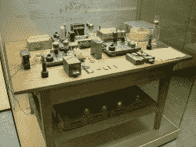
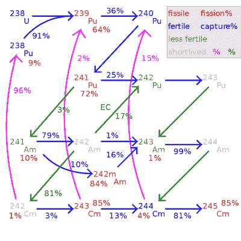
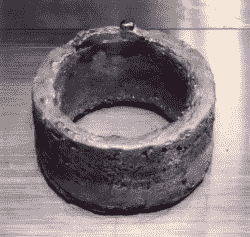
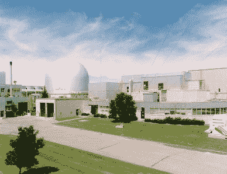
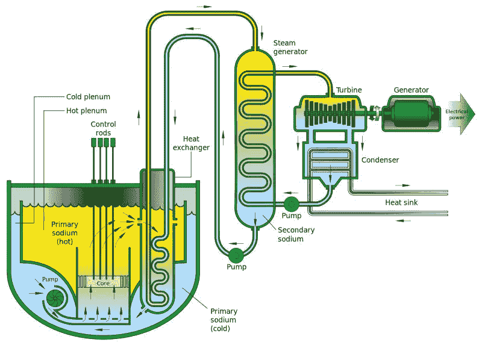
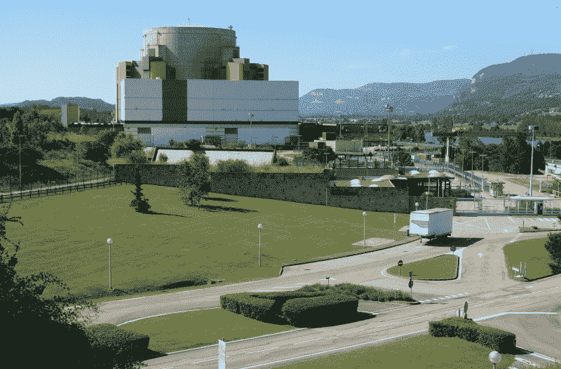
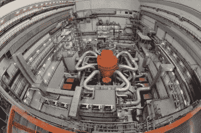

# 快堆的悠久历史和封闭燃料循环的承诺

> 原文：<https://hackaday.com/2019/10/08/the-long-history-of-fast-reactors-and-the-promise-of-a-closed-fuel-cycle/>

20 世纪 30 年代发现了核裂变，随之而来的是 20 世纪 40 年代核武器带来的核毁灭威胁，以及 20 世纪 50 年代核电站带来的清洁、丰富的电力前景。这些电厂将取代其他类型的热电厂，不产生废气，不产生飞灰，只需要偶尔使用铀和其他几乎随处可见的裂变燃料来补充燃料。

The equipment with which nuclear fission was experimentally proven in 1938.

随着核反应堆在 20 世纪 50 年代和 60 年代越来越快地出现，对铀燃料耗尽的担忧变得越来越明显，这导致了所谓的快中子反应堆中 R&D 的增加，在快中子增殖反应堆(FBR)配置中，可以通过使用快中子将铀燃料转变为 ^(239) 钚，然后可以与铀燃料混合，为慢中子反应堆制造(MOX)燃料，使铀中的能量不是 1%，而是高达 60%

20 世纪 70 年代发现的铀供应的繁荣在很大程度上阻止了这些 R&D 的努力，一些国家如法国仍在经历其 [Rapsodie](https://en.wikipedia.org/wiki/Rapsodie) 、 [Phénix](https://en.wikipedia.org/wiki/Ph%C3%A9nix) 和 [SuperPhénix](https://en.wikipedia.org/wiki/Superph%C3%A9nix) 的设计，直到最近在多年试图让该项目起飞后最终取消了[第四代](https://en.wikipedia.org/wiki/Generation_IV_reactor)、 [ASTRID](https://en.wikipedia.org/wiki/ASTRID_%28reactor%29) 验证机设计。

然而，这并不是快堆的终结。在这篇文章中，我们将看看这些工程奇迹是如何工作的，以及俄罗斯、中国和印度等国正在使用和开发的各种快堆。

## 快堆的“快”部分

正如引言中提到的，中子在裂变过程中的速度是“快”反应堆快速的原因。轻水反应堆( [LWR](https://en.wikipedia.org/wiki/Light-water_reactor) :包括压水堆、沸水堆和 SCWR)使用普通水作为中子减速剂，而快堆不使用。T2 235 U 和其他同位素在经历核链式反应时释放出的中子通常以相当快的速度运行。有趣的是，中子的运动速度决定了它与特定原子核相互作用的可能性。

The production of transuranic actinides in thermal neutron fission reactors. (CC-BY-SA-3.0)

这个[中子截面](https://en.wikipedia.org/wiki/Neutron_cross_section)属性用于对核素进行分类。当一个原子核吸收了一个中子，要么保留它，要么衰变，据说它有一个*俘获截面。*裂变(碎裂)的核素有一个*裂变截面*。其他核素将简单地散射中子，据说具有*散射截面*。具有大吸收截面的核素被称为[中子毒物](https://en.wikipedia.org/wiki/Neutron_poison)，因为它们只会吸收中子而不会衰变，本质上是使中子的核反应处于饥饿状态。

像 ^(238) U 这样的核素很有趣，因为在这三个截面类别中的每一个类别中都有非零的评级，这至少部分解释了为什么它对 LWR 来说是如此糟糕的燃料。这与 ^(235) U 非常不同，后者具有固体裂变截面，但只是在中子速度明显低于核链式反应期间新发射中子的速度。这意味着，为了维持裂变过程，LWR 中的中子必须减速(降低到“热”速度)。

在这里，水发现自己在燃料棒中，随着裂变过程被[启动中子源](https://en.wikipedia.org/wiki/Startup_neutron_source)启动，中子四处飞舞。这些快速中子很容易与水分子中的氢原子发生碰撞，导致前者失去动能，从而减慢速度。这使得它们能够直接撞上另一个(或同一个)燃料棒，并成功裂变出另一个 ^(235) U 核素。

水作为缓和剂的这一特性也是一个安全特征。如果核心的温度升高，水将最终沸腾，这导致它变成气体，这意味着单位体积的水分子减少，从而减少中子的减速，有效地降低了核链式反应的速率。这种负空隙系数是当今所有商用反应堆的共同特征，明显的例外是臭名昭著的 T2 RBMK T3 设计和加拿大 T4 坎杜重水反应堆 T5。

## 为了娱乐和利益而繁殖钚

Ring of nearly pure plutonium. (Credit: Los Alamos National Laboratory)

如前所述， ^(238) U 是一个有点奇怪的中子截面。它的三次倾斜意味着除了偶尔的裂变事件之外，它还吸收和散射中子，前者明显更普遍。在被一个 ^(238) U 核素捕获一个中子后，它转变(蜕变)成 ^(239) Pu(并且一些 ^(239) Pu 转变成 ^(240) Pu)。这一过程也发生在 LWR 反应堆中，但这是为了在快速增殖反应堆(FBR)中制造钚而特意进行的。

快速反应堆完全省略了中子减速剂，因为它需要快速中子来将尽可能多的 ^(238) U 转化为 ^(239) Pu。在 FBR，一个浓缩的 ^(235) U 堆芯被一层主要由 ^(238) U 组成的外壳所覆盖，然后这些铀慢慢转化为主要由 ^(239) Pu 和 ^(240) Pu 组成的物质，用于混合氧化物燃料。这意味着 FBR 是一个相对简单的设计，使用冷却回路或水池设计。使用的冷却剂通常是液态金属或钠基冷却剂，因为它们是弱中子减速剂，同时仍具有优异的传热性能。

法国的快中子反应堆已经被用于发电，就像任何其他热电厂一样，同时还提供了制造可用于其轻水堆的 MOX 燃料所需的钚。这一过程的一个主要原因是能源独立，因为法国没有大量的铀资源，这将使它能够从进口的铀中获得高达 60 倍的能源，使每公斤铀的寿命延长 60 倍。

Experimental Breeder Reactor II (EBR II), prototype to the US Integral Fast Reactor.

最近其他涉及快堆的努力包括美国的[整体快堆](https://en.wikipedia.org/wiki/Integral_fast_reactor)和日本的[文殊](https://en.wikipedia.org/wiki/Monju_Nuclear_Power_Plant)(由 FNR [Jouyou](https://en.wikipedia.org/wiki/J%C5%8Dy%C5%8D_%28nuclear_reactor%29) [钠冷快堆](https://en.wikipedia.org/wiki/Sodium-cooled_fast_reactor)接替)。增殖铀燃料的一个很好的副作用是，它大大减少了一次性燃料循环结束时的乏燃料体积，因为大部分原始的 238 铀将在 LWR 作为 239 钚燃料燃烧掉。轻水堆的乏燃料可以再次通过 FBR，烧掉轻水堆不能使用的“废”同位素，同时为轻水堆制造更多的燃料。

不幸的是，快堆的缺点是比轻水堆更昂贵，钠基冷却(主要是避免接触水)的挑战意味着，自 20 世纪 70 年代铀价暴跌以来，从铀矿石中制造新燃料，并在 LWR 中一次性运行后储存或倾倒乏燃料，通常更加经济可行。

尽管 LWR 自己进行了一些增殖，将一些铀转化为钚，但 LWR 的乏燃料仍然含有大约 96%的原始铀，以及 3%的“废”同位素和大约 1%的钚同位素。

## 燃烧，宝贝，燃烧

虽然大多数快堆被用于为轻水堆生产燃料，但另一种类型的目的是在当地使用所有的燃料。这种类型的快堆被称为[快中子反应堆](https://www.world-nuclear.org/information-library/current-and-future-generation/fast-neutron-reactors.aspx) (FNR)，本质上是 FBR 设计的不同核心配置，没有根本区别。理论上，任何快堆都可以用来培育燃料并燃烧它。

Schematic of a sodium-cooled fast reactor.

将 FBR 设计改为 FNR 涉及移除 ^(238) U 型包层并安装不锈钢(或等效物)[中子反射器](https://en.wikipedia.org/wiki/Neutron_reflector)。在最终的反应堆中，产生的中子被保存在堆芯内，使它们能够与核素发生新的相互作用，并继续裂变过程。

因此，FNR 可以有效地裂变和嬗变燃料中的核素，直到没有大量的锕系元素(包括铀和钚)残留。这可以与[高温处理](https://www.world-nuclear.org/information-library/nuclear-fuel-cycle/fuel-recycling/processing-of-used-nuclear-fuel.aspx)相结合，后者可以对今天来自轻水堆的乏燃料进行再处理，以便在轻水堆中烧掉，从而有效地结束核燃料循环。

## 法国抵抗运动

不仅仅是冰冷的经济在抑制西方快速反应堆的发展中起了作用。快速反应堆已经引起了恐怖分子和政治家的关注。前者的例子是 1982 年查姆·尼西姆用五枚 [RPG-7](https://en.wikipedia.org/wiki/RPG-7) 肩扛式火箭推进榴弹对[super phenix](https://en.wikipedia.org/wiki/Superph%C3%A9nix)FBR 号发动的火箭袭击，因为他认为 FBR“可以用它们的快速中子爆炸”。这个特殊的 FBR 是法国、意大利和德国的一个联合项目，最初的目标是在法国和德国建造基于 super phenix 设计的快堆。

The Superphénix reactor building. (© Yann Forget / Wikimedia Commons / CC-BY-SA)

从一开始，超级凤凰就面临着反核团体的强大政治阻力，1998 年，当反核绿色部长掌管法国政府时，这个原型反应堆被关闭。给出的唯一理由是该项目不可行，因为其“成本过高”，自 1976 年以来已高达 91 亿欧元，即每年约 4.3 亿欧元。尽管反应堆的钠回路问题已经在 1996 年得到解决，而且反应堆在大部分运行寿命期间通过发电赚钱。

## 当前发展

美国、法国和其它西方国家的情况与苏联、中国和印度形成鲜明对比。从 1973 年开始，位于里海岸边的 BN-350 FNR 向附近的阿克套市提供 135 兆瓦的电力和淡化水。它直到 1994 年才关闭，因为经营者没有资金购买更多的燃料。在服役 26 年后，该反应堆于 1999 年完全退役。

BN 系列 fnr 延续了在俄罗斯别洛亚尔斯克核电站建造的 [BN-600](https://en.wikipedia.org/wiki/BN-600_reactor) 。它采用基于钠池的设计，自 1980 年以来一直在运行，为当地电网提供 600 兆瓦的电力。尽管遇到了几十个主要与钠管道泄漏有关的小问题，但尽管是 BN 系列的第二个原型，它的运行历史基本上是无故障的。

The BN-800 FNR at Beloyarsk.

在同一个别洛亚尔斯克基地建造的 BN-800 反应堆是 BN 系列的最后一个原型，比 LWR VVER-1200 反应堆的运营成本降低了 85%，而 T2 BN-1200 反应堆将成为第一个大规模生产的快速反应堆。第一批 BN-1200 反应堆的建设目前正在进行中。中国的实验性 CEFR FNR 和 CFR-600 试点 FNR 基于俄罗斯 BN 反应堆技术。俄国也在研究一种铅冷却的快速反应堆，叫做 [BREST](https://en.wikipedia.org/wiki/BREST_%28reactor%29) 。

印度发现自己拥有丰富的钍资源，这使得它在铀反应堆的基础上专注于一个雄心勃勃的钍基开发项目。钍计划由三部分组成。首先，他们用轻水堆从铀中提取钚。然后 FNR 在燃烧钚的同时从 ^(232) Th 生成 ^(233) U。最后，[先进重水反应堆](https://en.wikipedia.org/wiki/Advanced_heavy-water_reactor)将使用由此产生的钍作为燃料，而 ^(233) U 和钚作为驱动燃料。

其他第四代 FNR 设计也在开发中，比如氦[气冷快堆](https://en.wikipedia.org/wiki/Gas-cooled_fast_reactor) (GFR)。

## 结束燃料循环

如前所述，fnr 能够使用当今所有的乏燃料(通常称为“核废料”)作为燃料。结合高温处理，这将允许核裂变反应堆以几乎零废物运行，耗尽所有铀燃料、少量锕系元素等。这一直是俄罗斯核计划的主要目标，也是中国、日本和韩国核计划的主要目标之一。

随着美国的努力(主要是阿贡国家实验室及其 IFR 高温处理)，韩国的 KAERI 正在积极致力于关闭韩国的燃料循环。目标是将用过的燃料从所有仍可用作燃料的物质中分离出来，也就是说所有仍具有放射性的物质。不幸的是，俄罗斯与中国以外的国家之间，以及韩国与日本或中国之间的合作在这种类型的研究上非常有限，主要是出于政治原因。

尽管如此，似乎正在努力使第四代 FNRs 成为新工厂的首选反应堆，不仅允许乏燃料完全用完并结束燃料循环，而且将我们可以从铀(可能还有钍)中获得的能量增加许多倍，甚至将铀燃料大约 100 年的悲观估计增加到几千年，同时不给世界留下乏铀燃料的遗产。