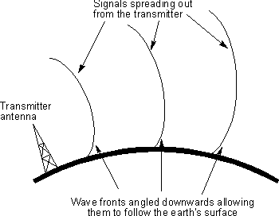

# 长波的内幕:未经许可的实验无线电

> 原文：<https://hackaday.com/2021/10/19/the-low-down-on-long-wave-unlicensed-experimental-radio/>

自马可尼第一次进行无线电传输以来的 125 年里，频谱被划分为不同的范围和频段，其中大部分是为政府和大型电信公司保留的。在企业的贪婪中，“小人物”在像美国无线电转播联盟(ARRL)这样的组织的帮助下，成功地开拓出他们自己的一小块天地。自 1914 年以来，ARRL 一直代表着美国业余无线电爱好者的利益，并帮助保护留给业余爱好者使用的波段。要真正利用这个绝佳的机会在这些波段上进行传输，你需要一个由联邦通信委员会颁发的许可证。执照真的不难获得，你应该得到一个，但如果你不想参加考试呢？或者你只是太不耐烦了？

好吧，不要害怕，因为无线电频谱上也有你的空间。

欢迎来到(法律的)奇妙世界！)未经许可的无线电实验，什么地方都去。好吧，不是任何事情，但是可能性是很大的。有几个实验性的无线电波段，被称为 LowFER，MedFER 和 HiFER，欢迎任何人来玩。在这三个人中，洛弗似乎最有希望。

## 让乐队重聚

在我们深入了解低频段、中频段和高频段的实际情况之前，值得注意的是，这些规则仅适用于美国。这并不是说这些频段在其他地方是非法的，但是在启动发射机之前，一定要检查你当地的频率分配。

Ground wave radio propagation along the surface of the Earth. Courtesy of [Electronics-Notes.com](https://www.electronics-notes.com/articles/antennas-propagation/ground-wave/basics-tutorial.php)

顾名思义，LowFER 包含三个频率范围中最低的频率范围，介于 160 kHz 和 190 kHz 之间，波长高达一英里左右。也被称为 1750 米波段，这个频率范围非常适合通过 [*地波传播*](https://www.electronics-notes.com/articles/antennas-propagation/ground-wave/basics-tutorial.php) 的长传输路径，这是一种无线电信号在地球表面移动的模式。这可以轻松地将低功率信号传输数百英里，偶尔通过一些大气黑魔法，信号可以传输数千英里。这些地波信号也能很好地穿过水体，尤其是盐水。

MedFER 是中频实验频段，具体运行范围为 510 kHz 到 1，705 kHz。现在，这个范围听起来可能很相似，这是应该的，因为它也被称为 AM 广播波段！没错，你可以用你的旧 AM 收音机收听这个节目。不过有一个问题——业余实验者被限制在 0.1 W 的发射功率，并且只能使用三米长的天线。虽然这对于四处演奏来说很好，但在 500 W 的专业电台上很少有机会被听到，这些专业电台拥有主宰该波段的巨大天线。

然后是 HiFER，高频实验带。比其他的只有 14 千赫宽，它位于 13.56 兆赫的中心。该频段通常用于许多 RFID 应用，包括钥匙卡、公共交通支付和任天堂 Amiibo。这个频段的实验仅限于极低的功率水平，在这样的功率水平下，信号只能传播几英寸，这对于 RFID 来说是完美的。

虽然在这些乐队中有很多可以做的事情，洛弗似乎是一个让自己产生一些严肃的乐趣的人。MidFER 和 HiFER 都将功耗限制得很低，以至于你不能走出家门，甚至不能伸出手臂。

## 低频率，高期望值

像其他乐队一样，LowFER 也有一些限制— [但他们的限制要少得多](https://www.lwca.net/sitepage/part15/index-what.htm)。首先也是最重要的一点是，发射机最后一次改变的功率不能超过 1 W，这仍然是相当低的功率，但有一些数字模式，如 WSPR，已知在某些频率上以 1 W 在全球传播。天线长度也被限制在 15 米以内——与近两千米的波长相比，这似乎太短了。一般这种线状天线的长度要调谐到波长的几分之一——1、  、，等等。为了最大效率。在这种情况下，“天线长度”还包括收音机和天线之间的传输线。因此，通常将天线直接连接到低频无线电，以最大化天线的辐射长度。

正如你可能想象的那样，因为我们在这里处理的频率非常低，所以很少有商业可用的解决方案可以让你以更低的频率进行广播——但这什么时候能阻止黑客和业余无线电爱好者团体呢？尽管有这些限制，我们还是看到了一些精彩的 kHz 范围项目，比如这个 [Altoids Tin Beacon](http://techlib.com/electronics/lowfer.htm) 和这个[基于 Arduino 的发射机](https://hackaday.io/project/6882-lowfer-transmitter-for-your-arduino)。如果你想从收听开始，现在有一个[数量的信标正在广播](https://www.classaxe.com/dx/ndb/rna/)。

带宽显然是底层的一个问题，因此低成本应用可能需要基于微控制器或计算机的解决方案来驱动它们，因此没有什么可以阻止您保持链路全天候运行。所需的长天线也有利于固定操作。黑客空间内的低比特率数据网络？

## 你能走多低？

所以，现在轮到你了。你打算怎么处置洛弗？造一个微型发射器，试着和远方的朋友通话？将一些瀑布艺术作品发送到以太网，希望某个遥远的黑客能看到它？甚至可能只是从事一些[古老的时尚 CW](https://en.wikipedia.org/wiki/Continuous_wave) 。虽然 LowFER 已经存在了一段时间，但我们认为这里仍然有大量未开发的潜力，可以为一些疯狂的黑客带来乐趣。只要确保检查(并服从！)您当地的法律，并告诉我们您做的任何令人敬畏的事情！