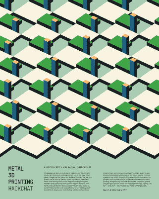
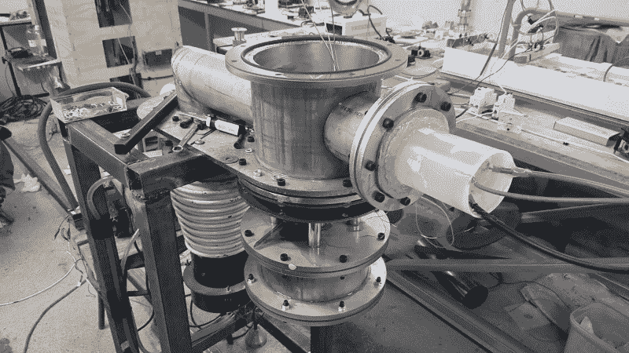

# 金属 3D 打印黑客聊天带来热度

> 原文：<https://hackaday.com/2022/03/11/the-metal-3d-printing-hack-chat-brings-the-heat/>

在这一点上，可以说桌面 3D 打印的新鲜感已经消退。社区已经很大程度上接受了挤出塑料的局限性，虽然我们仍然强烈地相信它是一种变革性的技术，但我们承认，200 美元的打印机喷出 PLA 确实是这项工作的最佳工具的应用并不多。

但是不要把今天的消费 3D 打印机市场看作是这条线的终点，如果它只是一个开始呢？随着切片、运动控制和挤压的问题或多或少地被解决，当谈到用塑料打印的机器时，是不是终于到了将我们的注意力转向制造负担得起的金属打印机的独特问题的时候了？Agustin Cruz 肯定是这样认为的，[这就是为什么他在本周的 Hack Chat 上](https://hackaday.io/event/184160-metal-3d-printing-hack-chat)谈论他对[开源 3D 打印机的个人愿景，这种打印机可以通过仔细控制的电子束将粉末金属变成固体](https://hackaday.io/project/183736-3d-metal-printer)。

 需要澄清的是，奥古斯汀并没有建议你马上放弃你的创造力。金属 3D 打印将永远是利基中的利基，但对于甚至像 PEI 和 PEEK 这样的高级工程塑料都无法实现的应用，他认为社区需要有一个廉价和可行的选择。特别是对于传统制造业可能难以发展的发展中国家和低收入国家。他一直在研究的机器不会超出个人建造和操作的能力，但至少目前主要目标是医院、大学和小公司。

聊天中充满了关于奥古斯汀设计的技术问题，他并不羞于回答这些问题。一些人想知道为什么他决定用电子枪烧结金属粉末，而固体激光器便宜，容易获得，并且相对容易操作。虽然表面上看，激光似乎是更简单的解决方案，但 Agustin 指出，使用磁聚焦电子束赋予了他的打印机一些独特的功能。

例如，他可以很容易地使光束散焦，并使其通过整个构建板来预热粉末。可控光束也不需要镜子，这不仅降低了机器的重量和复杂性，而且理论上应该允许更快的打印速度。光束可以在 X/Y 维度上移动，精度为 0.01 毫米，虽然光束直径目前为 0.5 毫米，但 Agustin 表示，他正在努力将其降至 0.1 毫米，以进行高细节工作。光束焦点的温度在 1400 到 1500 摄氏度之间，他指出，这不仅足以熔化粉末金属，还可以焊接不锈钢。

 [https://www.youtube.com/embed/hnYU1hB2ZDA?version=3&rel=1&showsearch=0&showinfo=1&iv_load_policy=1&fs=1&hl=en-US&autohide=2&wmode=transparent](https://www.youtube.com/embed/hnYU1hB2ZDA?version=3&rel=1&showsearch=0&showinfo=1&iv_load_policy=1&fs=1&hl=en-US&autohide=2&wmode=transparent)

但是，也有不好的一面。正如一些人在聊天中提到的，使用电子束需要将建造室抽成真空。一些人想知道细金属粉末在真空条件下会有什么反应，而另一些人则指出来自扩散泵的[油可能会污染粉末。当然，密封腔室不可避免地会有困难，而且这种结构会增加桌子的体积和重量。尽管如此，奥古斯汀仍然认为这个概念在他的概念机中工作得足够好，并认为抽真空总是比产生高功率激光束容易。](https://hackaday.com/2022/01/12/an-oil-diffusion-vacuum-pump-from-thrift-store-junk/)

说到这里，奥古斯汀说他的原型现在已经完成了大约 70%。他有密封直径为 5 厘米的构建区域的不锈钢真空室，将它拉下来的泵，定制的电子枪，以及安全驱动这一切所需的电源和传感器。它在工作时消耗大约 1500 瓦，其中 100 瓦用于电子枪本身。他*现在没有的是一个 Z 轴，但听起来这个设计已经在他的脑海里出现了。*

我们很高兴 Agustin 能够花时间与社区谈论他的项目，并希望它能让更多人思考用金属进行 3D 打印的可能性。在接下来的几个月里，我们将密切关注他的原型，看看事情如何发展，我们认为你应该这样做。他的电子束概念会成功吗？激光烧结最终会成为更成功的方法吗？老实说，我们不知道，但我们渴望找到答案。

* * *

Hack Chat 是一个每周一次的在线聊天会议，由来自硬件黑客世界各个角落的顶尖专家主持。对于黑客来说，这是一种有趣和非正式的联系方式，但如果你不能现场直播，这些概述帖子以及发布到 Hackaday.io 的[文字记录确保你不会错过。](https://hackaday.io/event/184160-metal-3d-printing-hack-chat)