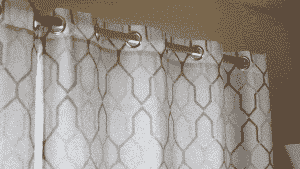

# 晨曦希望你的早晨更轻松，而不是更艰难

> 原文：<https://hackaday.com/2019/10/14/the-morningrod-wants-your-mornings-easier-not-harder/>

窗帘就像家用设备一样简单，但是自动化起来非常麻烦。每个人的窗口处理都略有不同，这阻碍了标准化的解决方案。[dfrenkel]热衷于 DIY，希望早晨充满阳光，以便更安静地醒来，因此 [MorningRod 智能窗帘杆](https://www.thingiverse.com/thing:3889979)诞生了。

Replacing the curtain rod with aluminum extrusion and 3D printed fixtures goes a long way towards standardizing for automation.

MorningRod 的设计利用了铝型材和 3D 打印部件等廉价硬件来创建一个系统，试图让用户尽可能保留现有的窗帘。

窗帘杆换成了铝型材。MorningRod 从 CNC 项目中借鉴了一些想法，将窗帘杆变成了一种双头线性致动器，窗帘就可以在其上随意移动。ESP32 充当大脑，而 NEMA17 步进电机提供肌肉。其结果是一个带无线接口的电动窗帘开合装置，可以轻松集成到[家庭自动化项目](https://hackaday.com/2019/01/05/build-a-home-automation-hub-for-20/)中。

[dfrenkel]正在提供一个工具包，但是那些更喜欢自己动手的人应该查看一下[Thingiverse](https://www.thingiverse.com/thing:3889979)上的项目页面。