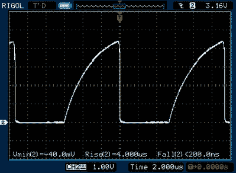

# 负轨解释道

> 原文：<https://hackaday.com/2018/11/09/the-negative-rail-explained/>

随着模块化组件的高度可用性以及在线信息和教程的惊人财富，黑客和制造商现在比以往任何时候都更容易组装复杂的电子项目，而不会陷入背后的理论。但不利的一面是，现代电子爱好者往往没有对底层概念的深刻理解，如果他们不得不从头开始构建一切，他们会有这样的理解。当他们尝试诊断和修复故障时，或者当他们开始扩展到逆向工程时，这可能是一个问题。

 这使得【大卫·克里斯滕森】的《积木》成为一个非常引人注目的系列。每周他都会在他的博客上展示一个新的电路，并用简单的英语解释它的用法和原因。[在这个系列的第一部分](http://ee.david.promo/BuildingBlocks/Vol-1/)中，他正在处理一个我们大多数人在探索更复杂的电子设备时见过的概念，但可能从来没有真正考虑过:负轨。

到底什么是负轨？很容易理解电路中的正供电轨及其与地的关系；即使是多个正供电轨，例如同时使用 5 V 和 3.3 V 电源的器件，也足以让您眼花缭乱。不幸的是，当某个值低于逻辑 0V 参考值时，就不那么直观了。但正如[David]解释的那样，电路中的负轨对于处理音频等双极性信号至关重要，这些信号高于 0 V 中心点的*和低于 0V 中心点的*。

[David]介绍了几种用于创建负供电轨的方法，从经典的中心抽头变压器到使用降压-升压转换器。但他不满足于仅仅描述这些电路如何工作，他带领读者创建了一个电荷泵电路，如果你发现自己需要难以捉摸的电压，你可以将它投入到你的下一个项目中。在解释和绘制之后，他在一块废弃的覆铜板上构建了电路，并通过一些基准测试来证明它符合他提出的理论。

如果你想听更多的负面言论，看看我们自己的[【Steven Dufresne】在制造他的 BB-8 机器人时与不同极性的电压](https://hackaday.com/2016/11/14/ask-hackaday-converting-negative-voltages-to-positive/)的斗争。