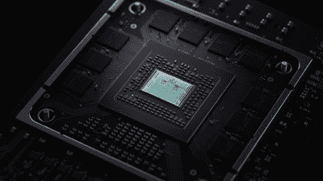
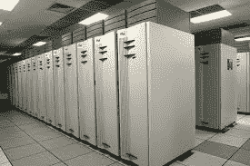
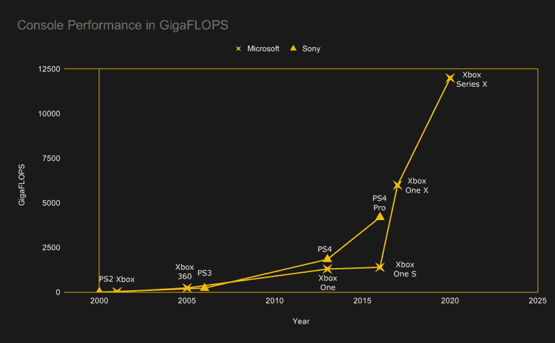

# 新的 Xbox:12 万亿次浮点运算到底有多快？

> 原文：<https://hackaday.com/2020/03/23/the-new-xbox-just-how-fast-is-12-teraflops/>

微软的新 Xbox 系列 X，原名 Project Scarlet，定于 2020 年假期期间发布。像任何新的控制台版本一样，它承诺更好的图形，更身临其境的游戏，以及新闻稿中所有其他最高级的方式。然而，与前几代人相比，突然之间，每个人都在谈论拖鞋。让我们深入探讨这意味着什么，以及它对性能有什么影响。

## 到底什么是翻牌？

通常，当我们谈论新主机发布的“失败”时，我们指的是像世嘉土星这样的产品，其销量远远低于预期。在这种情况下，我们谈论的是 FLOPS，或“每秒浮点运算”。这是用浮点数来衡量 CPU 或 GPU 每秒可以执行的计算次数。如今，谈论 FP32 性能或 32 位浮点计算是很典型的。科学或其他应用可能更关注 FP64 或“双倍”性能，这通常会返回一个低得多的数字。

给定处理器可以实现的 FLOPS 数量是比较不同硬件性能的一种方式。虽然软件优化和不同的工作负载意味着它不是真实世界应用程序性能的完美指南，但为了进行比较，它是一个有用的粗略数字。

## 新钻机怎么样？

Microsoft’s new console runs on AMD’s hottest new silicon.

来自微软的报告称，基于 AMD 新的 RDNA 2.0 技术，新 Xbox 系列 X 中的 GPU 能够提供 12 万亿次浮点运算。有趣的是，该版本只讨论了 GPU 性能。在过去的几十年里，GPU 已经超过了 CPU 的原始处理能力，因此这是比较的重点。

对于生活在电视机下的消费设备来说，这是一个巨大的数字。在那个时代，Playstation 3 代表了一个巨大的进步，它将处理能力融入了一个负担得起的游戏控制台。当时，PS3 的原始咕噜声，加上它运行 Linux 的能力，导致了世界各地一系列超级计算集群的出现。其中最大的秃鹰集群使用了 1760 个控制台，被美国空军用于监视任务。[拥有 500 万亿次浮点运算的能力](https://web.archive.org/web/20101209141211/http://www.wpafb.af.mil/news/story.asp?id=123231285)，今天类似的性能可能会在不到 100 台 X 系列游戏机上获得。不幸的是，微软没有宣布允许用户在该平台上运行定制操作系统的计划。

ASCI Red was a US government supercomputer, capable of 3.1 teraflops in its final guise, using Pentium II Xeon processors. It led the June 2000 TOP500 list, and used up to 850 kW of electricity when running.

将 X 系列与当代计算机硬件相比较，性能与 NVIDIA 当前的旗舰 GPU GeForce RTX 2080 TI 相当，GeForce 2080 TI 提供 13.45 万亿次浮点运算和 32 位浮点数学。鉴于在 PC 平台上运行双 GPU 系统的能力，以及新 Xbox 要到今年晚些时候才会发布的事实，PC 将一如预期地保持性能领先地位。

研究超级计算机领域是一项有趣的练习。早在 2000 年 6 月，ASCI Red 就占据了全球最强大超级计算机 500 强排行榜的第一名。Xbox Series X 应该很容易超越这一点，如果你带着它回到过去，你会偷到皇冠。在 11 月份的下一期出版物中，它被更新的对手 ASCI White 击败，实际性能为 4.938 万亿次，理论峰值为 12.288。Xbox 系列仍有机会卫冕，直到 2002 年 6 月 NEC 的地球模拟器上线，[在真实世界测试中号称超过 35 万亿次浮点运算。](https://www.top500.org/lists/2002/06/) ASCI Red 本身在运行中使用了 850 千瓦，而地球模拟器使用了巨大的 3200 千瓦。很高兴知道 X 系列将[在使用中仅消耗大约 300 W](https://www.tweaktown.com/news/69401/xbox-series-draw-up-300w-power/index.html)。在 20 年里，我们已经使世界上最快的超级计算机进入普通人的起居室，成为可能的堡垒之夜最高性能游戏。

 
如果我们看看更老的游戏机，差距是巨大的。Xbox 360 仅生产了 240 千兆次浮点运算，而最初的 Xbox 仅生产了 20 千兆次浮点运算。再往前追溯一代，Playstation 1 和 Nintendo 64 只能处理 100 兆次浮点运算。硬件方面的进步来得又快又厚，每台游戏机大约五年的寿命意味着两代之间有了很大的飞跃。

再往前追溯几乎不值得考虑，因为表演太乏味了。在 Playstation 1 之前，浮点单元是一种奢侈品，32 位架构才刚刚起步。然而，一些测试表明[Commodore 64 能够达到每秒 400 次浮点运算](https://www.lemon64.com/forum/viewtopic.php?t=9840&sid=4738b73da1ed596c43cd8bb0d42ce444)——基本上，没有 FPU。现在，c64 卖出了 1250 万到 1700 万台，成为历史上最畅销的电脑。将它们加在一起，您会得到 6.8 千兆次浮点运算，比单个 x 系列少一个数量级。显然，在实践中没有真正的方法来实现这一点，但它给了我们一个粗略的想法，我们已经走了多远！

## 这一切意味着什么

从根本上说，Xbox 系列 X 延续了游戏机市场计算能力的大致指数增长。随着[实时光线追踪成为可能](https://www.gamesradar.com/au/xbox-series-x-ray-tracing-minecraft-tech-demo/)，以及[更高的帧速率和分辨率](https://www.whathifi.com/au/advice/xbox-series-x-release-date-specs-price-and-news-for-the-next-gen-xbox)，这将带来更漂亮的游戏体验。

随着专门构建的高端硬件在 PC 领域的出现，我们不太可能在其他领域看到 X 系列的使用，这是一个遗憾，因为 Playstation 3 上的 Linux 相当出色。尽管与 PC 架构有相似之处，微软和索尼都坚决锁定他们的平台，阻止用户运行他们自己的代码或操作系统。无论如何，看到现在在我们自己的客厅中使用的计算能力令人印象深刻。游戏开始。